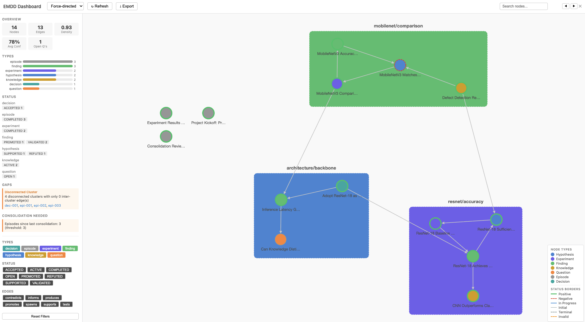
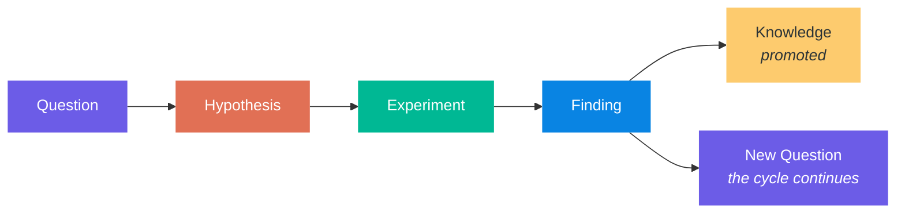

# EMDD: Evolving Mindmap-Driven Development

<p align="center">
  <a href="https://www.npmjs.com/package/@beomjk/emdd"></a>
  <a href="https://www.npmjs.com/package/@beomjk/emdd"></a>
  = 20">
  
  <a href="LICENSE"></a>
</p>

<p align="center">
  <a href="docs/TUTORIAL.md">5-Min Tutorial</a> &bull;
  <a href="docs/QUICK_START.md">Quick Start</a> &bull;
  <a href="docs/MCP_SETUP.md">AI Setup</a> &bull;
  <a href="docs/spec/SPEC_EN.md">Specification</a> &bull;
  <a href="examples/ml-backbone-selection/">Example Graph</a>
</p>

> [!WARNING]
> This project is in an **experimental stage**. APIs and file formats may change without notice.

> **A methodology that gives structure to R&D exploration through an AI-maintained evolving knowledge graph -- without killing the exploration itself.**

<p align="center">
  
</p>

<p align="center">
  
</p>

<p align="center">Interactive graph visualization with community clustering, force-directed / hierarchical layouts, node detail panel, and search. Launch with <code>emdd serve</code>.</p>

## Table of Contents

- [Installation](#installation)
- [Quick Start](#quick-start)
- [Using with AI Assistants](#using-with-ai-assistants)
- [What is EMDD?](#what-is-emdd)
- [Who is it for?](#who-is-it-for)
- [The EMDD Equation](#the-emdd-equation)
- [How It Works](#how-it-works)
- [CLI Commands](#cli-commands)
- [Phased Adoption](#phased-adoption)
- [Documentation](#documentation)
- [What EMDD is NOT](#what-emdd-is-not)
- [Contributing](#contributing)

## Installation

Requires **Node.js 20** or later.

```bash
npm install -g @beomjk/emdd
```

Or use directly with npx:

```bash
npx @beomjk/emdd <command>
```

## Quick Start

### With AI Assistant (recommended)

```bash
# 1. Initialize and connect
emdd init my-research --tool claude && cd my-research
claude mcp add emdd -- npx @beomjk/emdd mcp
# Windows: claude mcp add emdd -- cmd /c npx @beomjk/emdd mcp

# 2. Ask your AI to start
# "Load the EMDD context and help me create my first hypothesis."
```

Your AI guides you through the session cycle -- creating nodes, linking them, and recording episodes.

### With CLI

```bash
# 1. Initialize
emdd init my-research && cd my-research

# 2. Create nodes and connect them
emdd new hypothesis "surface-cracks-from-stress"
emdd new experiment "stress-test-baseline"
emdd link exp-001 hyp-001 tests

# 3. Check graph health
emdd health
```

See the [5-minute tutorial](docs/TUTORIAL.md) for a full walkthrough, or the [Quick Start Guide](docs/QUICK_START.md) for a 15-minute deep dive.

## Using with AI Assistants

EMDD exposes its full graph API via an [MCP server](docs/MCP_SETUP.md) -- 23 tools + 4 guided prompts that form a **session cycle**: `context-loading` (start) → work → `episode-creation` (end) → `consolidation` (maintenance) → `health-review` (review).

**Claude Code** (one-line setup):

```bash
claude mcp add emdd -- npx @beomjk/emdd mcp
# Windows: claude mcp add emdd -- cmd /c npx @beomjk/emdd mcp
```

**Cursor, Windsurf, VS Code Copilot, Continue** -- see the [MCP Setup Guide](docs/MCP_SETUP.md) for config snippets.

**Auto-generate AI rules** with `emdd init --tool`:

```bash
emdd init my-research --tool cursor   # creates .cursor/rules/emdd.mdc
emdd init my-research --tool claude   # creates .claude/CLAUDE.md + skills (/emdd-open, /emdd-close)
emdd init my-research --tool all      # generates rules for all supported tools
```

Supported tools: `claude` (default), `cursor`, `windsurf`, `cline`, `copilot`, `all`.

For Claude Code, use `/emdd-open` to start a session and `/emdd-close` to wrap up (writes Episode, checks consolidation, reviews health). The skills map to MCP prompts:

| Skill | Invokes |
|-------|---------|
| `/emdd-open` | `context-loading` |
| `/emdd-close` | `episode-creation` → `consolidation` → `health-review` |

## What is EMDD?

Too much structure suffocates research. Too little structure evaporates it. Existing approaches each solve one piece -- Zettelkasten gives bottom-up emergence, HDD gives hypothesis testing, DDP gives risk prioritization -- but none of them track the *relationships* between what you know, what you don't know, and what to explore next. EMDD fills that gap: it is a lightweight, AI-maintained knowledge graph that structures your exploration as it happens, surfaces blind spots, and remembers every dead end so you never walk it twice.

### Without EMDD

- "I tried this last week... why didn't it work again?"
- You re-attempt a dead-end approach because no one recorded why it failed.
- No way to know which assumptions are still untested.

### With EMDD

- `emdd health` -- instantly see 3 untested hypotheses and 2 orphan nodes.
- Failed experiments are recorded as Findings -- you never walk the same dead end twice.
- `emdd gaps` -- "No experiment tests hyp-002" is detected automatically.

## Who is it for?

- **Solo researchers or small teams doing exploratory R&D** where the destination is unknown -- visual inspection R&D, architecture spikes, open-ended investigations.
- **Developers working with AI coding assistants** (e.g., Claude Code) who want the AI to maintain the knowledge structure while they retain judgment.
- **Anyone who has lost track of what they tried last week**, why they abandoned an approach, or which assumptions remain untested.
- **Teams that need more rigor than a scratchpad** but less overhead than a project management system.
- **Researchers who want to know what to explore next**, not just what they have already done.

## The EMDD Equation

> [!TIP]
> ```
> EMDD = Zettelkasten's bottom-up emergence
>      + DDP's risk-first validation
>      + InfraNodus's structural gap detection
>      + Graphiti's temporal evolution
>      ─────────────────────────────────
>        Autonomous maintenance and suggestions by an AI agent
> ```
>
> Delegate cognitive load to the graph and the AI, but never delegate judgment.

## How It Works

EMDD has three roles. The **Researcher** exercises taste and judgment -- deciding which directions are worth pursuing, creating hypotheses, and making intuitive leaps the graph cannot derive on its own. The **Graph** is the living knowledge structure: a map of what is known, what remains unknown, and what has been tried. The **Agent** (AI) is the graph's gardener -- maintaining connections, detecting patterns and gaps, and suggesting what to explore next. Suggestions are always suggestions, never decisions.

### The Knowledge Graph

| Node Type | Purpose |
|-----------|---------|
| **Knowledge** | Confirmed facts, literature, domain rules |
| **Hypothesis** | Testable claims with confidence scores and kill criteria |
| **Experiment** | Units of work that validate or refute hypotheses |
| **Finding** | Facts or patterns discovered from experiments (observations, insights, negatives) |
| **Question** | Open research questions that need answers |
| **Decision** | Recorded decisions with rationale and alternatives considered |
| **Episode** | Record of one exploration session -- what was tried, what is next |

### The Lifecycle



Hypotheses move through `PROPOSED -> TESTING -> SUPPORTED / REFUTED / REVISED`. Findings accumulate evidence. When a Finding has sufficient independent support, it is promoted to Knowledge. Refuted hypotheses are preserved -- the knowledge of *why* something failed is itself knowledge.

### Impact Analysis

Before changing a node's status, you can ask: *"If this hypothesis is retracted, what else breaks?"*

`emdd impact hyp-001 --whatIf RETRACTED` traces cascade effects through the graph -- scoring each reachable node by propagation strength (Noisy-OR aggregation across multi-hop paths) and predicting which automatic status transitions would fire. Edges are classified as **conducts** (0.8), **attenuates** (0.4), or **blocks** (0.0), with edge attributes (strength, severity, etc.) further modifying the score. See [Impact Analysis](docs/IMPACT_ANALYSIS.md) for details.

## CLI Commands

Graph commands accept `--graphDir <path>`, `--lang <en|ko>`, and `--json`. Utility commands (`init`, `graph`, `serve`, `export-html`, `mcp`) accept only their own options as listed below.

### Core

<!-- AUTO:readme-cli-core -->
<!-- Generated from command registry — DO NOT EDIT -->
| Command | Description |
|---------|-------------|
| `emdd init [path]` | Initialize a new EMDD project (`--tool claude\|cursor\|windsurf\|cline\|copilot\|all`, `--lang en\|ko`, `--force`) |
| `emdd list` | List nodes, optionally filtered by type, status, and/or date (`--type decision\|episode\|experiment\|finding\|hypothesis\|knowledge\|question`, `--status`, `--since`) |
| `emdd read <nodeId>` | Read a node detail |
| `emdd new <type> <slug>` | Create a new node (`--title`, `--body`, `--lang`) |
| `emdd link <source> <target> <relation>` | Create an edge between two nodes (`--strength`, `--severity FATAL\|WEAKENING\|TENSION`, `--completeness`, `--dependencyType LOGICAL\|PRACTICAL\|TEMPORAL`, `--impact DECISIVE\|SIGNIFICANT\|MINOR`, `--force`) |
| `emdd unlink <source> <target>` | Remove a link between nodes (`--relation answers\|confirms\|context_for\|contradicts\|depends_on\|extends\|informs\|part_of\|produces\|promotes\|relates_to\|resolves\|revises\|spawns\|supports\|tests\|answered_by\|confirmed_by\|produced_by\|resolved_by\|spawned_from\|supported_by\|tested_by`) |
| `emdd update <nodeId>` | Update frontmatter fields on a node (`--set`, `--transitionPolicy strict\|warn\|off`) |
| `emdd done <episodeId> <item>` | Mark a checklist item as done in an episode (`--marker done\|deferred\|superseded`) |
| `emdd doctor` | Diagnose EMDD environment (`--lang en\|ko`) |
| `emdd workflow` | Show the EMDD research session cycle (`--lang en\|ko`) |
<!-- /AUTO:readme-cli-core -->

<details>
<summary><b>Analysis</b> (14 commands)</summary>

<!-- AUTO:readme-cli-analysis -->
<!-- Generated from command registry — DO NOT EDIT -->
| Command | Description |
|---------|-------------|
| `emdd neighbors <nodeId>` | List neighbor nodes within BFS depth (`--depth`) |
| `emdd gaps` | Show structural gaps in the graph |
| `emdd health` | Show health dashboard (`--all`) |
| `emdd check` | Check consolidation readiness |
| `emdd promote` | Show promotion candidates |
| `emdd confidence` | Propagate confidence scores through the graph |
| `emdd transitions` | Detect available status transitions |
| `emdd kill-check` | Check kill criteria alerts |
| `emdd branches` | List hypothesis branch groups |
| `emdd lint` | Lint the graph for schema errors |
| `emdd backlog` | Show project backlog (open items, deferred, checklists) (`--status pending\|done\|deferred\|superseded\|all`) |
| `emdd analyze-refutation` | Analyze refutation patterns in the graph |
| `emdd mark-consolidated` | Record a consolidation date to reset episode counting (`--date`) |
| `emdd impact <nodeId>` | Analyze cascade impact from a node state change (`--whatIf`) |
<!-- /AUTO:readme-cli-analysis -->

</details>

<details>
<summary><b>Export & Server</b> (5 commands)</summary>

<!-- AUTO:readme-cli-export -->
<!-- Generated from command registry — DO NOT EDIT -->
| Command | Description |
|---------|-------------|
| `emdd index` | Generate the _index.md file |
| `emdd serve [path]` | Start web dashboard server (`-p, --port`, `--no-open`) |
| `emdd export-html [output]` | Export graph as standalone HTML file (`--layout force\|hierarchical`, `--types`, `--statuses`) |
| `emdd graph [path]` | Generate `_graph.mmd` (Mermaid diagram) |
| `emdd mcp` | Start MCP server (stdio transport) |
<!-- /AUTO:readme-cli-export -->

</details>

> **Note:** Four commands use different names when accessed via MCP:
> `neighbors` → `graph-neighbors`, `gaps` → `graph-gaps`, `transitions` → `status-transitions`, `impact` → `impact-analysis`.

## Phased Adoption

You do not need to adopt everything at once. Start lite and add structure as you need it.

| Phase | Duration | Node Types | Daily Overhead | You're doing it right when... |
|-------|----------|------------|----------------|-------------------------------|
| **Lite** | Week 1-2 | 4 (Hypothesis, Experiment, Finding, Episode) | ~15 min | You can open last week's Episode and immediately know what to do next |
| **Standard** | Week 3-4 | 6 (+Knowledge, Question) | ~25 min | Findings regularly get promoted to Knowledge |
| **Full** | Week 5+ | 7 (+Decision, all edge types, all ceremonies) | ~45 min | The graph tells you what to explore next |

See [section 11 of the specification](docs/spec/SPEC_EN.md#11-phased-adoption-guide) for details on each phase.

## Documentation

- [EMDD in 5 Minutes](docs/TUTORIAL.md) -- copy-paste tutorial
- [Quick Start Guide](docs/QUICK_START.md) -- get started in 15 minutes
- [Example Graph](examples/ml-backbone-selection/) -- a complete 14-node research narrative
- [Full Specification](docs/spec/SPEC_EN.md) -- the complete methodology
- [Philosophy](docs/PHILOSOPHY.md) -- why EMDD exists
- [Operations](docs/OPERATIONS.md) -- research loops, ceremonies, adoption
- [Tool Comparison](docs/COMPARISON.md) -- EMDD vs. Obsidian, Zettelkasten, DDP, HDD, nbdev, and more
- [Glossary](docs/GLOSSARY.md) -- definitions of all EMDD terms
- [Impact Analysis](docs/IMPACT_ANALYSIS.md) -- cascade impact tracing and what-if simulation
- [한국어 스펙](docs/spec/SPEC_KO.md) -- Korean specification

<details>
<summary><b>What EMDD is NOT</b></summary>

- **Not a project management tool.** No deadlines, no progress percentages -- it tracks what you know and what you don't.
- **Not a knowledge base.** The value is in the tensions, contradictions, and gaps between information, not in tidy organization.
- **Not SDD with a graph bolted on.** Direction emerges from exploration; the specification does not come first.
- **Not a personal knowledge management system.** It is project-scoped working memory, not a second brain for a lifetime.
- **Not outsourcing research to AI.** The AI prunes branches and points to empty ground. The researcher decides where to walk.

</details>

## Contributing

Contributions are welcome -- whether that is trying EMDD on your own project and reporting what worked, proposing changes to the spec, or building tooling. See [CONTRIBUTING.md](docs/CONTRIBUTING.md) for guidelines and the RFC process.

## License

[MIT](LICENSE)
