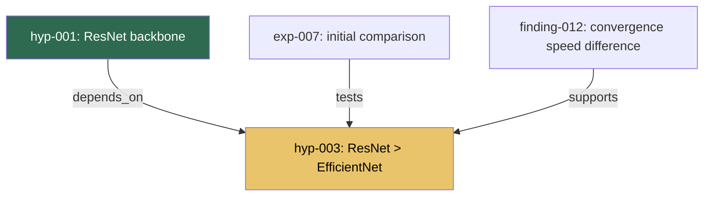

# EMDD: Operations Guide

> This document covers the practical day-to-day usage of EMDD — workflows, ceremonies, implementation, and common pitfalls. For the philosophical foundation, see [Philosophy](PHILOSOPHY.md). For the graph schema, see the [full specification](spec/SPEC_EN.md).

---

## 7. Workflows

### 7.1 Project Kickoff (Day 0, ~3 hours)

```
1. Place a PROBLEM node at the center (the core question, 1 node)
2. Place CONSTRAINT nodes (hardware, time, data, performance constraints; 3-7 nodes)
3. Literature survey -> KNOWLEDGE nodes (5-15 nodes)
4. Initial HYPOTHESIS nodes (2-5, each with confidence 0.3-0.5)
5. Open QUESTION nodes (3-10)
6. DDP-style assumption register: all hypotheses prioritized by risk_level x uncertainty
7. Sketch a one-week experiment roadmap (not a fixed plan — "current best guess")
```

### 7.2 Reference: Full-Time Research Loop

```
08:30-09:00  [30 min] Morning Briefing:
             1. Context loading (previous Episode prerequisite reading + cluster entry points)
             2. AI overnight report review
             3. Decide today's direction
09:00-12:00  [3 hours] Deep Work Block 1 — experiment execution (scratchpad notes, [!] = surprise)
12:00-12:15  [15 min] Midday Checkpoint — [!] items -> graph micro-update
13:00-17:00  [4 hours] Deep Work Block 2
17:00-17:30  [30 min] Daily Reflection:
             1. Write Episode (record today's loop)
             2. Consolidation trigger check (run Consolidation if triggered)
             3. Explore tomorrow's direction with AI

Total graph maintenance overhead: ~45 min/day (~10% of total)
  With Consolidation Ceremony: ~75 min (occurs roughly every other day)
```

**Morning Briefing — AI Overnight Report format:**

```
=== EMDD Daily Brief [2026-03-13] ===

[OVERNIGHT RESULTS]
- EXP-003 complete: mAP@0.5 = 0.68 (target 0.80 not met)
  -> H-001 confidence: 0.4 -> 0.25 (down)

[GRAPH STATE]
- Active hypotheses: 4 | Untested 3+ days: H-003 (priority rank 2)
- Stale question: Q-004 (unattended for 5 days)

[RECOMMENDATIONS]
1. [HIGH] H-001 follow-up: re-run experiment with data augmentation
2. [MEDIUM] Q-004 resolution: check annotation quality
3. [LOW] H-003 kickoff: initial experiment with segmentation approach
```

**Scratchpad protocol** (protecting flow during Deep Work):

```markdown
# scratchpad/2026-03-13.md
- 09:15 Using Albumentations for augmentation
- 09:45 Training started. 50 epochs estimated ~40 min
- 10:50 [!] Unexpected: small defects (< 10px) nearly disappear after augmentation
         -> Question: need a separate strategy for small defects?
- 11:20 Training complete. mAP@0.5 = 0.73 (+0.05). Target not met.
```

### 7.2a Part-Time / Async Variant

Not all research happens in 8-hour blocks. For researchers working part-time, intermittently, or across multiple projects:

**Session-based rhythm (no fixed schedule):**

```
Session Start (5 min):
  1. Read the last Episode's "What's Next" + prerequisite reading nodes
  2. Check Consolidation trigger (numbers only)
  3. Decide today's direction

Session Work:
  - Work + scratchpad notes ([!] for surprises)

Session End (10 min):
  1. Write Episode (skeleton: "What Was Tried" + "What's Next" are mandatory)
  2. If Consolidation trigger met -> run it or schedule it
```

**Minimum requirement:** At least one Episode per week. If you skip a week, the next session's context loading takes longer — the Episode chain breaks.

**AI agent behavior:** Same rules apply, but "Morning Briefing" and "Daily Reflection" collapse into session start/end. The interrupt budget resets per session, not per day.

### 7.2b Team Research Protocol

When multiple researchers share the same EMDD graph, additional coordination mechanisms are needed.

#### Ownership and Attribution

- Every node's `created_by` field identifies the author: `human:alice`, `human:bob`, `ai:claude`
- A new optional field `assigned_to` can be added to Hypothesis and Experiment nodes to indicate responsibility
- Episodes are always personal — each researcher writes their own Episodes for their own sessions
- Knowledge, Finding, and Question nodes are shared — anyone can create or modify them

#### Git Workflow

**Branch strategy:**
- `main` branch holds the canonical graph state
- Feature branches for exploratory work: `explore/<researcher>/<topic>` (e.g., `explore/alice/alt-backbone`)
- Experiment branches when running parallel experiments: `exp/<exp-id>` (e.g., `exp/exp-012`)
- Consolidation always happens on `main` — merge your branch first, then consolidate

**Merge protocol:**
- Node files rarely conflict (each has a unique ID)
- `_index.md` and `_graph.mmd` are auto-generated — regenerate after merge, don't resolve conflicts manually
- If two researchers modify the same node's frontmatter (e.g., confidence), the merge requires discussion — create a Decision node documenting the resolution

**Commit conventions:**
- `[graph] add hyp-005: alternative backbone hypothesis`
- `[graph] update find-012: confidence 0.7 → 0.85`
- `[consolidation] promote find-008 → know-005`
- `[episode] ep-007: alice session — data augmentation exploration`

#### CONTESTED Status (new Hypothesis status)

Add to the Hypothesis status transition diagram (§6.5):

```
TESTING   -> CONTESTED   : team members disagree on verdict
CONTESTED -> SUPPORTED   : consensus reached (Decision node required)
CONTESTED -> REFUTED     : consensus reached (Decision node required)
CONTESTED -> REVISED     : compromise — revised hypothesis
```

**CONTESTED rules:**
- Any team member can flag a hypothesis as CONTESTED by adding a Decision node with `status: contested`
- Resolution requires explicit consensus — a Decision node documenting: who participated, what alternatives were considered, what was decided, and why
- While CONTESTED, no downstream confidence propagation occurs (freeze the cascade)
- CONTESTED should not last more than 2 weeks — if unresolved, escalate at the Weekly Review

#### Team Ceremonies

**Shared Consolidation (replaces individual Consolidation when in team mode):**
- Schedule as a meeting (30-60 min, same triggers as individual Consolidation)
- One person drives, others review promotion candidates and question generation
- Disagreements on promotion — the Finding stays as-is until the next Consolidation
- Each participant writes a brief summary in their next Episode

**Team Weekly Review:**
- Same structure as individual Weekly Review (§7.4), but with two additions:
- **Assignment Review** — who is working on what, any blocked researchers
- **Conflict Check** — any CONTESTED hypotheses or disputed Knowledge to resolve
- Rotate the facilitator weekly

#### Conflict Resolution Principles

1. **Evidence over opinion** — disagreements should be resolved by designing an experiment, not by debate
2. **Record the disagreement** — even if one side "wins," the losing argument gets recorded in a Decision node (Principle 4: Temporal Evolution)
3. **Prefer splitting over choosing** — if two researchers want to go different directions, create two hypotheses rather than forcing one path
4. **The graph is the arbiter** — if the evidence supports one position, follow the evidence

### 7.3 AI Agent Intervention Design

**Interrupt budget (silence rules):**

| Time Period | AI Proactive Interventions | Notes |
|-------------|---------------------------|-------|
| Deep Work blocks | **0** | Only exceptions: kill criterion hit, crash |
| Morning Briefing | Max 3 suggestions | Excess hidden behind "show more" |
| Midday Checkpoint | Max 2 suggestions | |
| Daily Reflection | Unlimited | Researcher-led conversation |
| Weekly limit | Max 20/week | Ignored suggestions auto-archived after 2 weeks |

**When AI must remain silent:**
1. While the researcher is exploring a hypothesis in early stages — do not negate an idea still forming
2. During experiment execution — do not speculate before results are in
3. Immediately after a suggestion was rejected — no re-suggestion in the same context (24-hour cooldown)
4. When "exploration mode" is declared — intervene only at Morning Briefing/EOD

**AI automatic authority scope:**

| No Approval Needed | Approval Required | Absolutely Forbidden |
|--------------------|-------------------|---------------------|
| Experiment metrics -> RESULT node recording | Hypothesis confidence change | Hypothesis node deletion |
| EXPERIMENT status change | New Hypothesis/Question creation | DECISION node creation |
| Time-based attribute updates | Edge addition/deletion | Kill criterion modification |
| | Knowledge status change (DISPUTED/RETRACTED) | Knowledge node deletion |

### 7.4 Core Ceremonies

**Weekly Graph Review (Friday 16:00-17:30, 90 min):**
- Graph health check: size, hypothesis status, staleness, structural analysis (20 min)
- Pruning: CONTRADICTED nodes to archive, 2+ week untested low-priority nodes to archive candidates (20 min)
- Restructuring: cluster identification, theme node creation, assumption register re-prioritization (30 min)
- Next week sketch + overnight automated experiment planning (20 min)

**Pruning principle**: "Archive, don't delete." All archived nodes move to the `archived` layer and can be restored if needed.

**Consolidation Ceremony** (when 5 Findings or 3 Episodes accumulate, 30-60 min):

As research progresses, Findings accumulate rapidly while the other graph layers (Knowledge, Questions, Hypotheses) stagnate. This is natural, but left unaddressed, the graph becomes a "Finding cemetery" — facts pile up but are unstructured and unreusable. The Consolidation Ceremony structures this accumulation.

```
Consolidation triggers (run if any apply):
  - 5 or more Finding nodes added since last Consolidation
  - 3 or more Episode nodes added since last Consolidation
  - 0 open Questions (the illusion that research is "done")
  - An Experiment has become a catch-all with 5+ Findings attached
```

**Consolidation: 5 steps:**

| Step | Action | Example |
|------|--------|---------|
| **Promotion** | Promote established facts to Knowledge (review Findings with hints first) | "defect size distribution is bimodal with peaks at 5px and 45px" -> know-003 |
| **Splitting** | Split bloated Experiments into meaningful units | exp-003 "Data pipeline analysis" -> exp-003a (preprocessing), 003b (augmentation), 003c (post-processing) |
| **Question generation** | Convert Episode "Questions That Arose" into Question nodes | "Does defect aspect ratio affect detection more than size?" -> q-006 |
| **Hypothesis update** | Update confidence based on Finding evidence + create new hypotheses | hyp-001: 0.95->0.98, new hyp-004 |
| **Orphan cleanup** | Add connections to Findings without outgoing links | find-010 -> spawns q-006, q-007 |

**Health dashboard and Negative Decisions sync:** When collecting `not-pursued:` tags during the health check, display the item list (not just the count) so past rejection reasons can be reviewed quickly. Verify synchronization with the Negative Decisions section in `_index.md`.

**Consolidation principles:**
- **Consolidation is an obligation, not optional.** After creating Episodes or Findings, check the Consolidation trigger.
- **Do not record Consolidation itself as an Episode.** Consolidation is a meta-activity, not research.
- **Do not start new exploration during Consolidation.** Consolidation is garden tending. Plant new seeds in the next session.

**Milestone Ceremony** (on hypothesis verdict, 30 min):
- SUPPORTED confirmed: document evidence, generate derived Questions, create DECISION node, activate dependent hypotheses
- REFUTED confirmed: document failure evidence, record "why it was wrong," explore alternative hypotheses, archive

**Knowledge Refutation Ceremony** (when Knowledge is RETRACTED, 30-60 min):
- **Trigger**: CONTRADICTS edge added to a Knowledge node, and review confirms refutation
- **Snapshot**: record graph state before refutation
- **Failure analysis**: "why was this promoted to Knowledge?" — derive improvements to promotion judgment
- **Downstream impact analysis**: traverse dependent Hypotheses, Decisions, and other Knowledge to assess impact
- **Cluster entry point replacement**: if this Knowledge was an entry point, designate a replacement node
- **Pivot Ceremony trigger check**: if 2 or more Knowledge nodes in the same cluster have been refuted, trigger a Pivot Ceremony

**Pivot Ceremony** (on direction change, 2-3 hours):
- Trigger: 2+ core hypotheses simultaneously REFUTED / average confidence declining for 2 consecutive weeks / all paths BLOCKED / 2+ Knowledge nodes RETRACTED in the same cluster
- Save snapshot -> summarize "what was learned" -> brainstorm new directions -> restructure graph

### 7.5 Friction Budget

```
Absolute cap: 60 min/day (research time 7 hours, ~14%)
Target:       45 min/day (~10%)
Weekly review: 90 min/week (separate)

Anti-bureaucracy rules:
- "3-minute rule": if a single graph update takes more than 3 minutes -> simplify the format
- "Skip allowed": Midday Checkpoint can be skipped. Only Daily Reflection is mandatory (minimum 10 min)
- "2-week experiment": evaluate the EMDD process itself every 2 weeks; remove anything unnecessary
- "Tool independence": the core is the "hypothesis-experiment-learning-evolution" loop, not the tooling
```

---

## 8. Implementation Stack

### 8.1 Storage Format: Markdown + YAML Frontmatter (Git-backed)

**Rationale:**
- AI (Claude Code) can directly Read/Edit — no API or driver needed
- Git diffs are meaningful; branching/merging is natural
- Opening the same files in Obsidian provides a graph view automatically via `[[]]` links
- Neo4j is overkill (R&D PoC scale = hundreds of nodes)

**Single node file format:**

```markdown
---
id: hyp-003
type: hypothesis
status: testing
confidence: 0.65
risk_level: high
priority: 1
created: 2026-03-12
updated: 2026-03-12
created_by: human:bjkim
tags: [backbone, resnet, efficiency]
links:
  - target: exp-007
    relation: tested_by
  - target: hyp-001
    relation: depends_on
kill_criterion: "If mAP@0.5 < 0.60, change architecture"
sources:
  wandb_run: run-abc123
  dvc_exp: exp-branch-name
---

# ResNet-50 will converge faster than EfficientNet-B3 on the current dataset

## Background
- Dataset is small (~5K), so quality of pretrained features matters
- ResNet-50's ImageNet features may be more similar to our domain

## Current Evidence
- [[exp-007]] initial results: ResNet-50 val_acc 0.82 vs EfficientNet-B3 0.79
- However, EfficientNet is still converging -> [[exp-009]] needs longer training

## Open Questions
- [ ] Could learning rate scheduling differences be distorting the results?
```

### 8.2 Visualization: Mermaid (Phase 1) -> Cytoscape.js (Phase 2)

**Why Mermaid is recommended:** native rendering in GitHub/Obsidian/VSCode, Claude Code generates the syntax accurately, `classDef` maps confidence/status to colors. Transition to Cytoscape.js at 50+ nodes.

**`_graph.mmd` update timing:** `_graph.mmd` is updated at Consolidation Ceremony completion and at Weekly Graph Review. It is not updated on Episode creation (friction budget consideration).



### 8.3 AI Agent: Direct Use of Claude Code

**3-stage maturity model:**

| Mode | Timing | Approach |
|------|--------|----------|
| **Manual invocation** | Day 1+ | Researcher directly tells Claude Code "results are in, update the graph" |
| **Semi-automatic** | Week 2+ | Post-experiment hook triggers Claude automatically on experiment completion |
| **Autonomous analysis** | Month 2+ | Periodic full-graph analysis, automatic gap/pattern reporting |

### 8.4 ML Tool Integration

```
DVC exp run -> metrics.json -> post-experiment hook -> Claude Code
    -> create graph/experiments/exp-XXX.md
    -> update graph/hypotheses/hyp-YYY.md confidence
    -> update graph/_graph.mmd
```

- W&B: include hypothesis ID in run `tags`, record run URL in experiment node sources
- Hydra: connect to graph via `experiment_id` and `hypothesis_ids` fields in config

### 8.5 Project Directory Structure

```
project-root/
+-- .claude/
|   +-- CLAUDE.md              # EMDD rules + agent behavior (created by emdd init)
|
+-- graph/                     # EMDD knowledge graph
|   +-- _index.md              # Auto-generated index
|   +-- _graph.mmd             # Auto-generated Mermaid
|   +-- _analysis/             # AI analysis results
|   +-- hypotheses/
|   +-- experiments/
|   +-- findings/
|   +-- knowledge/
|   +-- questions/
|   +-- decisions/
|   +-- episodes/
|
+-- configs/                   # Hydra configuration
+-- src/                       # Source code
+-- notebooks/                 # Exploratory notebooks
+-- scratchpad/                # Daily notes
+-- data/                      # DVC managed
+-- dvc.yaml
+-- pyproject.toml
```

### 8.6 Integration Recipes

Step-by-step recipes for connecting external tools to your EMDD graph. For the full pattern catalog, see [§8.6 in the specification](spec/SPEC_EN.md#86-external-tool-integration-patterns).

#### Recipe: GitHub Issue → Question Node

```bash
# 1. Identify a research-relevant issue (e.g., #42)
# 2. Create the question node
emdd new question "can-distillation-close-accuracy-gap"

# 3. Edit the created file to add source metadata
# In graph/questions/qst-002-can-distillation-close-accuracy-gap.md:
#   meta:
#     source: "github:myorg/myrepo#42"

# 4. Link to relevant hypothesis
emdd link qst-002 hyp-001 relates_to
```

#### Recipe: Jupyter Notebook → Experiment + Finding

```bash
# 1. Run your notebook (notebooks/resnet-augmentation.ipynb)

# 2. Create experiment node
emdd new experiment "resnet-augmentation-v2"

# 3. Link to hypothesis being tested
emdd link exp-003 hyp-001 tests

# 4. Record notebook path (edit the experiment file)
# In graph/experiments/exp-003-resnet-augmentation-v2.md:
#   meta:
#     notebook: "notebooks/resnet-augmentation.ipynb"

# 5. Record key result as finding
emdd new finding "augmentation-improves-map-5pct"
emdd link fnd-004 exp-003 produced_by
emdd link fnd-004 hyp-001 supports

# 6. Update experiment status
emdd update exp-003 --set status=COMPLETED
```

#### Recipe: CI Pipeline → Experiment Status Update

```bash
# In your GitHub Actions workflow (or equivalent):
# .github/workflows/experiment.yml
#
# - name: Update EMDD
#   run: |
#     emdd update exp-004 --set status=COMPLETED
#     emdd update exp-004 --set "meta.ci_run=${{ github.server_url }}/${{ github.repository }}/actions/runs/${{ github.run_id }}"
```

#### Recipe: Paper → Knowledge Node

```bash
# 1. Create knowledge node for the paper's key contribution
emdd new knowledge "attention-is-all-you-need"

# 2. Edit to add DOI/source
# In graph/knowledge/knw-003-attention-is-all-you-need.md:
#   meta:
#     doi: "10.48550/arXiv.1706.03762"
#     source: "Vaswani et al., 2017"
#   tags: [literature, transformer, attention]

# 3. Link to hypotheses it informs
emdd link knw-003 hyp-002 informs
```

### 8.7 Scaling Your Graph

Practical guidance for managing graphs as they grow. For the full scale tier definitions, see [§13 in the specification](spec/SPEC_EN.md#13-scale--performance).

#### At ~50 nodes (Lite): No action needed

Default behavior is fine. Mermaid renders cleanly. All commands are instant.

#### At ~200 nodes (Standard): Add structure

```bash
# Use filters to navigate
emdd list --type hypothesis --status TESTING
emdd list --type finding --status DRAFT

# Keep _index.md current
emdd index

# Consolidate more frequently (every 2-3 Episodes)
emdd check   # Shows consolidation triggers
```

Adopt consistent tagging: `tags: [backbone, cnn]` groups related nodes for filtering.

#### At ~500 nodes (Large): Partition the graph

**Temporal archiving — move resolved lineages:**

```bash
# Create archive directory
mkdir -p graph/archive/2026-q1

# Move resolved hypothesis + its experiments + findings
mv graph/hypotheses/hyp-001-*.md graph/archive/2026-q1/
mv graph/experiments/exp-001-*.md graph/archive/2026-q1/
mv graph/findings/fnd-001-*.md graph/archive/2026-q1/
```

**Archive criteria checklist:**
- [ ] Hypothesis is SUPPORTED, REFUTED, or DEFERRED for > 30 days
- [ ] All downstream experiments are COMPLETED or ABANDONED
- [ ] No active nodes link to the archived nodes (or links are updated to `meta.xref`)

**Topic-based splitting:**

```bash
# Separate independent sub-projects
mkdir -p graph-distillation/{hypotheses,experiments,findings,knowledge,questions,episodes}

# Move relevant nodes
mv graph/hypotheses/hyp-003-*.md graph-distillation/hypotheses/
# Add cross-reference: meta.xref: "graph-distillation:hyp-003"
```

#### At ~1000+ nodes (Enterprise): Federate

Configure archiving in `.emdd.yml`:

```yaml
scale:
  tier: enterprise
  archive:
    after_days: 90
    statuses: [REFUTED, RETRACTED, SUPERSEDED]
    exempt: [knowledge, decision]
  visualization: cytoscape
  cluster_by: tags
```

Use separate `graph/` directories per project with `meta.xref` for cross-references. Promote shared knowledge to a central `shared-knowledge/graph/` repository.

#### Measuring performance

```bash
# Time any command
time emdd lint
time emdd health

# JSON output for scripting
emdd health --json | jq '.totalNodes, .linkDensity'
```

**Targets by tier:**

| Command | ~50 | ~200 | ~500 | ~1000+ |
|---------|-----|------|------|--------|
| `emdd health` | < 0.5s | < 1s | < 3s | < 5s |
| `emdd lint` | < 0.5s | < 3s | < 10s | < 30s |

---

## 9. Anti-Patterns (6)

### Anti-pattern 1: Over-Structuring — When the Graph Becomes Bureaucracy
**Symptoms**: Time spent deciding type/tags/metadata before adding a node. Discussions about "the right structure" outnumber actual exploration.
**Remedy**: Throw nodes in first, organize later. The AI agent will help with cleanup.

### Anti-pattern 2: Under-Feeding — When the Graph Starves
**Symptoms**: Only results are recorded; failures, doubts, and intermediate thoughts are absent. The graph becomes a highlight reel. If only Findings pile up with no Episodes or Questions, this pattern is active.
**Remedy**: Failures and doubts are the most valuable inputs. The graph is a lab notebook. Episode nodes enforce this — "What Got Stuck" and "What Was Deliberately Not Done" are mandatory sections.

### Anti-pattern 3: Blind Following — When AI Suggestions Are Followed Uncritically
**Symptoms**: AI suggestions executed in order. The researcher's unique perspective is lost.
**Remedy**: AI suggestions are a menu, not an order form. Ignoring 9 out of 10 is normal.

### Anti-pattern 4: Premature Convergence — When You Converge Too Early
**Symptoms**: First experiment succeeds, and you dive deep in that direction without exploring alternatives.
**Remedy**: The enemy of confirmation bias. Validate the strongest threat to your current hypothesis first.

### Anti-pattern 5: Finding Cemetery — When Findings Pile Up Without Consolidation
**Symptoms**: 10+ Findings with 0 Knowledge promotions, 0 open Questions, and a single Experiment with all Findings attached. The graph is flat with sparse relationships.
**Remedy**: Run a Consolidation Ceremony. Findings are intermediate artifacts — their value is realized only when promoted to Knowledge, spawning new Questions, or updating Hypotheses.

### Anti-pattern 6: Graph Amnesia — When Temporal History Is Ignored
**Symptoms**: Wrong hypotheses deleted. Direction changes unrecorded.
**Remedy**: Deprecate instead of deleting. The graph must be able to answer "why didn't we try that direction?"

---

## 11. Phased Adoption Guide

EMDD's full specification includes 7 node types, 14 edge types, and 5 ceremonies. Adopting everything at once is overwhelming and violates Principle 2 (Minimum Viable Structure). Instead, adopt EMDD in three phases:

### 11.1 Lite — The Hypothesis Loop (Week 1-2)

**Goal:** Establish the habit of recording what you tried, what you learned, and what's next.

**Use only:**
- **Node types (4):** Hypothesis, Experiment, Finding, Episode (skeleton)
- **Edge types (4):** SUPPORTS, CONTRADICTS, PRODUCES, SPAWNS
- **Ceremonies:** None — just write Episodes at the end of each session

**Daily overhead:** ~15 minutes (Episode writing only)

**You're doing it right when:** You can open last week's Episode and immediately know what to do next.

### 11.2 Standard — Adding Structure (Week 3-4)

**Goal:** Start consolidating findings into reusable knowledge and tracking open questions.

**Add:**
- **Node types (+2):** Knowledge, Question
- **Edge types (+3):** PROMOTES, ANSWERS, EXTENDS
- **Ceremonies (+1):** Consolidation (every 5 Findings or 3 Episodes)

**Daily overhead:** ~25 minutes

**You're doing it right when:** Findings regularly get promoted to Knowledge, and new Questions emerge from Episodes.

### 11.3 Full EMDD (Week 5+)

**Goal:** Use the complete methodology with risk-prioritized exploration and gap detection.

**Add:**
- **Node types (+1):** Decision
- **Edge types (all remaining):** DEPENDS_ON, RELATES_TO, INFORMS, PART_OF, CONTEXT_FOR, REVISES, CONFIRMS
- **Ceremonies (all):** Weekly Review, Milestone, Knowledge Refutation, Pivot

**Daily overhead:** ~45 minutes

**You're doing it right when:** The graph tells you what to explore next, not just what you've already done.

### 11.4 When to Skip Ahead

Skip directly to Full EMDD if:
- You have prior experience with structured research methodologies (DDP, HDD)
- Your project has high stakes and needs rigorous knowledge tracking from day one
- You're working in a team and need shared understanding from the start

---

*For the graph schema (node types, edge types, confidence propagation), see the [full specification](spec/SPEC_EN.md).*
