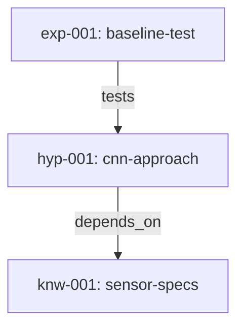

# EMDD in 5 Minutes

> One terminal is all you need. Copy-paste and follow along.

## 1. Install (30 seconds)

```bash
npx @beomjk/emdd --version
```

If you see a version number, you're ready. No global install needed.

## 2. Initialize a project (30 seconds)

```bash
emdd init my-research
cd my-research
```

This creates a `graph/` directory with subdirectories for each node type:

```
my-research/graph/
  hypotheses/  experiments/  findings/
  knowledge/   questions/    decisions/  episodes/
```

## 3. Create a Knowledge node (1 minute)

Knowledge nodes anchor your graph with confirmed facts.

```bash
emdd new knowledge sensor-specs
```

```
Created knowledge node: knw-001
```

Open `graph/knowledge/knw-001-sensor-specs.md` and fill in your domain facts. For example:

```markdown
## Content

- Target: surface defect detection on steel coils
- Camera: 4K line-scan, 100 fps
- Latency requirement: < 100ms per frame
- Five defect types: scratch, pit, stain, inclusion, rolled-in scale
```

## 4. Form a Hypothesis (1 minute)

A hypothesis is a testable claim -- something an experiment can prove wrong.

```bash
emdd new hypothesis cnn-approach
emdd link hyp-001 knw-001 depends_on
```

```
Created hypothesis node: hyp-001
Linked hyp-001 -> knw-001 (depends_on)
```

Open `graph/hypotheses/hyp-001-cnn-approach.md` and write your claim:

```markdown
## Hypothesis

ResNet-18 can detect surface defects with > 90% accuracy
within the 100ms latency constraint.

## Rationale

CNNs have shown strong performance on similar visual inspection tasks.
ResNet-18 is small enough for real-time inference on a single GPU.
```

## 5. Design an Experiment (1 minute)

```bash
emdd new experiment baseline-test
emdd link exp-001 hyp-001 tests
```

```
Created experiment node: exp-001
Linked exp-001 -> hyp-001 (tests)
```

Open `graph/experiments/exp-001-baseline-test.md`:

```markdown
## Design

Train ResNet-18 on 5,000 labeled defect images.
5-fold cross-validation. Report accuracy and inference time.

## Results

(Fill in after running the experiment)
```

## 6. Verify your graph (1 minute)

Check that everything is valid:

```bash
emdd lint
```

```
All nodes valid. No errors found.
```

See the health dashboard:

```bash
emdd health
```

```
=== EMDD Health Dashboard ===

Total Nodes: 3

By Type:
  hypothesis: 1
  experiment: 1
  knowledge: 1

Hypothesis Status:
  PROPOSED: 1

Average Confidence: 0.70
Open Questions: 0
Link Density: 0.67
```

Generate a visual graph:

```bash
emdd graph
```

```
Graph generated: 3 nodes, 2 edges
```

This creates `graph/_graph.mmd` -- a Mermaid diagram you can preview in any Mermaid-compatible viewer:



## Done!

You built a 3-node, 2-edge EMDD graph in under 5 minutes:

| Node | Type | Status |
|------|------|--------|
| knw-001 | knowledge | ACTIVE |
| hyp-001 | hypothesis | PROPOSED |
| exp-001 | experiment | PLANNED |

## What's next

1. **Run your experiment**, then create a Finding: `emdd new finding cnn-result`
2. **Log your session** with an Episode: `emdd new episode day-one`
3. **Learn the daily loop** in the [Quick Start Guide](QUICK_START.md)
4. **See a complete example** -- a 13-node graph with full narrative: [`examples/ml-backbone-selection/`](../examples/ml-backbone-selection/)

---

*For the complete methodology, read the [full specification](spec/SPEC_EN.md). For term definitions, see the [Glossary](GLOSSARY.md).*
