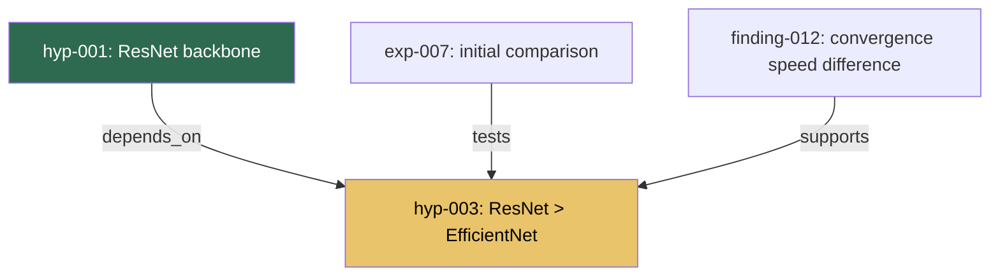

# EMDD: Evolving Mindmap-Driven Development

## Manifesto v0.4

> This specification was originally written in Korean. The English version is the canonical reference; the Korean original is preserved at `SPEC_KO.md`.

> **EMDD is a methodology that gives structure to R&D exploration through an AI-maintained evolving knowledge graph — without killing the exploration itself.**

---

## 1. Problem Statement

Software engineering has evolved on the assumption that "you know what to build." Spec-Driven Development, Waterfall, even Agile — all stand on the premise that a destination exists. Sprints end with deliverables; tickets have acceptance criteria. This works for development. It does not work for research. Research is, by nature, exploration without a specification.

On the opposite end lies vibe-coding: following intuition freely. This is creative but fatally flawed — it is irreproducible, yesterday's findings vanish from today's context, and you end up walking the same dead ends over and over. The tension James March identified between exploration and exploitation — the balance between discovering new possibilities and leveraging what you know — reproduces exactly at the level of an individual researcher's workflow.

**Too much structure suffocates exploration. Too little structure evaporates it.**

Existing methodologies capture only one facet of this problem. HDD provides a hypothesis-testing loop but does not track relationships between hypotheses. DDP prioritizes assumptions but cannot accommodate unexpected connections. nbdev unifies code and documentation but cannot express the evolution of knowledge. Zettelkasten produces bottom-up emergence but cannot tell you "what to explore next."

What we need is not the intersection of all these, but something that fills the single absence they all share: **a living structure built for exploration itself.**

---

## 2. The EMDD Equation

```
EMDD = Zettelkasten's bottom-up emergence
     + DDP's risk-first validation
     + InfraNodus's structural gap detection
     + Graphiti's temporal evolution
     ─────────────────────────────────
       Autonomous maintenance and suggestions by an AI agent
```

Delegate cognitive load to the graph and the AI, but never delegate judgment.

---

## 3. Core Principles (7)

### Principle 1: Graph as First-Class Citizen
The graph — not the code — is the project's source of truth. Nodes contain **knowledge and hypotheses**, not code modules. The graph simultaneously expresses "what we have learned so far" and "what we need to learn next." Code is an artifact derived from graph nodes.

### Principle 2: Minimum Viable Structure
Structure should exist only in the minimum necessary amount. When node formats are flexible, edge semantics are loose, and the overall graph shape is unpredictable — structure is working correctly. The moment it feels like bureaucracy, reduce it.

### Principle 3: Gap-Driven Exploration
The most valuable information in a graph is not in the nodes — it is in the empty spaces between them. Clusters that seem like they should be connected but are not; questions without answers; hypotheses without validation. The AI agent detects these gaps and suggests them. The researcher selects which are worth pursuing.

### Principle 4: Temporal Evolution
Nodes are created, modified, and deprecated. Hypotheses are validated or refuted. The full history of all these changes must be preserved within the graph. Tracking "how we got here" is as important in research as the results themselves. **Do not delete wrong paths — the knowledge of why they were wrong is itself knowledge.**

### Principle 5: Riskiest-First Ordering
Validate the most uncertain hypotheses first — the ones that could change the entire direction if they fail. Testing safe bets first is psychologically comfortable but strategically wrong. The AI agent identifies risk propagation paths ("if this falls, that falls too") and suggests validation priorities.

### Principle 6: Dual Trigger Evolution
The graph does not evolve in a single direction. When the human researcher inputs experimental results, the graph evolves. When the AI agent discovers patterns or detects conflicts with external knowledge, the graph evolves. This bidirectional triggering is the core dynamic of EMDD.

### Principle 7: Taste over Technique
AI is faster than humans at reading papers, matching patterns, generating code, and running experiments. But the judgment of "is this direction worth pursuing?" or "is this result interesting?" belongs to humans. In EMDD, AI suggestions are always suggestions, never decisions.

---

## 4. Three Roles

### The Researcher (Human): Taste, Judgment, Leaps

- **Exercises taste** — selects which AI-suggested exploration directions are worth pursuing
- **Makes judgments** — decides whether to revise or discard hypotheses
- **Makes leaps** — creates intuitive connections, analogies, and reframings that cannot be derived from the graph's logical structure alone
- Core action: **node creation and hypothesis verdicts**

### The Graph (Artifact): Living Knowledge Structure

Serves three roles simultaneously:
- **Knowledge representation**: a map of what is known and what remains unknown
- **Project roadmap**: gaps and untested hypotheses naturally compose the "what to do next" agenda
- **Research memory**: a record of attempted paths, failed hypotheses, and direction changes

### The Agent (AI): Gardener

The AI agent is a **gardener** of the graph, not an architect:
- **Maintenance**: cleaning up connections, detecting duplicates, identifying orphan nodes, maintaining consistency
- **Pattern detection**: identifying potential connections between nodes that the researcher missed
- **Gap suggestion**: structural gap analysis leading to exploration direction proposals
- **Automation**: literature search, experiment code generation, result summarization (the technique domain)

---

## 5. What EMDD Is Not

- **Not a project management tool**: no deadlines, no progress percentages. It tracks "what we know and what we don't."
- **Not a knowledge base**: the value lies not in organized information but in the tensions, contradictions, and gaps between information. A tidy graph is a dead graph.
- **Not SDD with a graph bolted on**: the specification does not come first. Direction emerges from the exploration process.
- **Not a personal knowledge management system**: it is **project-scoped**. Not a second brain for a lifetime of knowledge, but working memory for a single exploration.
- **Not outsourcing research to AI**: the AI only prunes branches, waters the garden, and says "there's empty ground over there."

---

## 6. Graph Schema

### 6.1 Design Principles

1. **Knowledge-first**: nodes represent knowledge units, not code. Code is referenced only as an Experiment artifact
2. **Temporal-aware**: creation/modification/deprecation timestamps on all nodes and edges
3. **Confidence-propagating**: confidence propagates along evidential edges
4. **Gap-detecting**: structural gaps ("spaces that need research") are detectable from the graph structure
5. **Dual-agency**: both humans and AI can create/modify; authorship is always tracked

<!-- v0.3: Finding/Insight merger reduced node types from 8 to 7 -->
<!-- ASSERT §6.2.1: there are exactly 7 node types -->
### 6.2 Node Types (7)

<!-- ASSERT §6.2.2: hypothesis has 7 statuses (PROPOSED, TESTING, SUPPORTED, REFUTED, REVISED, DEFERRED, CONTESTED) -->
<!-- ASSERT §6.2.3: experiment has 5 statuses (PLANNED, RUNNING, COMPLETED, FAILED, ABANDONED) -->
<!-- ASSERT §6.2.4: finding has 4 statuses (DRAFT, VALIDATED, PROMOTED, RETRACTED) -->
<!-- ASSERT §6.2.5: knowledge has 4 statuses (ACTIVE, DISPUTED, SUPERSEDED, RETRACTED) -->
<!-- ASSERT §6.2.6: question has 4 statuses (OPEN, RESOLVED, ANSWERED, DEFERRED) -->
<!-- ASSERT §6.2.7: decision has 5 statuses (PROPOSED, ACCEPTED, SUPERSEDED, REVERTED, CONTESTED) -->
<!-- ASSERT §6.2.8: episode has 2 statuses (ACTIVE, COMPLETED) -->

<!-- AUTO:node-types -->
<!-- Generated from graph-schema.yaml — DO NOT EDIT -->
| Type | Prefix | Directory | Status Count |
|------|--------|-----------|-------------|
| hypothesis | hyp | hypotheses | 7 |
| experiment | exp | experiments | 5 |
| finding | fnd | findings | 4 |
| knowledge | knw | knowledge | 4 |
| question | qst | questions | 4 |
| decision | dec | decisions | 5 |
| episode | epi | episodes | 2 |
<!-- /AUTO:node-types -->

<!-- AUTO:statuses -->
<!-- Generated from graph-schema.yaml — DO NOT EDIT -->
| Type | Statuses |
|------|----------|
| hypothesis | PROPOSED, TESTING, SUPPORTED, REFUTED, REVISED, DEFERRED, CONTESTED |
| experiment | PLANNED, RUNNING, COMPLETED, FAILED, ABANDONED |
| finding | DRAFT, VALIDATED, PROMOTED, RETRACTED |
| knowledge | ACTIVE, DISPUTED, SUPERSEDED, RETRACTED |
| question | OPEN, RESOLVED, ANSWERED, DEFERRED |
| decision | PROPOSED, ACCEPTED, SUPERSEDED, REVERTED, CONTESTED |
| episode | ACTIVE, COMPLETED |
<!-- /AUTO:statuses -->

| Type | Color | Meaning | Key Attributes |
|------|-------|---------|----------------|
| **Knowledge** | Blue | Confirmed facts, literature, domain rules | `knowledge_type`, `source`, `confidence` |
| **Hypothesis** | Orange | Testable claim | `confidence`, `risk_level`, `priority`, `status`, `kill_criterion` |
| **Experiment** | Green | Unit of work to validate a hypothesis | `config`, `status`, `results`, `artifacts` |
| **Finding** | Teal | Fact or pattern discovered from experiments/analysis | `finding_type`, `confidence`, `sources` |
| **Question** | Yellow | Open research question | `question_type`, `urgency`, `answer_summary` |
| **Decision** | Black | Recorded decision with rationale | `alternatives_considered`, `rationale`, `reversibility` |
| **Episode** | Gray | Record of one exploration loop | `trigger`, `duration`, `outcome`, `spawned`, `dead_ends` |

<!-- v0.3: Insight absorbed into Finding, distinguished by finding_type -->
**Finding subtypes (`finding_type` field):**

| `finding_type` | Meaning | Example |
|----------------|---------|---------|
| `observation` | Concrete result directly observed from a single experiment/analysis | "The dataset contains 73% small defects (<10px) that are lost during standard 224x224 resize" (find-005) |
| `insight` | Higher-order pattern discovered by combining multiple Findings/Knowledge | "Scratch defects and pit defects require fundamentally different detection strategies" |
| `negative` | Confirmed absence or failure — a fact of the form "X is not the case" | "Standard augmentation (flip, rotate) does not improve recall for elongated scratch defects" |

An `observation` is a reproducible single-experiment result; an `insight` is a cross-cutting pattern that emerged on top of the graph; a `negative` confirms that a particular path does not work. All three subtypes are stored in the `findings/` directory.

**Finding vs Knowledge distinction:**

```
Finding  = "A fact from experiment/analysis, or a pattern discovered across nodes"
           Subtypes: observation, insight, negative
           Nature: intermediate artifact. Based on individual or few pieces of evidence.

Knowledge = "An established, reusable fact"
            Example: "The defect size distribution is bimodal with peaks at 5px and 45px" (know-003)
            Nature: promoted from Finding. Can serve as a premise for other work.
                    A Finding that met the promotion criteria during Consolidation.
```

**Promotion path**: `Finding -> (Consolidation promotion) -> Knowledge`. Findings are intermediate artifacts; Knowledge is an established reusable fact.

<!-- v0.4: Consolidation Hint Tags -->
**Consolidation Hint**: A Finding's links may include an `extends: know-NNN` hint. This indicates that the Finding extends or reinforces a specific Knowledge node, and during the Consolidation promotion step, "Findings with hints are reviewed first" to accelerate the process. However, hints do not exempt the promotion criteria — the same criteria (2+ independent supports, confidence >= 0.9, de facto in use) still apply.

**Promotion criteria** (applied during Consolidation; at least one must be met):
- **Independent support**: 2 or more independent Findings or Experiments support the fact
- **High confidence**: confidence >= 0.9
- **De facto in use**: already referenced as a premise by other work

**Promotion considerations (refutation cascade cost):**
- The more nodes that would depend on this Knowledge, the more carefully promotion should be judged — a RETRACTED Knowledge node has large downstream impact
- Do not promote if an active `CONTRADICTS` edge exists (this would create DISPUTED Knowledge)
- Record the rejection reason for Findings that fail to meet promotion criteria (re-evaluate at next Consolidation)

### 6.3 Episode Node — Research Episodes

An Episode records a single exploration loop (= one session, or one meaningful unit of exploration). While Findings record "what was learned," Episodes record **"what happened"** in full — successes, failures, things deliberately not attempted, and what comes next.

**Why Episodes are needed:** If only Findings accumulate, the graph becomes a "highlight reel" (Anti-pattern 2). The reasons for choosing a direction, which attempts were blocked, and what was deferred all vanish. Episodes preserve the "narrative thread" of the research.

**Episode node format:**

```markdown
---
id: ep-003
type: episode
trigger: "find-005 complete -> small defect analysis is next priority"
created: 2026-03-15
duration: ~2h
outcome: success
created_by: human:bjkim + ai:claude
tags: [small-defects, resolution, augmentation]
links:
  - target: find-010
    relation: produces
  - target: find-005
    relation: extends
  - target: q-006
    relation: spawns
---

# EP-003: Small Defect Detection Strategy

## Goal
Investigate why the model fails on defects smaller than 10px and identify mitigation strategies

## What Was Tried
- [x] Dataset distribution analysis: defect size histogram across all categories
- [x] Multi-resolution inference: tested 224, 384, 512, and 768px input sizes
- [x] Tile-based inference: split images into overlapping 256×256 tiles
- [x] Verified tile-based approach recovers 89% of missed small defects

## What Got Stuck / Failures
- 384px input improved small defect recall but degraded large defect precision
- Initial tiling approach missed defects at tile boundaries -> needed 25% overlap
- find-005's assumption (uniform defect size distribution) was wrong -> heavily skewed

## What Was Deliberately Not Done
- Super-resolution preprocessing: too slow for production inference, ROI unclear
- find-005 annotation re-labeling: current annotations are ground truth, relabeling risks introducing noise

## What's Next
- [ ] Implement adaptive tiling: use coarse pass to identify regions of interest, then high-res tiles
  - Prerequisite reading: know-003, find-010, find-005
- [ ] Compare tile-based results with ImageNet-pretrained vs domain-specific backbone
  - Prerequisite reading: know-003, find-007, find-008, find-009
- [ ] Investigate why scratch defects have lower recall than pit defects (q-006)
  - Prerequisite reading: find-010, q-006

## Questions That Arose
- Does defect aspect ratio (elongated vs circular) affect detection more than size?
- Would a two-stage detector (region proposal + classification) outperform single-stage for small defects?
```

**When to write an Episode:** at the end of an exploration loop (= at a natural stopping point). Write during Daily Reflection or before starting the next session.

<!-- v0.4: Skeleton Episode — mandatory/optional section separation -->
**Episode sections (mandatory + optional):**

| Section | Required? | What to Record | Anti-pattern Prevention |
|---------|-----------|----------------|----------------------|
| What Was Tried | **Mandatory** | Successful approaches, tools/methods used | Prevents Under-Feeding |
| What's Next | **Mandatory** | Specific next steps + **prerequisite reading node list** | Prevents direction loss + context loss |
| What Got Stuck | Optional (when applicable) | Failures, errors, wrong assumptions | Prevents Graph Amnesia |
| What Was Deliberately Not Done | Optional (when applicable) | Consciously deferred/rejected directions and reasons | Prevents repeated exploration |
| Questions That Arose | Optional (when applicable) | New questions, ideas | Prevents Question exhaustion |

Empty optional sections should be omitted. Not every session encounters blocks or rejection decisions, and empty sections only add noise.

**"What's Next" prerequisite reading:** Under each next-step item, record `Prerequisite reading: node-id, node-id, ...`. This is the list of nodes that **must be read first** when starting that task in the next session. The previous Episode curates the context for the next Episode.

<!-- v0.3: Status marker table added -->
**"What's Next" status markers:** Track each item's status:

| Marker | Meaning | When Used |
|--------|---------|-----------|
| `[ ]` | Not Started | Default when Episode is written |
| `[done]` | Done | Checked off in a subsequent Episode |
| `[deferred]` | Deferred | Deprioritized or prerequisites not met |
| `[superseded]` | Superseded | No longer meaningful due to new information (record the reason) |

During Consolidation, if 3 or more `[deferred]` items have accumulated, conduct a separate review: either promote them to Question nodes or consciously reject them (move to "What Was Deliberately Not Done").

**Searchability of "What Was Deliberately Not Done":** If buried in Episode body text, these decisions become unfindable six months later. Two mechanisms address this:

1. Append a `not-pursued` suffix in the Episode frontmatter `tags`:
   ```yaml
   tags: [small-defects, resolution, not-pursued:super-resolution, not-pursued:annotation-relabel]
   ```
   This enables searching the entire graph with the `not-pursued:` prefix.

2. Add a **Negative Decisions** subsection to the cluster in `_index.md`, summarizing major rejections in one line:
   ```markdown
   **Negative Decisions**
   - Super-resolution preprocessing -> unnecessary (ep-003: tile-based inference achieves comparable recall at 10x speed)
   ```

<!-- v0.3: Frontmatter lowercase mapping note + CONFIRMS added for 14 total -->
<!-- ASSERT §6.5.1: there are exactly 16 edge types -->
### 6.4 Edge Types (16)

<!-- AUTO:edge-types -->
<!-- Generated from graph-schema.yaml — DO NOT EDIT -->
| # | Edge Type |
|---|-----------|
| 1 | answers |
| 2 | confirms |
| 3 | context_for |
| 4 | contradicts |
| 5 | depends_on |
| 6 | extends |
| 7 | informs |
| 8 | part_of |
| 9 | produces |
| 10 | promotes |
| 11 | relates_to |
| 12 | resolves |
| 13 | revises |
| 14 | spawns |
| 15 | supports |
| 16 | tests |
<!-- /AUTO:edge-types -->

<!-- AUTO:reverse-labels -->
<!-- Generated from graph-schema.yaml — DO NOT EDIT -->
| Reverse Label | Forward Edge |
|---------------|-------------|
| answered_by | answers |
| confirmed_by | confirms |
| produced_by | produces |
| resolved_by | resolves |
| spawned_from | spawns |
| supported_by | supports |
| tested_by | tests |
<!-- /AUTO:reverse-labels -->

**Frontmatter notation convention:** The `relation:` field in YAML frontmatter uses lowercase present tense (e.g., `relation: produces`). This maps to the canonical type `PRODUCES`. The uppercase names in the table below are canonical types; frontmatter uses lowercase snake_case.

<!-- ASSERT §6.5.2: reverse labels map confirmed_by→confirms, supported_by→supports, answered_by→answers, spawned_from→spawns, produced_by→produces, tested_by→tests, resolved_by→resolves -->
**Reverse labels allowed:** When recording a link from node A to target B, there are cases where you need to express the relationship in the B-to-A direction. In these cases, use reverse labels with `_by` or `_from` suffixes: `confirmed_by`, `supported_by`, `answered_by`, `spawned_from`, `produced_by`, `tested_by`, `resolved_by`. These are the reverses of `CONFIRMS`, `SUPPORTS`, `ANSWERS`, `SPAWNS`, `PRODUCES`, `TESTS`, and `RESOLVES` respectively. Do not duplicate the canonical-direction link in the other file.

**Evidential edges:**
- `SUPPORTS` — A supports B (strength: 0.0--1.0)
- `CONTRADICTS` — A contradicts B (severity: FATAL / WEAKENING / TENSION)
- `CONFIRMS` — A strongly confirms B (convenience alias for `SUPPORTS` with strength >= 0.9)

**Generative edges:**
- `SPAWNS` — B is derived from A (e.g., Question to Hypothesis, Hypothesis to Experiment)
- `PRODUCES` — A's execution produces B (e.g., Episode to Finding, Experiment to Finding)
- `ANSWERS` — A provides an answer to B (completeness: 0.0--1.0)
- `REVISES` — A is a revised version of B
- `PROMOTES` — A is promoted to B (Finding to Knowledge, during Consolidation)

**Structural edges:**
- `DEPENDS_ON` — A depends on B (LOGICAL / PRACTICAL / TEMPORAL)
- `EXTENDS` — A explores deeper based on B's results (Finding to Finding, Episode to Episode)
- `RELATES_TO` — A and B are related (weak directionality, Zettelkasten-style)
- `INFORMS` — A influences B's judgment (DECISIVE / SIGNIFICANT / MINOR)

**Compositional edges:**
- `PART_OF` — A is a sub-element of B
- `CONTEXT_FOR` — A provides context/background for B
- `RESOLVES` — A resolves the outcome of branch group B. Reverse label: `resolved_by`
- `TESTS` — A tests B (Experiment tests Hypothesis). Reverse label: `tested_by`

**Edge selection guide (commonly confused pairs):**

| Situation | Correct Edge | Common Misuse |
|-----------|-------------|---------------|
| A Finding emerged from an Episode | `PRODUCES` | ~~SPAWNS~~ (SPAWNS = logical derivation, PRODUCES = activity output) |
| find-010 dug deeper based on find-005 | `EXTENDS` | ~~REVISES~~ (REVISES = modification/replacement, EXTENDS = deepening) |
| A Finding was promoted to Knowledge | `PROMOTES` | ~~SPAWNS~~ (SPAWNS = new node derivation, PROMOTES = same fact elevated) |
| A Hypothesis emerged from a Question | `SPAWNS` | Correct usage |
| A Finding almost certainly supports a hypothesis | `CONFIRMS` | Same as `SUPPORTS(strength>=0.9)`. Use `SUPPORTS` for weaker support |

<!-- ASSERT §6.5.3: hypothesis transitions: PROPOSED→TESTING when connected Experiment is RUNNING -->
<!-- ASSERT §6.5.4: hypothesis transitions: TESTING→SUPPORTED when SUPPORTS edge strength >= 0.7 -->
<!-- ASSERT §6.5.5: hypothesis transitions: TESTING→REFUTED when CONTRADICTS edge exists -->
### 6.5 Hypothesis Status Transitions

<!-- AUTO:transition-rules -->
<!-- Generated from graph-schema.yaml — DO NOT EDIT -->

**hypothesis**

| From | To | Conditions |
|------|----|------------|
| PROPOSED | TESTING | has_linked(type=experiment, status=RUNNING, direction=any) |
| PROPOSED | SUPPORTED | has_linked(relation=supports, min_strength=0.7, direction=incoming) |
| TESTING | CONTESTED | has_linked(type=decision, status=CONTESTED, direction=incoming) |
| TESTING | REVISED | has_linked(relation=revises, direction=incoming) |
| TESTING | SUPPORTED | has_linked(relation=supports, min_strength=0.7, direction=incoming) |
| TESTING | REFUTED | has_linked(relation=contradicts, direction=incoming) |
| CONTESTED | REVISED | has_linked(relation=revises, direction=incoming) |
| CONTESTED | SUPPORTED | has_linked(relation=supports, min_strength=0.7, direction=incoming) AND has_linked(type=decision, status=ACCEPTED, direction=incoming) |
| CONTESTED | REFUTED | has_linked(relation=contradicts, direction=incoming) AND has_linked(type=decision, status=ACCEPTED, direction=incoming) |

**knowledge**

| From | To | Conditions |
|------|----|------------|
| ACTIVE | DISPUTED | has_linked(relation=contradicts, direction=incoming) |
| ACTIVE | SUPERSEDED | has_linked(relation=revises, type=knowledge, direction=incoming) |
| DISPUTED | SUPERSEDED | has_linked(relation=revises, type=knowledge, direction=incoming) |
| DISPUTED | ACTIVE | all_linked_with(relation=contradicts, status=RETRACTED) |
<!-- /AUTO:transition-rules -->

```
PROPOSED -> TESTING       : connected Experiment is RUNNING
PROPOSED -> SUPPORTED     : SUPPORTS edge (strength >= 0.7), no experiment needed
TESTING  -> SUPPORTED     : SUPPORTS edge (strength >= 0.7)
TESTING  -> REFUTED       : CONTRADICTS edge exists
TESTING  -> REVISED       : partial support/refutation -> revised hypothesis (REVISES edge)
ANY      -> DEFERRED      : explicitly deferred by the researcher
```

### 6.5a Kill Criterion Review Protocol

Every Hypothesis node has a `kill_criterion` field — a concrete, falsifiable condition that, if met, means the hypothesis should be abandoned. But a kill criterion is only useful if it's actually checked. This section defines the review protocol.

#### Kill Criterion Format

A well-formed kill criterion is:
- **Measurable**: tied to a specific metric or observable outcome
- **Time-bounded**: includes a deadline or trigger condition
- **Unambiguous**: two people reading it would agree on whether it's been met

**Good examples:**
- `"mAP@0.5 < 0.60 after 100 epochs with augmentation"` — metric, threshold, condition
- `"No convergence improvement after 3 consecutive experiments"` — pattern-based, countable
- `"Execution time > 10s per image on target hardware"` — metric, threshold, context

**Bad examples:**
- `"If it doesn't work"` — unmeasurable
- `"Poor performance"` — ambiguous
- `"mAP < 0.60"` — no time bound or experimental context

#### Review Triggers

Kill criteria are checked at these moments:

| Trigger | Who checks | Action if met |
|---------|-----------|---------------|
| **Experiment completes** | AI agent (automatic) | Flag the hypothesis and alert the researcher |
| **Milestone Ceremony** | Researcher + AI | Review all active hypotheses' kill criteria |
| **Weekly Review** | Researcher | Scan for hypotheses approaching their kill threshold |
| **Confidence drops below 0.3** | AI agent (automatic) | Remind researcher of the kill criterion |
| **Stale hypothesis (14+ days)** | AI agent (automatic) | Flag hypotheses in TESTING with no update for 14+ days |

#### What Happens When a Kill Criterion is Met

1. **Do not immediately REFUTE.** The kill criterion is a signal, not an automatic verdict.
2. **Verify the criterion was fairly tested:**
   - Was the experiment correctly configured?
   - Were there confounding factors?
   - Is the criterion itself still appropriate, or has the context changed?
3. **If confirmed → Milestone Ceremony:**
   - Set hypothesis status to `REFUTED`
   - Document the evidence in a Finding (`finding_type: negative`)
   - Record the decision in a Decision node (rationale: which kill criterion was met, evidence)
   - Check dependent hypotheses — do any need re-evaluation?
4. **If the criterion needs revision:**
   - Create a new version of the hypothesis (REVISES edge)
   - Update the kill criterion with clearer/updated conditions
   - Document why the original criterion was insufficient (Finding, `finding_type: negative`)

#### Kill Criterion Staleness

A kill criterion that can never be tested is useless. Watch for:
- **Untestable criteria**: the required experiment is too expensive or impossible → revise the criterion or split the hypothesis
- **Moved goalposts**: the criterion keeps being revised upward when results approach it → Anti-pattern 4 (Premature Convergence in reverse — refusing to kill)
- **Forgotten criteria**: the hypothesis has been in TESTING for weeks but no experiment targets the kill criterion → AI should flag this

#### AI Agent Responsibilities

The AI agent should:
- **At experiment completion**: compare results against all active hypotheses' kill criteria. If any criterion is met or approached (within 10% of threshold), alert the researcher.
- **At Weekly Review**: list all hypotheses whose kill criteria have not been tested in > 2 weeks.
- **At Consolidation**: check if any kill criterion text references outdated Findings or Knowledge.
- **Never**: autonomously change a hypothesis status based on a kill criterion. This is always a human decision (Principle 7: Taste over Technique).

<!-- v0.3: Knowledge status transitions added -->
<!-- ASSERT §6.6.1: knowledge transitions: ACTIVE→DISPUTED when CONTRADICTS edge from new Finding -->
### 6.6 Knowledge Status Transitions

Knowledge can change status even after promotion. When a new Finding contradicts existing Knowledge, that Knowledge becomes subject to review.

```
ACTIVE      -> DISPUTED    : CONTRADICTS edge from new Finding
DISPUTED    -> ACTIVE      : contradiction resolved (Finding retracted or reconciled)
DISPUTED    -> SUPERSEDED  : new Knowledge replaces this one (REVISES edge)
DISPUTED    -> RETRACTED   : contradiction confirmed, no replacement
ACTIVE      -> SUPERSEDED  : direct replacement without dispute phase
```

**Actions on DISPUTED transition:**
1. Apply a severity-based penalty to the confidence of all Hypotheses connected to this Knowledge via `SUPPORTS` or `DEPENDS_ON` edges:
   - `FATAL`: x0.5 — core premise collapsed
   - `WEAKENING`: x0.7 — partial contradiction, possible to salvage with revision
   - `TENSION`: x0.9 — interpretive difference, further investigation needed
2. If this Knowledge is a cluster entry point, display a "warning: disputed" notice in `_index.md`
3. Add a "warning: review needed" tag to all Decisions that cite this Knowledge in their `rationale`

**Actions on RETRACTED transition:**
4. Keep the Knowledge file in the `knowledge/` directory but change to `status: retracted`. Do not move the file — this preserves existing `[[knowledge/know-XXX]]` references and maintains history per Principle 4 (Temporal Evolution). Adjust the confidence of the original Finding downward.
5. If it was a cluster entry point, designate a replacement entry point
6. Analyze "why was this prematurely promoted to Knowledge?" and record it as a retraction Finding (`finding_type: negative`)
7. If 2 or more Knowledge nodes in the same cluster have been RETRACTED, trigger a Pivot Ceremony

<!-- ASSERT §6.7.1: confidence propagation formula uses 0.3 coefficient for SUPPORTS -->
<!-- ASSERT §6.7.2: severity weights are FATAL=0.9, WEAKENING=0.6, TENSION=0.3 -->
<!-- ASSERT §6.7.3: CONFIRMS edge treated as SUPPORTS with strength=1.0 -->
### 6.7 Confidence Propagation (Bayesian-inspired)

<!-- AUTO:thresholds -->
<!-- Generated from graph-schema.yaml — DO NOT EDIT -->
| Threshold | Value |
|-----------|-------|
| branch_convergence_gap | 0.3 |
| branch_convergence_weeks | 2 |
| branch_max_active | 3 |
| branch_max_candidates | 4 |
| branch_max_open_weeks | 4 |
| kill_confidence | 0.3 |
| kill_stale_days | 14 |
| min_independent_supports | 2 |
| promotion_confidence | 0.9 |
| support_strength_min | 0.7 |
<!-- /AUTO:thresholds -->

```python
def update_hypothesis_confidence(hypothesis):
    prior = hypothesis.initial_confidence
    for edge in hypothesis.incoming_evidential_edges:
        if edge.type == "SUPPORTS":
            impact = edge.source.confidence * edge.strength
            prior = prior + (1 - prior) * impact * 0.3
        elif edge.type == "CONTRADICTS":
            impact = edge.source.confidence * severity_weight(edge.severity)
            prior = prior * (1 - impact * 0.5)
    return clamp(prior, 0.0, 1.0)
```

**`severity_weight` definition:**

| Severity | Weight | Meaning |
|----------|--------|---------|
| `FATAL` | 0.9 | Core premise collapsed — near-total impact |
| `WEAKENING` | 0.6 | Partial contradiction — significant but recoverable |
| `TENSION` | 0.3 | Interpretive difference — warrants investigation |

> Note: These weights represent the *impact magnitude* of contradictory evidence in the confidence formula. They are distinct from the *penalty multipliers* in Section 6.6 (DISPUTED transition), which are applied directly to dependent hypotheses' confidence values.

**Design rationale for constants:**
- `0.3` (SUPPORTS coefficient): Conservative update — a single piece of supporting evidence should not shift confidence by more than 30%. This prevents premature convergence on early positive results.
- `0.5` (CONTRADICTS coefficient): Symmetric counterpart — contradictory evidence should not destroy confidence in a single step either, allowing for the possibility that the contradiction itself may be flawed.

**CONFIRMS handling:** A `CONFIRMS` edge is treated as `SUPPORTS` with `strength = 1.0`.

**Worked Example:**

```
Hypothesis H-001 (initial_confidence: 0.40)

Step 1: SUPPORTS edge arrives
  source.confidence = 0.90, strength = 0.80
  impact = 0.90 x 0.80 = 0.72
  new_confidence = 0.40 + (1 - 0.40) x 0.72 x 0.3
                 = 0.40 + 0.60 x 0.72 x 0.3
                 = 0.40 + 0.1296
                 = 0.5296

Step 2: CONTRADICTS edge arrives
  source.confidence = 0.70, severity = WEAKENING (weight = 0.6)
  impact = 0.70 x 0.6 = 0.42
  new_confidence = 0.5296 x (1 - 0.42 x 0.5)
                 = 0.5296 x (1 - 0.21)
                 = 0.5296 x 0.79
                 = 0.4184

Final confidence: 0.42 (rounded)
```

<!-- ASSERT §6.8.1: there are exactly 5 structural gap types -->
### 6.8 Structural Gap Detection (5 Types)

| Gap Type | Detection Method | Output |
|----------|-----------------|--------|
| **Disconnected Clusters** | Community detection, then inter-cluster edge count < threshold | Auto-suggest Questions |
| **Untested Hypotheses** | PROPOSED status + (N days elapsed **OR** M episodes since updated) | Suggest experiment design |
| **Blocking Questions** | OPEN + urgency=BLOCKING + (N days **OR** M episodes since updated) | Urge immediate resolution |
| **Stale Knowledge** | Source is N months old + newer Knowledge added to same cluster (day-only) | Warn that update is needed |
| **Orphan Findings** | Finding node has no outgoing `edgeCategories.value_producing` edges (12 types) | Suggest new Question/Hypothesis connections |

**Default Thresholds and Configuration:**

| Gap Type | Default Threshold | Config Key | Rationale |
|----------|-------------------|------------|-----------|
| Untested Hypotheses | 5 days in `PROPOSED` | `gaps.untested_days` | A week without testing suggests the hypothesis is either too risky to test first (good — but surface it) or forgotten |
| Untested Hypotheses | 3 episodes since `updated` | `gaps.untested_episodes` | Matches consolidation cadence; 3 sessions without testing signals neglect regardless of calendar time |
| Stale Knowledge | 90 days since source date | `gaps.stale_days` | Quarterly review cadence; source material may have updates |
| Orphan Findings | 0 outgoing edges of type `edgeCategories.value_producing` (12 types) | `gaps.orphan_min_outgoing` | A Finding that doesn't connect forward is value unrealized |
| Blocking Questions | 7 days at `urgency=BLOCKING` | `gaps.blocking_days` | One week is long enough to confirm the block is real, short enough to prevent stalls |
| Blocking Questions | 3 episodes since `updated` | `gaps.blocking_episodes` | Same episode-based cadence as untested hypotheses |
| Disconnected Clusters | < 2 inter-cluster edges | `gaps.min_cluster_edges` | Below 2 edges, clusters are effectively independent research threads |

These thresholds are defaults. Override them per-project by creating a `.emdd.yml` config file in the graph root:

```yaml
# .emdd.yml
gaps:
  untested_days: 7
  untested_episodes: 3
  stale_days: 60
  orphan_min_outgoing: 1
  blocking_days: 5
  blocking_episodes: 3
  min_cluster_edges: 3
```

**Dual-Trigger Detection (Day + Episode):**

Untested Hypotheses and Blocking Questions use a dual-trigger system: a gap fires when **either** the day threshold **or** the episode threshold is met. Episode count is measured as the number of Episode nodes created *after* the target node's `updated` date (using strict `>` comparison, so episodes created on the same day are excluded).

- `stale_knowledge` remains day-only because it measures real-world source aging, not session activity.
- `orphan_finding` and `disconnected_cluster` are structural gaps independent of time or sessions.

Each detected gap includes a `triggerType` field (`'days'`, `'episodes'`, or `'both'`) indicating which trigger(s) fired.

<!-- ASSERT §6.9.1: consolidation trigger check is part of context loading protocol -->
### 6.9 Topic Clusters and Context Loading

As the graph grows, the increasing number of nodes makes it difficult to determine "which nodes are relevant to the current task?" Two mechanisms address this.

**Topic clusters (maintained in `_index.md`):**

Structure the node listing in `_index.md` as **topic-based clusters** rather than a flat list. Each cluster designates an **entry point node** — the Knowledge or confirmed Finding that should be read first for that topic, summarizing the core facts.

```markdown
## Cluster: Small Defect Detection
- **Entry point**: know-003 (defect size distribution + detection thresholds)
- find-005 (size analysis), find-010 (tile-based inference results)
- hyp-001, q-007, ep-001

## Cluster: Scratch Detection
- **Entry point**: know-004 (scratch morphology classification)
- find-007, find-008, find-009
- hyp-003
```

Cluster entry points are managed during the Consolidation Ceremony. When a Knowledge node is promoted, it becomes an entry point candidate.

<!-- v0.3: Consolidation trigger check added to context loading -->
**Context loading protocol (before starting exploration):**

Before beginning a new exploration loop (Episode), perform the following:

```
1. Review the previous Episode's "What's Next"
   -> Read all prerequisite reading nodes for the relevant task

2. Read the entry point node of the related topic cluster
   -> Match task keywords to cluster names/tags

3. Check for related open Questions
   -> Are there questions that might be answered during this exploration?

4. Consolidation trigger check (numbers only)
   -> Check unpromoted Finding count and accumulated Episode count
   -> If trigger is met, output "[Consolidation recommended]" message
```

For AI agents, this protocol **runs automatically at session start**. For human researchers, it is performed during the Morning Briefing.

**Principle: Each Episode curates the context for the next Episode.** When the previous session records "what to read next," the following session starts not from zero but from curated context. This mirrors a human researcher's lab notebook habit — "tomorrow, pick up here; check this first before starting."

### 6.10 Parallel Exploration

Research often reaches a fork: "Should we try approach A or approach B?" Rather than choosing prematurely (Anti-pattern 4: Premature Convergence), EMDD supports exploring multiple paths simultaneously and converging when evidence warrants it.

#### Branch Groups

A **branch group** is a set of competing hypotheses that represent alternative approaches to the same question. They share a common parent Question or Hypothesis.

**Frontmatter field:**
```yaml
# In each competing hypothesis:
branch_group: bg-001
branch_role: candidate    # candidate | control | baseline
```

- `candidate` — an approach being actively explored
- `control` — a known-good baseline used for comparison (optional)
- `baseline` — the current state of affairs against which candidates are measured (optional)

A branch group must have at least two `candidate` members. The `control` and `baseline` roles are optional and do not count toward the minimum.

**Branch group lifecycle:**
```
OPEN      -> CONVERGED   : one candidate selected, others archived
OPEN      -> MERGED      : insights from multiple candidates combined into a new hypothesis
OPEN      -> ABANDONED   : all candidates failed, parent question needs rethinking
```

#### Creating a Branch Group

**Trigger:** A Question or Hypothesis spawns two or more competing approaches.

The parent node records the branch group it spawned. Each candidate hypothesis references the branch group and links back to the parent via `spawned_from` (the reverse label of `SPAWNS`, per section 6.4).

```markdown
# Example: q-003 spawns two competing hypotheses

# graph/questions/q-003.md
---
id: q-003
type: question
question_type: strategic
spawns_branch_group: bg-001
---
# Which backbone architecture is optimal for our dataset?

# graph/hypotheses/hyp-004.md
---
id: hyp-004
type: hypothesis
branch_group: bg-001
branch_role: candidate
status: testing
confidence: 0.5
links:
  - target: q-003
    relation: spawned_from
---
# ResNet-50 is optimal for small datasets

# graph/hypotheses/hyp-005.md
---
id: hyp-005
type: hypothesis
branch_group: bg-001
branch_role: candidate
status: testing
confidence: 0.5
links:
  - target: q-003
    relation: spawned_from
---
# EfficientNet-B3 is optimal given compute constraints
```

#### Convergence Protocol

**When to converge:** When one of these conditions is met:
1. One candidate's confidence exceeds all others by >= 0.3
2. All but one candidate are REFUTED (per section 6.5 status transitions)
3. A time limit is reached (set per branch group; default: 2 weeks)
4. Resource constraints force a choice

**Convergence ceremony (15-30 min):**
1. Compare all candidates' evidence side by side
2. Create a Decision node documenting the choice and rationale (including `alternatives_considered` per section 6.2)
3. Selected candidate continues as a normal hypothesis with its existing status
4. Non-selected candidates transition to status: `DEFERRED` (per section 6.5 — not deleted, following Principle 4: Temporal Evolution)
5. Tag non-selected candidates with `not-pursued:bg-001-<hyp-id>` for searchability (same convention as Episode "What Was Deliberately Not Done" in section 6.3)
6. Update parent Question with `answer_summary` if the convergence resolves it

**Recording the Decision:**

The Decision node created at convergence should follow the standard Decision format from section 6.2, with `alternatives_considered` listing all branch candidates and their final confidence values:

```yaml
---
id: dec-005
type: decision
alternatives_considered:
  - hyp-004 (ResNet-50) — confidence: 0.65, strong on small data but slow
  - hyp-005 (EfficientNet-B3) — confidence: 0.82, better compute/accuracy tradeoff
rationale: "EfficientNet-B3 outperforms on both accuracy and inference time given our GPU budget"
reversibility: medium
links:
  - target: bg-001
    relation: resolves
  - target: hyp-005
    relation: confirms
---
# Decision: EfficientNet-B3 selected as backbone
```

#### Cross-Pollination

Often, exploring branch B reveals insights useful for branch A. Record these with:
- An `INFORMS` edge from the Finding in branch B to the Hypothesis in branch A (with impact level: DECISIVE / SIGNIFICANT / MINOR, per section 6.4)
- Tag the Finding with both branch groups if applicable

Cross-pollination Findings are valuable regardless of which candidate wins. During the Convergence ceremony, explicitly review cross-pollination edges to ensure insights are not lost when non-selected candidates are deferred.

#### Branch Group in _index.md

Track active branch groups in `_index.md` alongside the Topic Clusters (section 6.9):

```markdown
## Branch Group: bg-001 (Backbone Selection) — OPEN
- **Parent**: q-003
- **Candidates**:
  - hyp-004 (ResNet-50) — confidence: 0.65
  - hyp-005 (EfficientNet-B3) — confidence: 0.50
- **Deadline**: 2026-04-01
```

When a branch group transitions to CONVERGED or MERGED, update `_index.md` to reflect the outcome and move the section under a **Resolved Branch Groups** heading. ABANDONED branch groups should record a one-line reason.

#### Constraints

- **Maximum 3 active branch groups** at any time. More indicates scope creep or decision avoidance.
- **Maximum 4 candidates** per branch group. More candidates means none are being explored deeply enough.
- A branch group that has been OPEN for more than 4 weeks triggers a warning in the health dashboard (checked during the Weekly Graph Review, section 7.4).
- If a branch group exceeds its deadline without convergence, it becomes a mandatory agenda item at the next Weekly Graph Review.

#### Interaction with Existing Mechanisms

- **Confidence propagation (section 6.7):** Each candidate's confidence updates independently via the standard Bayesian-inspired formula. The >= 0.3 gap convergence trigger uses these propagated values.
- **Structural gap detection (section 6.8):** The "Untested Hypotheses" gap type applies to each candidate individually. A branch group where all candidates are PROPOSED for 5+ days should surface in the gap report.
- **Consolidation (section 7.4):** Branch group candidates count toward the Finding/Episode accumulation triggers like any other node. During Consolidation, review branch group health alongside the standard 5 steps.
- **Pivot Ceremony (section 7.4):** If an entire branch group is ABANDONED, this counts as evidence toward a Pivot Ceremony trigger ("all paths BLOCKED").

---

## 7. Workflows

### 7.1 Project Kickoff (Day 0, ~3 hours)

```
1. Place a KNOWLEDGE node at the center (the core problem definition, 1 node)
2. Place KNOWLEDGE nodes for constraints (hardware, time, data, performance; 3-7 nodes)
3. Literature survey -> KNOWLEDGE nodes (5-15 nodes)
4. Initial HYPOTHESIS nodes (2-5, each with confidence 0.3-0.5)
5. Open QUESTION nodes (3-10)
6. DDP-style assumption register: all hypotheses prioritized by risk_level x uncertainty
7. Sketch a one-week experiment roadmap (not a fixed plan — "current best guess")
```

### 7.2 Reference: Full-Time Research Loop

```
08:30-09:00  [30 min] Morning Briefing:
             1. Context loading (previous Episode prerequisite reading + cluster entry points)
             2. AI overnight report review
             3. Decide today's direction
09:00-12:00  [3 hours] Deep Work Block 1 — experiment execution (scratchpad notes, [!] = surprise)
12:00-12:15  [15 min] Midday Checkpoint — [!] items -> graph micro-update
13:00-17:00  [4 hours] Deep Work Block 2
17:00-17:30  [30 min] Daily Reflection:
             1. Write Episode (record today's loop)
             2. Consolidation trigger check (run Consolidation if triggered)
             3. Explore tomorrow's direction with AI

Total graph maintenance overhead: ~45 min/day (~10% of total)
  With Consolidation Ceremony: ~75 min (occurs roughly every other day)
```

**Morning Briefing — AI Overnight Report format:**

```
=== EMDD Daily Brief [2026-03-13] ===

[OVERNIGHT RESULTS]
- EXP-003 complete: mAP@0.5 = 0.68 (target 0.80 not met)
  -> H-001 confidence: 0.4 -> 0.25 (down)

[GRAPH STATE]
- Active hypotheses: 4 | Untested 3+ days: H-003 (priority rank 2)
- Stale question: Q-004 (unattended for 5 days)

[RECOMMENDATIONS]
1. [HIGH] H-001 follow-up: re-run experiment with data augmentation
2. [MEDIUM] Q-004 resolution: check annotation quality
3. [LOW] H-003 kickoff: initial experiment with segmentation approach
```

**Scratchpad protocol** (protecting flow during Deep Work):

```markdown
# scratchpad/2026-03-13.md
- 09:15 Using Albumentations for augmentation
- 09:45 Training started. 50 epochs estimated ~40 min
- 10:50 [!] Unexpected: small defects (< 10px) nearly disappear after augmentation
         -> Question: need a separate strategy for small defects?
- 11:20 Training complete. mAP@0.5 = 0.73 (+0.05). Target not met.
```

### 7.2a Part-Time / Async Variant

Not all research happens in 8-hour blocks. For researchers working part-time, intermittently, or across multiple projects:

**Session-based rhythm (no fixed schedule):**

```
Session Start (5 min):
  1. Read the last Episode's "What's Next" + prerequisite reading nodes
  2. Check Consolidation trigger (numbers only)
  3. Decide today's direction

Session Work:
  - Work + scratchpad notes ([!] for surprises)

Session End (10 min):
  1. Write Episode (skeleton: "What Was Tried" + "What's Next" are mandatory)
  2. If Consolidation trigger met -> run it or schedule it
```

**Minimum requirement:** At least one Episode per week. If you skip a week, the next session's context loading takes longer — the Episode chain breaks.

**AI agent behavior:** Same rules apply, but "Morning Briefing" and "Daily Reflection" collapse into session start/end. The interrupt budget resets per session, not per day.

### 7.2b Team Research Protocol

When multiple researchers share the same EMDD graph, additional coordination mechanisms are needed.

#### Ownership and Attribution

- Every node's `created_by` field identifies the author: `human:alice`, `human:bob`, `ai:claude`
- A new optional field `assigned_to` can be added to Hypothesis and Experiment nodes to indicate responsibility
- Episodes are always personal — each researcher writes their own Episodes for their own sessions
- Knowledge, Finding, and Question nodes are shared — anyone can create or modify them

#### Git Workflow

**Branch strategy:**
- `main` branch holds the canonical graph state
- Feature branches for exploratory work: `explore/<researcher>/<topic>` (e.g., `explore/alice/alt-backbone`)
- Experiment branches when running parallel experiments: `exp/<exp-id>` (e.g., `exp/exp-012`)
- Consolidation always happens on `main` — merge your branch first, then consolidate

**Merge protocol:**
- Node files rarely conflict (each has a unique ID)
- `_index.md` and `_graph.mmd` are auto-generated — regenerate after merge, don't resolve conflicts manually
- If two researchers modify the same node's frontmatter (e.g., confidence), the merge requires discussion — create a Decision node documenting the resolution

**Commit conventions:**
- `[graph] add hyp-005: alternative backbone hypothesis`
- `[graph] update find-012: confidence 0.7 → 0.85`
- `[consolidation] promote find-008 → know-005`
- `[episode] ep-007: alice session — data augmentation exploration`

#### CONTESTED Status (new Hypothesis status)

Add to the Hypothesis status transition diagram (§6.5):

```
TESTING   -> CONTESTED   : team members disagree on verdict
CONTESTED -> SUPPORTED   : consensus reached (Decision node required)
CONTESTED -> REFUTED     : consensus reached (Decision node required)
CONTESTED -> REVISED     : compromise — revised hypothesis
```

**CONTESTED rules:**
- Any team member can flag a hypothesis as CONTESTED by adding a Decision node with `status: contested`
- Resolution requires explicit consensus — a Decision node documenting: who participated, what alternatives were considered, what was decided, and why
- While CONTESTED, no downstream confidence propagation occurs (freeze the cascade)
- CONTESTED should not last more than 2 weeks — if unresolved, escalate at the Weekly Review

#### Team Ceremonies

**Shared Consolidation (replaces individual Consolidation when in team mode):**
- Schedule as a meeting (30-60 min, same triggers as individual Consolidation)
- One person drives, others review promotion candidates and question generation
- Disagreements on promotion — the Finding stays as-is until the next Consolidation
- Each participant writes a brief summary in their next Episode

**Team Weekly Review:**
- Same structure as individual Weekly Review (§7.4), but with two additions:
- **Assignment Review** — who is working on what, any blocked researchers
- **Conflict Check** — any CONTESTED hypotheses or disputed Knowledge to resolve
- Rotate the facilitator weekly

#### Conflict Resolution Principles

1. **Evidence over opinion** — disagreements should be resolved by designing an experiment, not by debate
2. **Record the disagreement** — even if one side "wins," the losing argument gets recorded in a Decision node (Principle 4: Temporal Evolution)
3. **Prefer splitting over choosing** — if two researchers want to go different directions, create two hypotheses rather than forcing one path
4. **The graph is the arbiter** — if the evidence supports one position, follow the evidence

### 7.3 AI Agent Intervention Design

**Interrupt budget (silence rules):**

| Time Period | AI Proactive Interventions | Notes |
|-------------|---------------------------|-------|
| Deep Work blocks | **0** | Only exceptions: kill criterion hit, crash |
| Morning Briefing | Max 3 suggestions | Excess hidden behind "show more" |
| Midday Checkpoint | Max 2 suggestions | |
| Daily Reflection | Unlimited | Researcher-led conversation |
| Weekly limit | Max 20/week | Ignored suggestions auto-archived after 2 weeks |

**When AI must remain silent:**
1. While the researcher is exploring a hypothesis in early stages — do not negate an idea still forming
2. During experiment execution — do not speculate before results are in
3. Immediately after a suggestion was rejected — no re-suggestion in the same context (24-hour cooldown)
4. When "exploration mode" is declared — intervene only at Morning Briefing/EOD

**AI automatic authority scope:**

| No Approval Needed | Approval Required | Absolutely Forbidden |
|--------------------|-------------------|---------------------|
| Experiment metrics -> RESULT node recording | Hypothesis confidence change | Hypothesis node deletion |
| EXPERIMENT status change | New Hypothesis/Question creation | DECISION node creation |
| Time-based attribute updates | Edge addition/deletion | Kill criterion modification |
| | Knowledge status change (DISPUTED/RETRACTED) | Knowledge node deletion |

### 7.4 Core Ceremonies

**Weekly Graph Review (Friday 16:00-17:30, 90 min):**
- Graph health check: size, hypothesis status, staleness, structural analysis (20 min)
- Pruning: CONTRADICTED nodes to archive, 2+ week untested low-priority nodes to archive candidates (20 min)
- Restructuring: cluster identification, theme node creation, assumption register re-prioritization (30 min)
- Next week sketch + overnight automated experiment planning (20 min)

**Pruning principle**: "Archive, don't delete." All archived nodes move to the `archived` layer and can be restored if needed.

**Consolidation Ceremony** (when 5 Findings or 3 Episodes accumulate, 30-60 min):

As research progresses, Findings accumulate rapidly while the other graph layers (Knowledge, Questions, Hypotheses) stagnate. This is natural, but left unaddressed, the graph becomes a "Finding cemetery" — facts pile up but are unstructured and unreusable. The Consolidation Ceremony structures this accumulation.

```
Consolidation triggers (run if any apply):
  - 5 or more Finding nodes added since last Consolidation
  - 3 or more Episode nodes added since last Consolidation
  - 0 open Questions (the illusion that research is "done")
  - An Experiment has become a catch-all with 5+ Findings attached
```

**Consolidation: 5 steps:**

| Step | Action | Example |
|------|--------|---------|
| **Promotion** | Promote established facts to Knowledge (review Findings with hints first) | "defect size distribution is bimodal with peaks at 5px and 45px" -> know-003 |
| **Splitting** | Split bloated Experiments into meaningful units | exp-003 "Data pipeline analysis" -> exp-003a (preprocessing), 003b (augmentation), 003c (post-processing) |
| **Question generation** | Convert Episode "Questions That Arose" into Question nodes | "Does defect aspect ratio affect detection more than size?" -> q-006 |
| **Hypothesis update** | Update confidence based on Finding evidence + create new hypotheses | hyp-001: 0.95->0.98, new hyp-004 |
| **Orphan cleanup** | Add connections to Findings without outgoing links | find-010 -> spawns q-006, q-007 |

<!-- v0.3: not-pursued listing display rule added -->
**Health dashboard and Negative Decisions sync:** When collecting `not-pursued:` tags during the health check, display the item list (not just the count) so past rejection reasons can be reviewed quickly. Verify synchronization with the Negative Decisions section in `_index.md`.

**Consolidation principles:**
- **Consolidation is an obligation, not optional.** After creating Episodes or Findings, check the Consolidation trigger.
- **Do not record Consolidation itself as an Episode.** Consolidation is a meta-activity, not research.
- **Do not start new exploration during Consolidation.** Consolidation is garden tending. Plant new seeds in the next session.

**Milestone Ceremony** (on hypothesis verdict, 30 min):
- SUPPORTED confirmed: document evidence, generate derived Questions, create DECISION node, activate dependent hypotheses
- REFUTED confirmed: document failure evidence, record "why it was wrong," explore alternative hypotheses, archive

<!-- v0.3: Knowledge Refutation Ceremony added -->
**Knowledge Refutation Ceremony** (when Knowledge is RETRACTED, 30-60 min):
- **Trigger**: CONTRADICTS edge added to a Knowledge node, and review confirms refutation
- **Snapshot**: record graph state before refutation
- **Failure analysis**: "why was this promoted to Knowledge?" — derive improvements to promotion judgment
- **Downstream impact analysis**: traverse dependent Hypotheses, Decisions, and other Knowledge to assess impact
- **Cluster entry point replacement**: if this Knowledge was an entry point, designate a replacement node
- **Pivot Ceremony trigger check**: if 2 or more Knowledge nodes in the same cluster have been refuted, trigger a Pivot Ceremony

**Pivot Ceremony** (on direction change, 2-3 hours):
- Trigger: 2+ core hypotheses simultaneously REFUTED / average confidence declining for 2 consecutive weeks / all paths BLOCKED / 2+ Knowledge nodes RETRACTED in the same cluster
- Save snapshot -> summarize "what was learned" -> brainstorm new directions -> restructure graph

### 7.5 Friction Budget

```
Absolute cap: 60 min/day (research time 7 hours, ~14%)
Target:       45 min/day (~10%)
Weekly review: 90 min/week (separate)

Anti-bureaucracy rules:
- "3-minute rule": if a single graph update takes more than 3 minutes -> simplify the format
- "Skip allowed": Midday Checkpoint can be skipped. Only Daily Reflection is mandatory (minimum 10 min)
- "2-week experiment": evaluate the EMDD process itself every 2 weeks; remove anything unnecessary
- "Tool independence": the core is the "hypothesis-experiment-learning-evolution" loop, not the tooling
```

---

## 8. Implementation Stack

### 8.1 Storage Format: Markdown + YAML Frontmatter (Git-backed)

**Rationale:**
- AI (Claude Code) can directly Read/Edit — no API or driver needed
- Git diffs are meaningful; branching/merging is natural
- Opening the same files in Obsidian provides a graph view automatically via `[[]]` links
- Neo4j is overkill (R&D PoC scale = hundreds of nodes)

**Single node file format:**

```markdown
---
id: hyp-003
type: hypothesis
status: testing
confidence: 0.65
risk_level: high
priority: 1
created: 2026-03-12
updated: 2026-03-12
created_by: human:bjkim
tags: [backbone, resnet, efficiency]
links:
  - target: exp-007
    relation: tested_by
  - target: hyp-001
    relation: depends_on
kill_criterion: "If mAP@0.5 < 0.60, change architecture"
sources:
  wandb_run: run-abc123
  dvc_exp: exp-branch-name
---

# ResNet-50 will converge faster than EfficientNet-B3 on the current dataset

## Background
- Dataset is small (~5K), so quality of pretrained features matters
- ResNet-50's ImageNet features may be more similar to our domain

## Current Evidence
- [[exp-007]] initial results: ResNet-50 val_acc 0.82 vs EfficientNet-B3 0.79
- However, EfficientNet is still converging -> [[exp-009]] needs longer training

## Open Questions
- [ ] Could learning rate scheduling differences be distorting the results?
```

<!-- v0.3: _graph.mmd update timing clarified -->
### 8.2 Visualization: Mermaid (Phase 1) -> Cytoscape.js (Phase 2)

**Why Mermaid is recommended:** native rendering in GitHub/Obsidian/VSCode, Claude Code generates the syntax accurately, `classDef` maps confidence/status to colors. Transition to Cytoscape.js at 50+ nodes.

**`_graph.mmd` update timing:** `_graph.mmd` is updated at Consolidation Ceremony completion and at Weekly Graph Review. It is not updated on Episode creation (friction budget consideration).



### 8.3 AI Agent: Direct Use of Claude Code

**3-stage maturity model:**

| Mode | Timing | Approach |
|------|--------|----------|
| **Manual invocation** | Day 1+ | Researcher directly tells Claude Code "results are in, update the graph" |
| **Semi-automatic** | Week 2+ | Post-experiment hook triggers Claude automatically on experiment completion |
| **Autonomous analysis** | Month 2+ | Periodic full-graph analysis, automatic gap/pattern reporting |

### 8.4 ML Tool Integration

```
DVC exp run -> metrics.json -> post-experiment hook -> Claude Code
    -> create graph/experiments/exp-XXX.md
    -> update graph/hypotheses/hyp-YYY.md confidence
    -> update graph/_graph.mmd
```

- W&B: include hypothesis ID in run `tags`, record run URL in experiment node sources
- Hydra: connect to graph via `experiment_id` and `hypothesis_ids` fields in config

### 8.5 Project Directory Structure

```
project-root/
+-- .emdd.yml                  # Project config (created by emdd init)
+-- .claude/
|   +-- CLAUDE.md              # EMDD rules + agent behavior (created by emdd init)
|
+-- graph/                     # EMDD knowledge graph
|   +-- _index.md              # Auto-generated index
|   +-- _graph.mmd             # Auto-generated Mermaid
|   +-- _analysis/             # AI analysis results
|   +-- hypotheses/
|   +-- experiments/
|   +-- findings/
|   +-- knowledge/
|   +-- questions/
|   +-- decisions/
|   +-- episodes/
|
+-- configs/                   # Hydra configuration
+-- src/                       # Source code
+-- notebooks/                 # Exploratory notebooks
+-- scratchpad/                # Daily notes
+-- data/                      # DVC managed
+-- dvc.yaml
+-- pyproject.toml
```

**`.emdd.yml`** is created by `emdd init`. It contains two base fields:
- `lang` — project language (`en` or `ko`)
- `version` — configuration schema version (currently `"1.0"`). This is the `.emdd.yml` format version, **not** the emdd package version.

Additional configuration blocks (`gaps`, `integrations`, `scale`) are documented in sections 6.8, 8.6, and 13.5 respectively.

### 8.6 External Tool Integration Patterns

EMDD graphs do not live in isolation. Research projects typically involve issue trackers, notebooks, CI pipelines, and literature managers. This section defines patterns for bridging external tools with the EMDD graph.

**Design principles for integration:**
- The EMDD graph is the **destination**, not the source. External tools feed into it.
- Prefer manual or semi-automatic integration over fully automatic. Human judgment on what enters the graph is essential (Principle 5: Researcher Primacy).
- Use `meta.source` to preserve provenance back to the external system.

#### Pattern 1: Issue Tracker → Question

| Aspect | Detail |
|--------|--------|
| **External tools** | GitHub Issues, Linear, Jira |
| **EMDD mapping** | Issue → `question` node |
| **Trigger** | Researcher identifies a research-relevant issue |
| **Automation level** | Manual (recommended) or semi-auto via label filter |

**Field mapping:**

| External field | EMDD field |
|---------------|------------|
| `issue.title` | `question.title` |
| `issue.body` | Question body (markdown) |
| `issue.labels` | `question.tags` |
| `issue.url` | `question.meta.source` (e.g., `"github:owner/repo#123"`) |
| `issue.created_at` | `question.created` |

**Workflow:**
1. Label research-relevant issues with `emdd:question` or `research-question`
2. Run `emdd new question <slug>` with content derived from the issue
3. Add `meta.source: "github:owner/repo#123"` to preserve traceability
4. When the question is resolved in the graph, optionally close or comment on the original issue

**When NOT to use:** Bug reports, feature requests, and operational issues are not research questions. Only issues that represent genuine uncertainty about the problem domain belong in the graph.

#### Pattern 2: Notebook → Experiment + Finding

| Aspect | Detail |
|--------|--------|
| **External tools** | Jupyter, Google Colab, Kaggle Notebooks |
| **EMDD mapping** | Notebook → `experiment` node; key results → `finding` nodes |
| **Trigger** | Experiment completion |
| **Automation level** | Semi-auto (post-run hook) or manual |

**Workflow:**
1. Add EMDD metadata to the notebook's first cell:
   ```python
   # EMDD: tests hyp-002, extends exp-001
   ```
2. After experiment completion, create the experiment node:
   ```bash
   emdd new experiment <slug>
   emdd link exp-004 hyp-002 tests
   ```
3. Record the notebook path in the experiment's `meta.notebook` field
4. Extract key results into finding nodes:
   ```bash
   emdd new finding <result-slug>
   emdd link fnd-005 exp-004 produced_by
   ```

**Post-run hook (optional):**
```bash
#!/bin/bash
# .hooks/post-notebook.sh — triggered after notebook execution
NOTEBOOK=$1
EXP_ID=$(head -5 "$NOTEBOOK" | grep "# EMDD:" | sed 's/.*EMDD: //')
emdd new experiment "$(basename "$NOTEBOOK" .ipynb)"
echo "Created experiment node. Link manually: emdd link <exp-id> <hyp-id> tests"
```

#### Pattern 3: CI/CD → Experiment Status

| Aspect | Detail |
|--------|--------|
| **External tools** | GitHub Actions, Jenkins, GitLab CI |
| **EMDD mapping** | CI run → `experiment.status` update |
| **Trigger** | CI pipeline completion |
| **Automation level** | Auto (webhook/action) |

**Workflow:**
1. Tag experiment nodes with the CI job name in `meta.ci_job`
2. On CI completion, update the experiment status:
   ```bash
   # In CI pipeline
   emdd update exp-004 --set status=COMPLETED
   emdd update exp-004 --set "meta.ci_run=https://github.com/.../runs/123"
   ```
3. On CI failure:
   ```bash
   emdd update exp-004 --set status=FAILED
   ```

#### Pattern 4: Literature Manager → Knowledge

| Aspect | Detail |
|--------|--------|
| **External tools** | Zotero, Paperpile, BibTeX files |
| **EMDD mapping** | Paper/article → `knowledge` node (status: `ACTIVE`) |
| **Trigger** | Researcher reads a paper relevant to the research |
| **Automation level** | Manual |

**Workflow:**
1. Create a knowledge node summarizing the paper's key contribution:
   ```bash
   emdd new knowledge <paper-slug>
   ```
2. Set `meta.doi` or `meta.source` to the paper reference
3. Link to relevant hypotheses: `emdd link knw-003 hyp-001 informs`
4. Use `tags: [literature, <topic>]` to distinguish from empirical knowledge

**Note:** Not every paper read needs a node. Only create nodes for papers that directly inform your graph's hypotheses or questions.

#### Pattern 5: Discussion Forum → Question or Hypothesis

| Aspect | Detail |
|--------|--------|
| **External tools** | GitHub Discussions, Slack, Discord |
| **EMDD mapping** | Thread → `question` or `hypothesis` node |
| **Trigger** | A discussion surfaces a research-relevant question or conjecture |
| **Automation level** | Manual |

**Workflow:** Same as Pattern 1, with `meta.source` pointing to the discussion URL. Use `hypothesis` when the discussion proposes a testable claim; use `question` when it raises an open uncertainty.

#### Pattern 6: Knowledge Base ↔ Graph (Bidirectional)

| Aspect | Detail |
|--------|--------|
| **External tools** | Obsidian, Notion, Logseq |
| **EMDD mapping** | Bidirectional sync via shared IDs |
| **Trigger** | Periodic sync (e.g., weekly review) |
| **Automation level** | Manual or plugin-assisted |

**Sync rules:**
- EMDD node IDs (e.g., `hyp-001`) serve as the shared key
- Obsidian links use `[[hyp-001]]` format; EMDD frontmatter is the source of truth for metadata
- Sync direction: EMDD → Obsidian for graph metadata; Obsidian → EMDD for extended notes
- Never create duplicate nodes — if an ID exists in both systems, the EMDD frontmatter wins

**Caution:** Bidirectional sync is the most complex pattern. Start with one-way (EMDD → Obsidian export) before attempting two-way sync.

#### Integration Configuration

Integration preferences can be specified in `.emdd.yml`:

```yaml
integrations:
  github:
    label_filter: "emdd:question"    # Only sync issues with this label
    auto_close: false                # Don't auto-close issues on question resolution
  notebooks:
    path: "notebooks/"               # Where to look for notebooks
    post_hook: ".hooks/post-notebook.sh"
  ci:
    auto_update: true                # Auto-update experiment status from CI
  literature:
    doi_field: "meta.doi"            # Where to store DOI references
```

---

## 9. Anti-Patterns (6)

### Anti-pattern 1: Over-Structuring — When the Graph Becomes Bureaucracy
**Symptoms**: Time spent deciding type/tags/metadata before adding a node. Discussions about "the right structure" outnumber actual exploration.
**Remedy**: Throw nodes in first, organize later. The AI agent will help with cleanup.

### Anti-pattern 2: Under-Feeding — When the Graph Starves
**Symptoms**: Only results are recorded; failures, doubts, and intermediate thoughts are absent. The graph becomes a highlight reel. If only Findings pile up with no Episodes or Questions, this pattern is active.
**Remedy**: Failures and doubts are the most valuable inputs. The graph is a lab notebook. Episode nodes enforce this — "What Got Stuck" and "What Was Deliberately Not Done" are mandatory sections.

### Anti-pattern 3: Blind Following — When AI Suggestions Are Followed Uncritically
**Symptoms**: AI suggestions executed in order. The researcher's unique perspective is lost.
**Remedy**: AI suggestions are a menu, not an order form. Ignoring 9 out of 10 is normal.

### Anti-pattern 4: Premature Convergence — When You Converge Too Early
**Symptoms**: First experiment succeeds, and you dive deep in that direction without exploring alternatives.
**Remedy**: The enemy of confirmation bias. Validate the strongest threat to your current hypothesis first.

### Anti-pattern 5: Finding Cemetery — When Findings Pile Up Without Consolidation
**Symptoms**: 10+ Findings with 0 Knowledge promotions, 0 open Questions, and a single Experiment with all Findings attached. The graph is flat with sparse relationships.
**Remedy**: Run a Consolidation Ceremony. Findings are intermediate artifacts — their value is realized only when promoted to Knowledge, spawning new Questions, or updating Hypotheses.

### Anti-pattern 6: Graph Amnesia — When Temporal History Is Ignored
**Symptoms**: Wrong hypotheses deleted. Direction changes unrecorded.
**Remedy**: Deprecate instead of deleting. The graph must be able to answer "why didn't we try that direction?"

---

## 10. Getting Started — Minimum Viable Tool (MVT)

### Week 1: Start Today

```bash
# 1. Create directory structure
mkdir -p graph/{hypotheses,experiments,findings,knowledge,questions,decisions,episodes,_analysis}
mkdir -p scratchpad

# 2. Ask Claude Code:
# "Organize the current project's research questions and assumptions
#  into EMDD nodes in the graph/ directory.
#  Follow the format in this document."
```

**What you need: nothing.** Markdown files and Claude Code are all it takes.

### Week 2: Mermaid auto-generation + post-experiment hook

### Week 3: Graph MCP Server (~200 lines of Python)

```python
# Tools (implemented in TypeScript MCP server):
#   list-nodes(type?, status?) -> node listing
#   read-node(id) -> single node details
#   create-node(type, slug) -> create a new node
#   create-edge(source, target, relation) -> add an edge
#   health(graphDir) -> graph health dashboard (replaces graph_stats)
#   check(graphDir) -> consolidation triggers
#   promote(graphDir) -> promotion candidates
#   confidence-propagate(graphDir) -> confidence propagation
#   status-transitions(graphDir) -> recommended status transitions
#   kill-check(graphDir) -> kill criteria status
#   branch-groups(graphDir) -> branch group analysis
#   graph_neighbors(id, depth=1) -> connected nodes
#   graph_gaps() -> structural gap analysis
```

### Week 4+: Cytoscape.js visualization, time slider, autonomous analysis

**The key: do not stop researching to build tools.** EMDD's value is not in the tooling but in the **mindset of structuring research knowledge and finding gaps**.

---

## 11. Phased Adoption Guide

EMDD's full specification includes 7 node types, 16 edge types, and 5 ceremonies. Adopting everything at once is overwhelming and violates Principle 2 (Minimum Viable Structure). Instead, adopt EMDD in three phases:

### 11.1 Lite — The Hypothesis Loop (Week 1-2)

**Goal:** Establish the habit of recording what you tried, what you learned, and what's next.

**Use only:**
- **Node types (4):** Hypothesis, Experiment, Finding, Episode (skeleton)
- **Edge types (4):** SUPPORTS, CONTRADICTS, PRODUCES, SPAWNS
- **Ceremonies:** None — just write Episodes at the end of each session

**Daily overhead:** ~15 minutes (Episode writing only)

**You're doing it right when:** You can open last week's Episode and immediately know what to do next.

### 11.2 Standard — Adding Structure (Week 3-4)

**Goal:** Start consolidating findings into reusable knowledge and tracking open questions.

**Add:**
- **Node types (+2):** Knowledge, Question
- **Edge types (+3):** PROMOTES, ANSWERS, EXTENDS
- **Ceremonies (+1):** Consolidation (every 5 Findings or 3 Episodes)

**Daily overhead:** ~25 minutes

**You're doing it right when:** Findings regularly get promoted to Knowledge, and new Questions emerge from Episodes.

### 11.3 Full EMDD (Week 5+)

**Goal:** Use the complete methodology with risk-prioritized exploration and gap detection.

**Add:**
- **Node types (+1):** Decision
- **Edge types (all remaining):** DEPENDS_ON, RELATES_TO, INFORMS, PART_OF, CONTEXT_FOR, REVISES, CONFIRMS
- **Ceremonies (all):** Weekly Review, Milestone, Knowledge Refutation, Pivot

**Daily overhead:** ~45 minutes

**You're doing it right when:** The graph tells you what to explore next, not just what you've already done.

### 11.4 When to Skip Ahead

Skip directly to Full EMDD if:
- You have prior experience with structured research methodologies (DDP, HDD)
- Your project has high stakes and needs rigorous knowledge tracking from day one
- You're working in a team and need shared understanding from the start

---

## 12. Success Metrics

EMDD does not have "deliverables" or "velocity" in the traditional sense. But a healthy EMDD graph exhibits measurable patterns. These metrics help researchers assess whether their graph is serving them well or drifting toward an anti-pattern.

### 12.1 Graph Health Indicators

| Indicator | Healthy Range | Warning Sign | Related Anti-pattern |
|-----------|--------------|--------------|---------------------|
| **Hypothesis closure rate** | 30-50% of hypotheses reach SUPPORTED or REFUTED within 2 weeks | < 20% (hypotheses languish) or > 80% (only testing safe bets) | Premature Convergence (#4) |
| **Knowledge/Finding ratio** | 1:4 to 1:8 | < 1:10 (Findings accumulate without promotion) | Finding Cemetery (#5) |
| **Findings per Episode** | 2-4 | 0 (Episodes without discoveries) or > 8 (Episode scope too large) | Under-Feeding (#2) |
| **Open Questions** | ≥ 3 at all times | 0 (false sense of completion) | Finding Cemetery (#5) |
| **Episode frequency** | ≥ 1 per week (part-time) or ≥ 3 per week (full-time) | Gap > 2 weeks | Graph Amnesia (#6) |
| **Negative Finding ratio** | 15-30% of all Findings | < 5% (only recording successes) | Under-Feeding (#2) |
| **Orphan Finding count** | < 3 | ≥ 5 (Findings not connected forward) | Finding Cemetery (#5) |
| **Consolidation cadence** | Every 5-8 Findings or 3-4 Episodes | > 10 Findings without Consolidation | Finding Cemetery (#5) |
| **"Not pursued" decisions** | ≥ 1 per month | 0 over 2+ months (not making conscious choices) | Blind Following (#3) |
| **Graph density** (edges/nodes) | 1.5-3.0 | < 1.0 (disconnected nodes) or > 5.0 (over-connected) | Over-Structuring (#1) |

### 12.2 Trajectory Signals

Beyond point-in-time metrics, watch for trends:

**Positive trajectory (EMDD is working):**
- Hypotheses are being resolved (supported or refuted), not just accumulating
- New Questions emerge from Episodes and Consolidation
- Knowledge nodes are growing — Findings are being promoted
- Episodes' "What's Next" sections are actionable and followed up on
- The graph is helping you decide what to explore next

**Negative trajectory (intervention needed):**
- The same hypotheses have been in TESTING for > 3 weeks
- No new Questions have been created in > 2 weeks
- Episodes are perfunctory (copy-paste, minimal content)
- "What's Next" items are mostly [deferred] or [superseded]
- You're spending more time maintaining the graph than doing research (friction budget exceeded)
- All AI suggestions are being accepted or all are being rejected

### 12.3 Health Dashboard Integration

The `emdd health` command (or equivalent) should report these metrics. Recommended dashboard format:

```
=== EMDD Health Report [2026-03-15] ===

[GRAPH SIZE]
Nodes: 47 | Edges: 68 | Density: 1.45

[HYPOTHESIS STATUS]
Active: 5 | Closure rate (30d): 40% ✓
Untested > 5d: hyp-008 (7d) ⚠

[FINDINGS]
Total: 23 | Orphans: 2 ✓ | Negative: 18% ✓
Last Consolidation: 4 Findings ago ✓

[KNOWLEDGE]
Total: 5 | K/F ratio: 1:4.6 ✓ | Disputed: 0

[QUESTIONS]
Open: 4 ✓ | Blocking: 0 ✓ | Stale > 7d: q-009 ⚠

[EPISODES]
Total: 12 | Last: 1d ago ✓
Deferred items: 2 | Superseded: 1

[RECOMMENDATIONS]
1. Review hyp-008 — untested for 7 days
2. Review q-009 — open for 9 days without progress
```

### 12.4 When to Worry

**Trigger an immediate review if:**
- Zero open Questions (the research feels "done" but probably isn't)
- Average hypothesis confidence trending down for 2+ weeks (systematic failure)
- More than 3 [deferred] items in backlog (decision avoidance)
- No Episode written in 2+ weeks (the graph is dying)
- Knowledge RETRACTED twice in the same cluster (foundational assumptions are wrong → consider Pivot Ceremony)

### 12.5 What Success Looks Like

EMDD is succeeding when:
1. **You can explain your research trajectory** — the Episode chain tells the story of how you got here
2. **You know what you don't know** — open Questions and untested Hypotheses are visible and prioritized
3. **Dead ends are documented** — you never accidentally re-explore a failed path
4. **The graph surprises you** — AI gap detection surfaces connections or questions you hadn't considered
5. **New team members can onboard** — reading the graph's entry points + recent Episodes gives them context in 30 minutes

---

## 13. Scale & Performance

EMDD is designed for "R&D PoC scale" — typically tens to hundreds of nodes. But projects grow, and teams accumulate knowledge across months. This section provides guidance for managing graphs at different scales.

### 13.1 Scale Tiers

| Tier | Nodes | Typical scenario | Key challenge |
|------|-------|-----------------|---------------|
| **Lite** | ~50 | Single PoC, solo researcher | None (default behavior) |
| **Standard** | ~200 | Mid-size project, 2-3 hypothesis lineages | Navigation efficiency, visualization |
| **Large** | ~500 | Long-running project, team research | Structural partitioning, performance |
| **Enterprise** | ~1000+ | Multi-project, organizational knowledge | Graph federation, archiving |

### 13.2 Lite Tier (~50 nodes)

At this scale, everything works out of the box:

- **Visualization:** Mermaid renders cleanly. `_graph.mmd` is readable.
- **Navigation:** File system browsing + `emdd list` is sufficient.
- **Consolidation cadence:** Every 3 Episodes (default threshold).
- **Performance:** All CLI commands complete in < 1 second.

No special measures needed. Focus on methodology, not tooling.

### 13.3 Standard Tier (~200 nodes)

At ~200 nodes, the graph becomes too large to visualize as a single Mermaid diagram, and manual browsing slows down.

**Recommended practices:**
- **Visualization:** Transition from Mermaid to Cytoscape.js (or similar) for interactive exploration. Continue generating `_graph.mmd` for cluster-level overviews.
- **Filtering:** Use type and status filters actively: `emdd list --type hypothesis --status TESTING`
- **Tagging:** Adopt consistent tag conventions for clustering. Example: `tags: [backbone, cnn]` to group related nodes.
- **Index reliance:** Use `emdd index` output (`_index.md`) as the primary navigation tool.
- **Consolidation cadence:** Every 2-3 Episodes (slightly more frequent to prevent Finding accumulation).

**Performance targets:**

| Command | Target |
|---------|--------|
| `emdd health` | < 1 second |
| `emdd lint` | < 3 seconds |
| `emdd list` | < 1 second |
| `emdd graph` | < 2 seconds |

### 13.4 Large Tier (~500 nodes)

At this scale, a single flat graph becomes unwieldy. Partitioning is essential.

**Graph partitioning strategies:**

**A. Temporal archiving:**
Move completed hypothesis lineages to an `archive/` directory:

```
graph/
├── hypotheses/          # Active hypotheses
├── archive/
│   └── 2026-q1/         # Archived: resolved hypothesis lineage
│       ├── hyp-001-*.md
│       ├── exp-001-*.md
│       └── fnd-001-*.md
```

Archive criteria: hypothesis is SUPPORTED, REFUTED, or DEFERRED for > 30 days, and all downstream experiments are COMPLETED or ABANDONED.

**B. Topic-based splitting:**
Separate independent research questions into distinct `graph/` directories:

```
project-root/
├── graph/               # Main research thread
├── graph-distillation/  # Independent sub-project
└── graph-deployment/    # Separate concern
```

Use `meta.xref: "graph-distillation:hyp-003"` for cross-references between graphs.

**C. Core + detail separation:**
Maintain a "core graph" of Knowledge + active Hypotheses, with Experiments and Findings as the detail layer:

- Core graph: Knowledge, Decision, active Hypothesis, open Question nodes
- Detail graph: Experiments, Findings, Episodes

The `emdd health` dashboard should report on the core graph by default, with `--all` for full detail.

**Archiving policy:**
- REFUTED hypotheses + their experiments/findings: archive after 30 days
- RETRACTED findings: archive after 14 days
- COMPLETED episodes older than 90 days: archive
- SUPERSEDED decisions: archive after the replacement decision is ACCEPTED

**Performance targets:**

| Command | Target |
|---------|--------|
| `emdd health` | < 3 seconds |
| `emdd lint` | < 10 seconds |
| `emdd list` (filtered) | < 2 seconds |

### 13.5 Enterprise Tier (~1000+ nodes)

At organizational scale, a single graph is no longer viable. Federation is the answer.

**Graph federation model:**

```
organization/
├── shared-knowledge/     # Promoted knowledge shared across projects
│   └── graph/
├── project-alpha/
│   └── graph/            # Project-specific graph
├── project-beta/
│   └── graph/
```

**Federation rules:**
- Each project maintains its own graph with its own ID namespace
- Knowledge nodes promoted to "organizational knowledge" are copied (not moved) to `shared-knowledge/graph/knowledge/`
- Cross-project references use fully qualified IDs: `meta.xref: "project-alpha:knw-005"`
- Git submodules or monorepo structure recommended for multi-project management
- Each project runs its own MCP server instance

**Automated archiving policy:**

```yaml
# .emdd.yml
scale:
  tier: enterprise
  archive:
    after_days: 90                              # Archive nodes untouched for 90 days
    statuses: [REFUTED, RETRACTED, SUPERSEDED]  # Auto-archive these statuses
    exempt: [knowledge, decision]               # Never auto-archive these types
  visualization: cytoscape
  cluster_by: tags
```

**Performance targets:**

| Command | Target (per project) |
|---------|---------------------|
| `emdd health` | < 5 seconds |
| `emdd lint` | < 30 seconds |
| `emdd list` (filtered) | < 3 seconds |

### 13.6 When to Scale Up

**Signals that you've outgrown your current tier:**
- `emdd health` takes noticeably longer than previous runs
- You regularly can't find nodes by browsing — you always need `emdd list` filters
- The Mermaid graph is unreadable (overlapping edges, too many nodes)
- Consolidation ceremonies take > 90 minutes because there's too much to review
- Team members report "graph fatigue" — the graph feels like a burden, not a tool

**Scaling is not mandatory.** Many successful EMDD projects remain at the Lite tier. Scale up only when the current tier's practices are insufficient. Premature scaling is itself a form of Over-Structuring (Anti-pattern #1).

---

## Closing

EMDD rests on a single conviction: **the structure R&D needs already exists, but the cost of maintaining it has been too high.** Now that AI agents can dramatically lower that maintenance cost, we can for the first time research in a way that explores and structures simultaneously.

Niklas Luhmann, creator of the Zettelkasten, called his card box a "conversation partner." The EMDD graph is that kind of conversation partner too — except now, with AI as mediator, the conversation flows in both directions. The graph speaks to the researcher: "There is empty space here. There is a contradiction here. How about checking this first?"

The researcher responds. Sometimes following the suggestion, sometimes heading in an entirely different direction. And every movement is recorded in the graph, becoming fuel for the next conversation.

**Structure your exploration, but do not let the structure cage you. That is EMDD.**

---

<!-- Historical changelog from the original Korean specification. -->

## Appendix: v0.3 Changelog (Changes from v0.2)

1. **Finding/Insight merger (6.2)**: Removed the Insight type and absorbed it into Finding. The `finding_type` field distinguishes three subtypes: `observation`, `insight`, `negative`. Node types reduced from 8 to 7. `insights/` directory no longer needed; `findings/` is the canonical location.

2. **Edge type refinement (6.4)**: Added `CONFIRMS` as a convenience alias for `SUPPORTS(strength>=0.9)` (13 types to 14). Clarified that the lowercase `relation:` field in frontmatter maps to uppercase canonical types.

3. **Knowledge status transitions added (6.6)**: Defined the `ACTIVE -> DISPUTED -> SUPERSEDED/RETRACTED` state transitions for Knowledge and the actions on each transition (confidence penalty, cluster entry point replacement, pivot trigger, etc.).

4. **Consolidation trigger check added to context loading (6.9)**: Added a 4th step to the pre-exploration protocol: "check unpromoted Finding count and accumulated Episode count; output Consolidation recommendation message if trigger is met."

5. **Episode status marker table (6.3)**: Tabulated the "What's Next" status markers (`[ ]`, `[done]`, `[deferred]`, `[superseded]`) for improved readability.

6. **`_graph.mmd` update timing clarified (8.2)**: Updated only on Consolidation Ceremony completion and Weekly Graph Review. Not updated on Episode creation (friction budget consideration).

7. **Health dashboard not-pursued listing (7.4)**: When collecting `not-pursued:` tags, display item lists (not just counts). Added synchronization check rule with the `_index.md` Negative Decisions section.

8. **Knowledge Refutation Ceremony added (7.4)**: 30-60 minute ceremony on Knowledge RETRACTED — snapshot, promotion failure analysis, downstream impact traversal, cluster entry point replacement, pivot trigger check.

9. **Section numbering realignment**: Addition of Knowledge Status Transitions (6.6) shifted subsequent section numbers by 1 (former 6.5 became 6.7, former 6.6 became 6.8, former 6.7 became 6.9).

**v0.3 second review feedback (6 items):**

10. **DISPUTED penalty severity-linked (6.6)**: Changed from uniform x0.7 to FATAL x0.5 / WEAKENING x0.7 / TENSION x0.9. Ensures consistency with the severity_weight in the 6.7 Confidence Propagation formula.

11. **Knowledge promotion criteria specified (6.2)**: 2+ independent supports, confidence >= 0.9, de facto in use (at least one of three criteria). Refutation cascade cost considered as input to promotion judgment.

12. **RETRACTED Knowledge handling refined (6.6)**: Kept in `knowledge/` directory with `status: retracted` (no file move — preserves references, follows Principle 4). Original Finding confidence adjusted downward.

13. **Episode example relations unified to present tense (6.3)**: `produced` changed to `produces`, `spawned` changed to `spawns`. Matches practical graph usage.

14. **Knowledge status change added to AI authority table (7.3)**: Knowledge DISPUTED/RETRACTED changes added to "Approval Required." Knowledge node deletion added to "Absolutely Forbidden."

15. **Getting Started mkdir fix (10)**: Added `knowledge/` and `episodes/` directories.

16. **Reverse labels officially allowed (6.4)**: `confirmed_by`, `supported_by`, `answered_by`, `spawned_from`, `produced_by` officially allowed as convenience reverse notations for canonical edge types. Duplicate entries in both files prohibited.

## Appendix: v0.4 Changelog (Changes from v0.3)

1. **Skeleton Episode (6.3)**: Split Episode's 5 sections into mandatory/optional. Only "What Was Tried" and "What's Next" are mandatory; the rest ("What Got Stuck," "What Was Deliberately Not Done," "Questions That Arose") are written only when applicable. Empty optional sections are omitted to reduce friction.

2. **Consolidation Hint Tags (6.2, 7.4)**: Officially allowed `extends: know-NNN` hints in Finding links. Added the rule "review Findings with hints first" during the Consolidation promotion step. Hints accelerate promotion judgment but do not exempt promotion criteria (2+ independent supports, confidence >= 0.9, de facto in use).

3. **CLI-Slash integration**: Slash commands (`emdd-episode`, `emdd-context`, `emdd-consolidation`, `emdd-health`) rewritten to directly invoke CLI commands. Four new CLI commands added:
   - `emdd update <node-id> --set key=value`: update frontmatter fields (with confidence range validation)
   - `emdd link <source-id> <target-id> <relation>`: add a link between nodes (relation validation, duplicate skip)
   - `emdd done <episode-id> "<item>" [--marker <done|deferred|superseded>]`: change status marker of an Episode "What's Next" item (default: done)
   - `emdd backlog [--status pending|done|deferred|superseded|all]`: consolidated query of incomplete items across all Episodes (deduplication)
   - `init` command substitutes `{EMDD_PY}` placeholder with the actual path during installation
