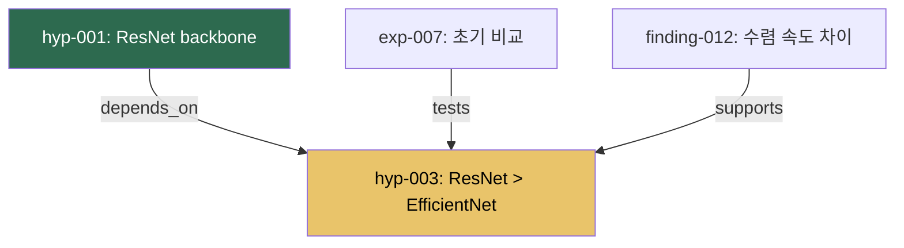

# EMDD: Evolving Mindmap-Driven Development

## Manifesto v0.4

> **EMDD는 AI가 유지하는 진화하는 지식 그래프를 통해, R&D의 탐구에 구조를 부여하되 탐구를 죽이지 않는 방법론이다.**

---

## 1. 문제 인식

소프트웨어 공학은 "무엇을 만들지 아는 상태"를 전제로 발전해왔다. Spec-Driven Development, Waterfall, 심지어 Agile조차 — 도착지가 존재한다는 가정 위에 서 있다. Sprint의 끝에는 deliverable이 있고, ticket에는 acceptance criteria가 있다. 이것은 개발에는 작동한다. 그러나 연구에는 작동하지 않는다. 연구란 본질적으로 "specification이 없는 탐구"이기 때문이다.

그 반대편에는 vibe-coding이 있다. 직관을 따라 자유롭게 탐색하는 방식이다. 이것은 창의적이지만 치명적인 결함이 있다: 재현 불가능하고, 어제의 발견이 오늘의 맥락에서 사라지며, 같은 막다른 길을 반복해서 걷게 된다. James March가 말한 exploration과 exploitation의 긴장 — 탐구와 활용 사이의 균형 — 은 개인 연구자의 작업 방식에서도 정확히 재현된다.

**너무 많은 구조는 탐구를 질식시키고, 너무 적은 구조는 탐구를 증발시킨다.**

기존 방법론들은 이 문제의 한 단면만을 포착한다. HDD는 가설 검증 루프를 제공하지만 가설 간의 관계를 추적하지 않는다. DDP는 가정의 우선순위를 매기지만 예상 밖의 연결을 수용하지 못한다. nbdev는 코드와 문서를 통합하지만 지식의 진화를 표현하지 못한다. Zettelkasten은 상향식 emergence를 만들어내지만 "다음에 무엇을 탐구해야 하는가"를 말해주지 않는다.

우리에게 필요한 것은 이 모든 것의 교집합이 아니라, 이들이 공유하는 하나의 부재를 채우는 것이다: **탐구 자체를 위한, 살아 움직이는 구조.**

---

## 2. EMDD 등식

```
EMDD = Zettelkasten의 상향식 emergence
     + DDP의 위험 우선 검증
     + InfraNodus의 구조적 공백 탐지
     + Graphiti의 시간적 진화
     ─────────────────────────────────
       AI agent의 자율적 유지보수와 제안
```

인간의 인지 부하를 그래프와 AI에게 위임하되, 판단은 위임하지 않는다.

---

## 3. 핵심 원칙 (7개)

### 원칙 1: Graph as First-Class Citizen
코드가 아니라 그래프가 프로젝트의 source of truth이다. 노드는 코드 모듈이 아니라 **지식과 가설**을 담는다. 그래프는 "지금까지 무엇을 알게 되었는가"와 "다음에 무엇을 알아야 하는가"를 동시에 표현한다. 코드는 그래프 노드에서 파생되는 artifact이다.

### 원칙 2: Minimum Viable Structure
구조는 필요한 최소량만 존재해야 한다. 노드의 형식이 자유롭고, 연결의 의미가 느슨하며, 전체 그래프의 형태가 예측 불가능할 때 — 구조가 올바르게 작동하고 있는 것이다. 관료주의가 느껴지는 순간, 구조를 줄여야 한다.

### 원칙 3: Gap-Driven Exploration
그래프에서 가장 가치 있는 정보는 노드에 있지 않다 — 노드 사이의 빈 공간에 있다. 연결되어야 할 것 같은데 연결되지 않은 클러스터, 답이 없는 질문, 검증이 없는 가설. AI agent는 이 공백을 탐지하고 제안한다. 연구자는 추구할 가치가 있는 것을 선별한다.

### 원칙 4: Temporal Evolution
노드는 생성되고, 수정되고, 폐기된다. 가설은 검증되거나 반증된다. 이 모든 변화의 이력이 그래프 안에 보존되어야 한다. "어떻게 여기까지 왔는가"를 추적하는 것이 연구에서는 결과만큼 중요하다. **잘못된 경로를 삭제하지 말라 — 그것이 왜 잘못되었는지가 지식이다.**

### 원칙 5: Riskiest-First Ordering
가장 불확실하고, 실패 시 전체 방향을 바꿀 수 있는 가설을 먼저 검증한다. 확실한 것을 먼저 하는 것은 심리적으로 편하지만 전략적으로 잘못되었다. AI agent는 "이것이 무너지면 저것도 무너진다"는 위험 전파 경로를 식별하고, 검증 우선순위를 제안한다.

### 원칙 6: Dual Trigger Evolution
그래프의 변화는 단일 방향이 아니다. 인간 연구자가 실험 결과를 입력하면 그래프가 진화한다. AI agent가 패턴을 발견하거나 외부 지식과의 충돌을 감지하면 그래프가 진화한다. 이 양방향 촉발이 EMDD의 핵심 역학이다.

### 원칙 7: Taste over Technique
AI는 논문을 읽고, 패턴을 매칭하고, 코드를 생성하고, 실험을 실행하는 데 인간보다 빠르다. 그러나 "이 방향이 추구할 가치가 있는가", "이 결과가 흥미로운가"라는 판단은 인간의 영역이다. EMDD에서 AI의 제안은 언제나 제안이지 결정이 아니다.

---

## 4. 세 개의 역할

### The Researcher (인간): 취향, 판단, 도약

- **취향을 행사한다** — AI가 제안한 탐구 방향 중 추구할 가치가 있는 것을 고른다
- **판단을 내린다** — 가설을 수정/폐기할지 결정한다
- **도약한다** — 그래프의 논리적 구조에서는 도출되지 않는 직관적 연결, 유추, 재구성을 만든다
- 핵심 행위: **노드의 생성과 가설의 판정**

### The Graph (artifact): 살아있는 지식 구조

세 가지 역할을 동시에 수행한다:
- **지식 표현**: 현재까지 알려진 것과 알려지지 않은 것의 지도
- **프로젝트 로드맵**: 빈 공간과 미검증 가설이 자연스럽게 "다음에 할 일"을 구성
- **연구 기억**: 시도했던 경로, 실패한 가설, 변경된 방향의 이력

### The Agent (AI): 정원사

AI agent는 그래프의 **정원사(gardener)**이지 건축가(architect)가 아니다:
- **유지보수**: 연결 정리, 중복 탐지, 고아 노드 식별, 일관성 유지
- **패턴 탐지**: 연구자가 놓친 노드 간의 연결 가능성 식별
- **공백 제안**: 구조적 공백 분석 → 탐구 방향 제안
- **자동화**: 문헌 검색, 실험 코드 생성, 결과 요약 (technique 영역)

---

## 5. EMDD가 아닌 것

- **프로젝트 관리 도구가 아니다**: 마감일도 없고, 진척률도 없다. "무엇을 알고 있고 무엇을 모르는가"를 추적한다.
- **지식 베이스가 아니다**: 정리된 정보가 아니라 정보 간의 긴장, 모순, 공백이 가치다. 깔끔한 그래프는 죽은 그래프다.
- **SDD에 그래프를 붙인 것이 아니다**: Specification이 먼저가 아니다. 탐구 과정에서 방향이 emergent하게 나타난다.
- **개인 지식 관리 시스템이 아니다**: **프로젝트에 한정된다(project-scoped)**. 평생의 지식을 담는 second brain이 아니라, 하나의 탐구를 위한 working memory이다.
- **AI에게 연구를 맡기는 것이 아니다**: AI는 가지를 치고, 물을 주고, "저쪽에 빈 땅이 있다"고 알려줄 뿐이다.

---

## 6. 그래프 스키마

### 6.1 설계 원칙

1. **Knowledge-first**: 노드는 코드가 아닌 지식 단위를 표현. 코드는 Experiment의 artifact로만 참조
2. **Temporal-aware**: 모든 노드/엣지에 생성/수정/폐기 시점 기록
3. **Confidence-propagating**: 신뢰도는 evidential edge를 따라 전파
4. **Gap-detecting**: 그래프 구조에서 "연구해야 할 빈 공간" 탐지 가능
5. **Dual-agency**: 인간과 AI 모두 생성/수정 가능, 누가 했는지 항상 추적

<!-- v0.3: Finding/Insight 통합으로 노드 타입 8종→7종 -->
### 6.2 노드 타입 (7종)

<!-- AUTO:node-types -->
<!-- Generated from schema.config.ts — DO NOT EDIT -->
| Type | Prefix | Directory | Status Count |
|------|--------|-----------|-------------|
| hypothesis | hyp | hypotheses | 7 |
| experiment | exp | experiments | 5 |
| finding | fnd | findings | 4 |
| knowledge | knw | knowledge | 4 |
| question | qst | questions | 4 |
| decision | dec | decisions | 5 |
| episode | epi | episodes | 2 |
<!-- /AUTO:node-types -->

<!-- AUTO:statuses -->
<!-- Generated from schema.config.ts — DO NOT EDIT -->
| Type | Statuses |
|------|----------|
| hypothesis | PROPOSED, TESTING, SUPPORTED, REFUTED, REVISED, DEFERRED, CONTESTED |
| experiment | PLANNED, RUNNING, COMPLETED, FAILED, ABANDONED |
| finding | DRAFT, VALIDATED, PROMOTED, RETRACTED |
| knowledge | ACTIVE, DISPUTED, SUPERSEDED, RETRACTED |
| question | OPEN, RESOLVED, ANSWERED, DEFERRED |
| decision | PROPOSED, ACCEPTED, SUPERSEDED, REVERTED, CONTESTED |
| episode | ACTIVE, COMPLETED |
<!-- /AUTO:statuses -->

| 타입 | 색상 | 의미 | 핵심 속성 |
|------|------|------|----------|
| **Knowledge** | 파랑 | 확인된 사실, 문헌, 도메인 규칙 | `knowledge_type`, `source`, `confidence` |
| **Hypothesis** | 주황 | 검증 가능한 주장 | `confidence`, `risk_level`, `priority`, `status`, `kill_criterion` |
| **Experiment** | 초록 | 가설 검증을 위한 실험 단위 | `config`, `status`, `results`, `artifacts` |
| **Finding** | 청록 | 실험/분석에서 나온 사실 또는 노드 간 패턴 발견 | `finding_type`, `confidence`, `sources` |
| **Question** | 노랑 | 열린 연구 질문 | `question_type`, `urgency`, `answer_summary` |
| **Decision** | 검정 | 내린 결정과 근거 | `alternatives_considered`, `rationale`, `reversibility` |
| **Episode** | 회색 | 하나의 탐구 루프 기록 | `trigger`, `duration`, `outcome`, `spawned`, `dead_ends` |

<!-- v0.3: Insight가 Finding에 흡수됨. finding_type으로 구분 -->
**Finding의 하위 유형 (`finding_type` 필드):**

| `finding_type` | 의미 | 예시 |
|----------------|------|------|
| `observation` | 하나의 실험/분석에서 직접 관찰된 구체적 결과 | "데이터셋의 73%가 표준 224x224 리사이즈에서 소실되는 소형 결함(<10px)이다" (find-005) |
| `insight` | 여러 Finding/Knowledge를 조합하여 발견한 상위 패턴 | "스크래치 결함과 피트 결함은 근본적으로 다른 검출 전략이 필요하다" |
| `negative` | 확인된 부재 또는 실패 — "X는 아니다"라는 형태의 사실 | "표준 증강(flip, rotate)은 길쭉한 스크래치 결함의 재현율을 개선하지 않는다" |

`observation`은 재현 가능한 단일 실험 결과, `insight`는 그래프 위에서 emerge한 교차 패턴, `negative`는 특정 경로가 작동하지 않음을 확정하는 결과이다. 세 유형 모두 `findings/` 디렉토리에 저장한다.

**Finding vs Knowledge 구분:**

```
Finding  = "실험/분석에서 나온 사실, 또는 노드 간 패턴의 발견"
           하위 유형: observation, insight, negative
           특성: 중간 산출물. 개별 또는 소수의 근거에 기반.

Knowledge = "확정되어 재사용 가능한 사실"
            예: "결함 크기 분포는 5px와 45px에서 이봉 분포를 보인다" (know-003)
            특성: Finding에서 승격된 것. 다른 작업의 전제로 사용 가능.
                  Consolidation에서 승격 기준을 충족한 Finding.
```

**승격 경로**: `Finding → (Consolidation 승격) → Knowledge`. Finding은 중간 산출물이고, Knowledge는 확정된 재사용 가능 사실이다.

<!-- v0.4: Consolidation Hint Tags -->
**Consolidation Hint**: Finding의 links에 `extends: know-NNN` 힌트를 기재할 수 있다. 이 힌트는 해당 Finding이 특정 Knowledge를 확장하거나 보강한다는 의미이며, Consolidation 승격 단계에서 "hint가 있는 Finding부터 검토"하여 판단을 가속한다. 단, 힌트는 승격 기준을 면제하지 않는다 — 승격 기준(독립 지지 2개+, confidence ≥ 0.9, 사실상 사용 중)은 동일하게 적용한다.

**승격 기준** (Consolidation에서 적용, 하나 이상 충족):
- **독립 지지**: 2개 이상의 독립적인 Finding 또는 Experiment가 해당 사실을 지지
- **높은 확신**: confidence ≥ 0.9
- **사실상 사용 중**: 다른 작업의 전제로 이미 참조되고 있음 (de facto Knowledge)

**승격 시 고려 (반증 캐스케이드 비용):**
- 이 Knowledge에 의존하게 될 노드가 많을수록 승격을 신중히 판단한다 — RETRACTED 시 파급이 크기 때문
- 활성 `CONTRADICTS` 엣지가 존재하면 승격하지 않는다 (DISPUTED 상태의 Knowledge가 탄생하므로)
- 승격 기준을 충족하지 못한 Finding은 승격 기각 사유를 기록한다 (다음 Consolidation에서 재검토)

### 6.3 Episode 노드 — 연구 에피소드

Episode는 하나의 탐구 루프(= 하나의 세션, 또는 하나의 의미 있는 탐구 단위)를 기록하는 노드다. Finding이 "무엇을 알게 되었는가"를 기록한다면, Episode는 **"무엇이 일어났는가"** 전체를 기록한다 — 성공, 실패, 시도하지 않기로 한 것, 다음에 할 것 모두.

**Episode가 필요한 이유:** Finding만 축적되면 그래프가 "하이라이트 릴"이 된다 (Anti-pattern 2). 왜 이 방향을 선택했고, 어떤 시도가 막혔고, 무엇을 보류했는지가 사라진다. Episode는 연구의 "내러티브 스레드"를 보존한다.

**Episode 노드 포맷:**

```markdown
---
id: ep-003
type: episode
trigger: "find-005 완료 → 소형 결함 분석이 다음 우선순위"
created: 2026-03-15
duration: ~2h
outcome: success
created_by: human:bjkim + ai:claude
tags: [small-defects, resolution, augmentation]
links:
  - target: find-010
    relation: produces
  - target: find-005
    relation: extends
  - target: q-006
    relation: spawns
---

# EP-003: 소형 결함 검출 전략

## 목표
모델이 10px 미만 결함에서 실패하는 이유를 조사하고 완화 전략 식별

## 시도한 것
- [✓] 데이터셋 분포 분석: 전체 카테고리에 걸친 결함 크기 히스토그램
- [✓] 다중 해상도 추론: 224, 384, 512, 768px 입력 크기 테스트
- [✓] 타일 기반 추론: 이미지를 겹치는 256×256 타일로 분할
- [✓] 타일 기반 접근법이 누락된 소형 결함의 89%를 복구함을 확인

## 막혔던 것 / 실패
- 384px 입력이 소형 결함 재현율은 개선했지만 대형 결함 정밀도를 저하시킴
- 초기 타일링 접근법이 타일 경계의 결함을 놓침 → 25% 오버랩 필요
- find-005의 가정(균일한 결함 크기 분포)이 틀림 → 심하게 편향됨

## 하지 않기로 한 것
- 초해상도 전처리: 프로덕션 추론에 너무 느림, ROI 불분명
- find-005 어노테이션 재라벨링: 현재 어노테이션이 ground truth, 재라벨링은 노이즈 도입 위험

## 다음에 할 것
- [ ] 적응형 타일링 구현: 관심 영역 식별을 위한 거친 패스 후 고해상도 타일
  - 선행 읽기: know-003, find-010, find-005
- [ ] ImageNet 사전학습 vs 도메인 특화 백본으로 타일 기반 결과 비교
  - 선행 읽기: know-003, find-007, find-008, find-009
- [ ] 스크래치 결함이 피트 결함보다 낮은 재현율을 보이는 이유 조사 (q-006)
  - 선행 읽기: find-010, q-006

## 떠오른 질문
- 결함 종횡비(길쭉한 vs 원형)가 크기보다 검출에 더 영향을 미치는가?
- 2단계 검출기(영역 제안 + 분류)가 소형 결함에서 단일 단계보다 우수할까?
```

**Episode 작성 시점:** 탐구 루프가 끝날 때 (= 자연스러운 중단점에서). 일일 리플렉션이나 다음 세션 시작 전에 작성.

<!-- v0.4: Skeleton Episode — 필수/선택 섹션 분리 -->
**Episode 섹션 (필수 + 선택):**

| 섹션 | 필수/선택 | 기록 대상 | Anti-pattern 방지 |
|------|----------|----------|------------------|
| 시도한 것 | **필수** | 성공한 접근, 사용한 도구/방법 | Under-Feeding 방지 |
| 다음에 할 것 | **필수** | 구체적 다음 단계 + **선행 읽기 노드 목록** | 방향 유실 + 컨텍스트 유실 방지 |
| 막혔던 것 | 선택 (해당 시) | 실패, 오류, 잘못된 가정 | Graph Amnesia 방지 |
| 하지 않기로 한 것 | 선택 (해당 시) | 의식적으로 보류/기각한 방향과 이유 | 반복 탐구 방지 |
| 떠오른 질문 | 선택 (해당 시) | 새로 생긴 의문, 아이디어 | Question 고갈 방지 |

빈 선택 섹션은 생략한다. 모든 세션이 막히거나 기각 결정을 내리는 것은 아니며, 빈 섹션은 노이즈만 추가한다.

**"다음에 할 것"의 선행 읽기:** 각 다음 단계 항목 아래에 `선행 읽기: node-id, node-id, ...`를 기재한다. 이것은 다음 세션에서 해당 작업을 시작할 때 **반드시 먼저 읽어야 할 노드**의 목록이다. 이전 Episode가 다음 Episode의 컨텍스트를 큐레이션하는 것이다.

<!-- v0.3: 상태 마커 테이블 추가 -->
**"다음에 할 것"의 상태 마커:** 각 항목에 상태를 표시하여 추적한다:

| 마커 | 의미 | 사용 시점 |
|------|------|----------|
| `[ ]` | 미착수 | Episode 작성 시 기본값 |
| `[done]` | 완료 | 후속 Episode에서 체크 |
| `[deferred]` | 보류 | 우선순위 밀림 or 선행조건 미충족 |
| `[superseded]` | 무효화 | 새 정보로 더 이상 의미 없음 (이유 기재) |

Consolidation에서 `[deferred]` 항목이 3개 이상 누적되면 별도 검토: Question으로 승격하거나, 의식적으로 기각(→ "하지 않기로 한 것"으로 이동).

**"하지 않기로 한 것"의 검색성:** Episode 본문에 묻히면 6개월 뒤 찾을 수 없다. 두 가지로 보완한다:

1. Episode frontmatter의 `tags`에 `not-pursued` 접미사를 붙인다:
   ```yaml
   tags: [small-defects, resolution, not-pursued:super-resolution, not-pursued:annotation-relabel]
   ```
   이렇게 하면 `not-pursued:` 접두어로 그래프 전체를 검색할 수 있다.

2. `_index.md`의 클러스터에 **Negative Decisions** 서브섹션을 두어 주요 기각 사항을 한 줄로 요약한다:
   ```markdown
   **Negative Decisions**
   - 초해상도 전처리 → 불필요 (ep-003: 타일 기반 추론이 10배 속도로 유사한 재현율 달성)
   ```

<!-- v0.3: frontmatter lowercase 매핑 노트 + CONFIRMS 추가로 14종 -->
### 6.4 엣지 타입 (16종)

<!-- AUTO:edge-types -->
<!-- Generated from schema.config.ts — DO NOT EDIT -->
| # | Edge Type |
|---|-----------|
| 1 | answers |
| 2 | confirms |
| 3 | context_for |
| 4 | contradicts |
| 5 | depends_on |
| 6 | extends |
| 7 | informs |
| 8 | part_of |
| 9 | produces |
| 10 | promotes |
| 11 | relates_to |
| 12 | resolves |
| 13 | revises |
| 14 | spawns |
| 15 | supports |
| 16 | tests |
<!-- /AUTO:edge-types -->

<!-- AUTO:reverse-labels -->
<!-- Generated from schema.config.ts — DO NOT EDIT -->
| Reverse Label | Forward Edge |
|---------------|-------------|
| answered_by | answers |
| confirmed_by | confirms |
| produced_by | produces |
| resolved_by | resolves |
| spawned_from | spawns |
| supported_by | supports |
| tested_by | tests |
<!-- /AUTO:reverse-labels -->

**Frontmatter 표기 규칙:** YAML frontmatter의 `relation:` 필드는 소문자 현재형으로 기재한다 (예: `relation: produces`). 이것은 정형 타입 `PRODUCES`에 매핑된다. 아래 표의 대문자 이름이 정형 타입이고, frontmatter에서는 소문자 snake_case를 사용한다.

**역방향 라벨 허용:** 노드 A에서 target B로의 링크를 기재할 때, 의미상 B→A 방향의 관계를 표현해야 하는 경우가 있다. 이때 `_by` 또는 `_from` 접미사를 붙인 역방향 라벨을 사용할 수 있다: `confirmed_by`, `supported_by`, `answered_by`, `spawned_from`, `produced_by`, `tested_by`. 이들은 각각 `CONFIRMS`, `SUPPORTS`, `ANSWERS`, `SPAWNS`, `PRODUCES`, `TESTS`의 역방향이다. 정규 방향의 링크를 반대쪽 파일에 중복 기재하지 않는다.

**증거 관계:**
- `SUPPORTS` — A가 B를 지지 (strength: 0.0~1.0)
- `CONTRADICTS` — A가 B와 모순 (severity: FATAL / WEAKENING / TENSION)
- `CONFIRMS` — A가 B를 강하게 확인 (`SUPPORTS(strength≥0.9)`의 편의 별칭)

**생성 관계:**
- `SPAWNS` — A에서 B가 파생됨 (Question→Hypothesis, Hypothesis→Experiment 등)
- `PRODUCES` — A의 실행이 B를 생성함 (Episode→Finding, Experiment→Finding)
- `ANSWERS` — A가 B에 대한 답을 제공 (completeness: 0.0~1.0)
- `REVISES` — A가 B의 수정 버전
- `PROMOTES` — A가 B로 승격됨 (Finding→Knowledge, Consolidation에서)

**구조 관계:**
- `DEPENDS_ON` — A가 B에 의존 (LOGICAL / PRACTICAL / TEMPORAL)
- `EXTENDS` — A가 B의 결과를 기반으로 더 깊이 탐구함 (Finding→Finding, Episode→Episode)
- `RELATES_TO` — A와 B가 관련 (약한 방향성, Zettelkasten 스타일)
- `INFORMS` — A가 B의 판단에 영향 (DECISIVE / SIGNIFICANT / MINOR)

**구성 관계:**
- `PART_OF` — A가 B의 하위 요소
- `CONTEXT_FOR` — A가 B의 맥락/배경 지식
- `RESOLVES` — A가 branch group B의 결과를 해결. 역방향 라벨: `resolved_by`
- `TESTS` — A가 B를 테스트 (Experiment가 Hypothesis를 테스트). 역방향 라벨: `tested_by`

**엣지 선택 가이드 (자주 혼동되는 쌍):**

| 상황 | 올바른 엣지 | 오용 주의 |
|------|-----------|----------|
| Episode에서 Finding이 나왔다 | `PRODUCES` | ~~SPAWNS~~ (SPAWNS는 논리적 파생, PRODUCES는 활동의 산출물) |
| find-010이 find-005를 기반으로 더 깊이 파고들었다 | `EXTENDS` | ~~REVISES~~ (REVISES는 수정/대체, EXTENDS는 심화) |
| Finding이 Knowledge로 승격됐다 | `PROMOTES` | ~~SPAWNS~~ (SPAWNS는 새 노드 파생, PROMOTES는 동일 사실의 승격) |
| Question에서 Hypothesis가 나왔다 | `SPAWNS` | 정확한 사용 |
| Finding이 가설을 거의 확실히 지지한다 | `CONFIRMS` | `SUPPORTS(strength≥0.9)`와 동일. 약한 지지에는 `SUPPORTS` 사용 |

### 6.5 Hypothesis Status 전이

<!-- AUTO:transition-rules -->
<!-- Generated via @beomjk/state-engine — DO NOT EDIT -->
**hypothesis**
| From | To | Conditions |
|------|----|------------|
| PROPOSED | TESTING | has_linked(type=experiment, status=RUNNING, direction=any) |
| PROPOSED | SUPPORTED | has_linked(relation=supports, min_strength=0.7, direction=incoming) |
| TESTING | CONTESTED | has_linked(type=decision, status=CONTESTED, direction=incoming) |
| TESTING | REVISED | has_linked(relation=revises, direction=incoming) |
| TESTING | SUPPORTED | has_linked(relation=supports, min_strength=0.7, direction=incoming) |
| TESTING | REFUTED | has_linked(relation=contradicts, direction=incoming) |
| CONTESTED | REVISED | has_linked(relation=revises, direction=incoming) |
| CONTESTED | SUPPORTED | has_linked(relation=supports, min_strength=0.7, direction=incoming), has_linked(type=decision, status=ACCEPTED, direction=incoming) |
| CONTESTED | REFUTED | has_linked(relation=contradicts, direction=incoming), has_linked(type=decision, status=ACCEPTED, direction=incoming) |

**knowledge**
| From | To | Conditions |
|------|----|------------|
| ACTIVE | DISPUTED | has_linked(relation=contradicts, direction=incoming) |
| ACTIVE | SUPERSEDED | has_linked(relation=revises, type=knowledge, direction=incoming) |
| DISPUTED | SUPERSEDED | has_linked(relation=revises, type=knowledge, direction=incoming) |
| DISPUTED | ACTIVE | all_linked_with(relation=contradicts, status=RETRACTED) |

<!-- /AUTO:transition-rules -->

#### Manual Transitions

<!-- AUTO:manual-transitions -->
<!-- Generated via @beomjk/state-engine — DO NOT EDIT -->
**hypothesis**
| From | To |
|------|----|
| ANY | DEFERRED |

**knowledge**
| From | To |
|------|----|
| DISPUTED | RETRACTED |

<!-- /AUTO:manual-transitions -->

```
PROPOSED → TESTING       : 연결된 Experiment가 RUNNING
PROPOSED → SUPPORTED     : SUPPORTS edge (strength ≥ 0.7), 실험 없이 직행
TESTING  → SUPPORTED     : SUPPORTS edge (strength ≥ 0.7)
TESTING  → REFUTED       : CONTRADICTS edge 존재
TESTING  → REVISED       : 부분적 지지/반박 → 수정 가설 (REVISES edge)
ANY      → DEFERRED      : 인간이 명시적으로 보류
```

### 6.5a Kill Criterion 검토 프로토콜

모든 Hypothesis 노드에는 `kill_criterion` 필드가 있다 — 충족 시 해당 가설을 포기해야 함을 의미하는 구체적이고 반증 가능한 조건이다. 하지만 kill criterion은 실제로 검토해야만 의미가 있다. 이 섹션은 검토 프로토콜을 정의한다.

#### Kill Criterion 형식

잘 작성된 kill criterion의 조건:
- **측정 가능**: 특정 지표나 관찰 가능한 결과에 연결
- **시간 제한**: 마감일이나 트리거 조건 포함
- **명확함**: 두 사람이 읽었을 때 충족 여부에 동의할 수 있어야 함

**좋은 예시:**
- `"augmentation 적용 100 epochs 후 mAP@0.5 < 0.60"` — 지표, 임계값, 조건
- `"3회 연속 실험 후 수렴 개선 없음"` — 패턴 기반, 측정 가능
- `"대상 하드웨어에서 이미지당 실행 시간 > 10초"` — 지표, 임계값, 맥락

**나쁜 예시:**
- `"안 되면"` — 측정 불가
- `"성능이 나쁨"` — 모호함
- `"mAP < 0.60"` — 시간 제한이나 실험 맥락 없음

#### 검토 트리거

Kill criteria는 다음 시점에 검토된다:

| 트리거 | 검토 주체 | 충족 시 조치 |
|--------|----------|-------------|
| **실험 완료** | AI 에이전트 (자동) | 가설 플래그 및 연구자에게 알림 |
| **마일스톤 세러모니** | 연구자 + AI | 모든 활성 가설의 kill criteria 검토 |
| **주간 리뷰** | 연구자 | kill 임계값에 근접한 가설 스캔 |
| **Confidence 0.3 미만 하락** | AI 에이전트 (자동) | 연구자에게 kill criterion 상기 |
| **가설 정체 (14일 이상)** | AI 에이전트 (자동) | TESTING 상태에서 14일 이상 업데이트 없는 가설 플래그 |

#### Kill Criterion 충족 시 절차

1. **즉시 REFUTE하지 않는다.** Kill criterion은 신호이지, 자동 판결이 아니다.
2. **기준이 공정하게 테스트되었는지 확인:**
   - 실험이 올바르게 구성되었는가?
   - 교란 요인이 있었는가?
   - 기준 자체가 여전히 적절한가, 맥락이 변했는가?
3. **확인된 경우 → 마일스톤 세러모니:**
   - 가설 상태를 `REFUTED`로 설정
   - 증거를 Finding으로 기록 (`finding_type: negative`)
   - Decision 노드에 결정 기록 (근거: 어떤 kill criterion이 충족되었는지, 증거)
   - 종속 가설 확인 — 재평가가 필요한 것이 있는가?
4. **기준 수정이 필요한 경우:**
   - 가설의 새 버전 생성 (REVISES edge)
   - 더 명확한/업데이트된 조건으로 kill criterion 갱신
   - 원래 기준이 불충분했던 이유 기록 (Finding, `finding_type: negative`)

#### Kill Criterion 노후화

테스트할 수 없는 kill criterion은 무용하다. 주의할 점:
- **테스트 불가 기준**: 필요한 실험이 비용이 너무 크거나 불가능 → 기준 수정 또는 가설 분할
- **이동하는 골대**: 결과가 근접하면 기준이 계속 상향 조정됨 → 안티패턴 4 (역방향 조기 수렴 — 킬 거부)
- **잊힌 기준**: 가설이 몇 주간 TESTING이지만 kill criterion을 대상으로 한 실험 없음 → AI가 플래그해야 함

#### AI 에이전트 책임

AI 에이전트는:
- **실험 완료 시**: 결과를 모든 활성 가설의 kill criteria와 비교. 기준 충족 또는 근접(임계값의 10% 이내) 시 연구자에게 알림.
- **주간 리뷰 시**: 2주 이상 테스트되지 않은 kill criteria가 있는 가설 목록 제시.
- **Consolidation 시**: kill criterion 텍스트가 오래된 Finding이나 Knowledge를 참조하는지 확인.
- **절대 안 됨**: kill criterion에 기반하여 자율적으로 가설 상태를 변경. 이는 항상 인간의 결정이다 (원칙 7: 기법보다 판단).

<!-- v0.3: Knowledge status 전이 신설 -->
### 6.6 Knowledge Status 전이

Knowledge는 승격 후에도 상태가 변할 수 있다. 새로운 Finding이 기존 Knowledge와 모순될 때, 해당 Knowledge는 재검토 대상이 된다.

```
ACTIVE      → DISPUTED    : CONTRADICTS edge from new Finding
DISPUTED    → ACTIVE      : contradiction resolved (Finding retracted or reconciled)
DISPUTED    → SUPERSEDED  : new Knowledge replaces this one (REVISES edge)
DISPUTED    → RETRACTED   : contradiction confirmed, no replacement
ACTIVE      → SUPERSEDED  : direct replacement without dispute phase
```

**DISPUTED 전이 시 수행 사항:**
1. 이 Knowledge에 `SUPPORTS` 또는 `DEPENDS_ON` 엣지로 연결된 모든 Hypothesis의 confidence에 severity 기반 penalty를 적용한다:
   - `FATAL`: ×0.5 — 핵심 전제가 무너진 경우
   - `WEAKENING`: ×0.7 — 부분적 모순, 수정으로 살릴 가능성
   - `TENSION`: ×0.9 — 해석 차이 수준, 추가 조사 필요
2. 이 Knowledge가 클러스터 진입점인 경우, `_index.md`에 "⚠ disputed" 경고를 표시한다
3. 이 Knowledge를 `rationale`에서 인용하는 모든 Decision에 "⚠ review needed" 태그를 추가한다

**RETRACTED 전이 시 수행 사항:**
4. Knowledge 파일을 `knowledge/` 디렉토리에 그대로 유지하되 `status: retracted`로 변경한다. 파일을 이동하지 않는다 — 기존 `[[knowledge/know-XXX]]` 참조가 깨지지 않도록 하기 위함이며, 원칙 4(Temporal Evolution)에 따라 이력을 보존한다. 원본 Finding의 confidence를 하향 조정한다.
5. 클러스터 진입점이었다면 대체 진입점을 지정한다
6. "왜 이것이 Knowledge로 조기 승격되었는가?"를 분석하여 retraction Finding(`finding_type: negative`)으로 기록한다
7. 동일 클러스터에서 2개 이상의 Knowledge가 RETRACTED된 경우 피벗 세러모니를 트리거한다

### 6.7 Confidence 전파 (Bayesian-inspired)

<!-- AUTO:thresholds -->
<!-- Generated from schema.config.ts — DO NOT EDIT -->
| Threshold | Value |
|-----------|-------|
| branch_convergence_gap | 0.3 |
| branch_convergence_weeks | 2 |
| branch_max_active | 3 |
| branch_max_candidates | 4 |
| branch_max_open_weeks | 4 |
| kill_confidence | 0.3 |
| kill_stale_days | 14 |
| min_independent_supports | 2 |
| promotion_confidence | 0.9 |
| support_strength_min | 0.7 |
<!-- /AUTO:thresholds -->

```python
def update_hypothesis_confidence(hypothesis):
    prior = hypothesis.initial_confidence
    for edge in hypothesis.incoming_evidential_edges:
        if edge.type == "SUPPORTS":
            impact = edge.source.confidence * edge.strength
            prior = prior + (1 - prior) * impact * 0.3
        elif edge.type == "CONTRADICTS":
            impact = edge.source.confidence * severity_weight(edge.severity)
            prior = prior * (1 - impact * 0.5)
    return clamp(prior, 0.0, 1.0)
```

**`severity_weight` 정의:**

| Severity | 가중치 | 의미 |
|----------|--------|------|
| `FATAL` | 0.9 | 핵심 전제 붕괴 — 거의 전면적 영향 |
| `WEAKENING` | 0.6 | 부분적 모순 — 심각하지만 회복 가능 |
| `TENSION` | 0.3 | 해석적 차이 — 조사가 필요함 |

> 참고: 이 가중치는 confidence 공식에서 모순 증거의 *영향 크기*를 나타낸다. §6.6(DISPUTED 전이)의 *페널티 승수*와는 다른 값이다 — 페널티 승수는 의존 가설의 confidence에 직접 적용된다.

**상수 설계 근거:**
- `0.3` (SUPPORTS 계수): 보수적 업데이트 — 지지 증거 하나가 confidence를 30% 이상 이동시키지 않는다. 초기 긍정 결과에 대한 조기 수렴을 방지한다.
- `0.5` (CONTRADICTS 계수): 대칭적 대응 — 모순 증거도 한 번에 confidence를 파괴하지 않는다. 모순 자체가 결함일 수 있는 가능성을 허용한다.

**CONFIRMS 처리:** `CONFIRMS` 에지는 `SUPPORTS`와 동일하게 처리되며, `strength = 1.0`으로 취급한다.

**계산 예제:**

```
Hypothesis H-001 (initial_confidence: 0.40)

Step 1: SUPPORTS 에지 도착
  source.confidence = 0.90, strength = 0.80
  impact = 0.90 x 0.80 = 0.72
  new_confidence = 0.40 + (1 - 0.40) x 0.72 x 0.3
                 = 0.40 + 0.60 x 0.72 x 0.3
                 = 0.40 + 0.1296
                 = 0.5296

Step 2: CONTRADICTS 에지 도착
  source.confidence = 0.70, severity = WEAKENING (weight = 0.6)
  impact = 0.70 x 0.6 = 0.42
  new_confidence = 0.5296 x (1 - 0.42 x 0.5)
                 = 0.5296 x (1 - 0.21)
                 = 0.5296 x 0.79
                 = 0.4184

최종 confidence: 0.42 (반올림)
```

### 6.8 구조적 공백 탐지 (5종)

| Gap Type | 탐지 방법 | 출력 |
|----------|----------|------|
| **Disconnected Clusters** | 커뮤니티 탐지 후 클러스터 간 엣지 수 < threshold | Question 자동 제안 |
| **Untested Hypotheses** | PROPOSED 상태 + (N일 경과 **또는** updated 이후 M개 에피소드) | 실험 설계 제안 |
| **Blocking Questions** | OPEN + urgency=BLOCKING + (N일 경과 **또는** updated 이후 M개 에피소드) | 즉시 해소 촉구 |
| **Stale Knowledge** | N개월 된 source + 같은 클러스터에 새 Knowledge 추가 (일수 기반만) | 업데이트 필요 경고 |
| **Orphan Findings** | Finding 노드에 outgoing `edgeCategories.value_producing` 에지 없음 (12종) | 새 질문/가설 연결 제안 |

**Dual-Trigger 탐지 (일수 + 에피소드):**

Untested Hypotheses와 Blocking Questions는 이중 트리거 시스템을 사용한다: 일수 임계값 **또는** 에피소드 임계값 중 하나라도 충족되면 발동한다. 에피소드 수는 대상 노드의 `updated` 날짜 *이후*에 생성된 Episode 노드 수로 측정한다 (strict `>` 비교, 같은 날 생성된 에피소드는 제외).

- `stale_knowledge`는 외부 소스의 실제 노후화를 측정하므로 일수 기반만 유지한다.
- `orphan_finding`과 `disconnected_cluster`는 시간이나 세션과 무관한 구조적 공백이다.

각 탐지된 gap에는 `triggerType` 필드 (`'days'`, `'episodes'`, `'both'`)가 포함되어 어떤 트리거가 발동했는지 표시한다.

기본 에피소드 임계값: `untested_episodes: 3`, `blocking_episodes: 3` (Consolidation 케이던스와 동일).

### 6.9 토픽 클러스터와 컨텍스트 로딩

그래프가 성장하면 노드 수가 많아져 "지금 이 작업에 어떤 노드가 관련 있는가?"를 파악하기 어려워진다. 이를 해결하기 위해 두 가지 메커니즘을 사용한다.

**토픽 클러스터 (`_index.md`에 유지):**

`_index.md`의 노드 목록을 평면 나열이 아닌 **토픽별 클러스터**로 구조화한다. 각 클러스터에는 **진입점 노드**를 지정한다 — 해당 토픽에 대해 가장 먼저 읽어야 할, 핵심 사실이 요약된 Knowledge 또는 확정 Finding.

```markdown
## Cluster: Small Defect Detection
- **진입점**: know-003 (결함 크기 분포 + 검출 임계값)
- find-005 (크기 분석), find-010 (타일 기반 추론 결과)
- hyp-001, q-007, ep-001

## Cluster: Scratch Detection
- **진입점**: know-004 (스크래치 형태 분류)
- find-007, find-008, find-009
- hyp-003
```

클러스터 진입점은 Consolidation 세러모니에서 관리한다. Knowledge 노드가 승격되면 진입점 후보가 된다.

<!-- v0.3: 컨텍스트 로딩에 Consolidation 트리거 체크 추가 -->
**컨텍스트 로딩 프로토콜 (탐구 시작 전):**

새로운 탐구 루프(Episode)를 시작하기 전에 다음을 수행한다:

```
1. 직전 Episode의 "다음에 할 것" 확인
   → 해당 작업의 선행 읽기 노드를 모두 읽는다

2. 관련 토픽 클러스터의 진입점 노드를 읽는다
   → 작업 키워드와 클러스터 이름/태그를 매칭

3. 열린 Question 중 관련된 것을 확인한다
   → 탐구 도중 답을 발견할 수 있는 질문이 있는가?

4. Consolidation 트리거 체크 (숫자만)
   → Finding 미승격 수, Episode 축적 수를 확인
   → 트리거 충족 시 "[Consolidation 권장]" 메시지 출력
```

AI 에이전트의 경우, 이 프로토콜은 **세션 시작 시 자동으로 실행**한다. 인간 연구자의 경우, 모닝 브리핑에서 수행한다.

**원칙: Episode가 다음 Episode의 컨텍스트를 큐레이션한다.** 이전 세션에서 "다음에 무엇을 읽어야 하는가"를 기록해두면, 다음 세션에서는 제로에서 시작하는 것이 아니라 큐레이션된 맥락 위에서 시작한다. 이것은 인간 연구자의 lab notebook 습관과 같다 — "내일은 여기서 이어서, 먼저 이것을 확인하고 시작할 것."

### 6.10 병렬 탐구 (Parallel Exploration)

연구는 종종 분기점에 도달한다: "접근법 A를 시도할까, B를 시도할까?" 성급하게 선택하기보다(안티패턴 4: 조기 수렴), EMDD는 여러 경로를 동시에 탐구하고 증거가 충분할 때 수렴하는 것을 지원한다.

#### Branch Groups

**Branch group**은 같은 질문에 대한 대안적 접근법을 나타내는 경쟁 가설의 집합이다. 공통 부모 Question 또는 Hypothesis를 공유한다.

**Frontmatter 필드:**
```yaml
# 각 경쟁 가설에:
branch_group: bg-001
branch_role: candidate    # candidate | control | baseline
```

- `candidate` — 적극적으로 탐구 중인 접근법
- `control` — 비교를 위한 알려진 기준선 (선택적)
- `baseline` — 후보들을 측정하는 현재 상태 (선택적)

Branch group은 최소 2개의 `candidate` 멤버가 있어야 한다. `control`과 `baseline` 역할은 선택적이며 최소 요건에 포함되지 않는다.

**Branch group 생명주기:**
```
OPEN      -> CONVERGED   : 하나의 후보 선택, 나머지 아카이브
OPEN      -> MERGED      : 여러 후보의 통찰을 새 가설로 결합
OPEN      -> ABANDONED   : 모든 후보 실패, 부모 질문 재고 필요
```

#### Branch Group 생성

**트리거:** Question이나 Hypothesis가 2개 이상의 경쟁 접근법을 생성할 때.

부모 노드는 생성한 branch group을 기록한다. 각 후보 가설은 branch group을 참조하고 `spawned_from`(§6.4의 `SPAWNS` 역라벨)을 통해 부모에 연결한다.

```markdown
# 예: q-003이 두 개의 경쟁 가설을 생성

# graph/questions/q-003.md
---
id: q-003
type: question
question_type: strategic
spawns_branch_group: bg-001
---
# 우리 데이터셋에 최적의 백본 아키텍처는?

# graph/hypotheses/hyp-004.md
---
id: hyp-004
type: hypothesis
branch_group: bg-001
branch_role: candidate
status: testing
confidence: 0.5
links:
  - target: q-003
    relation: spawned_from
---
# ResNet-50이 소규모 데이터셋에 최적이다

# graph/hypotheses/hyp-005.md
---
id: hyp-005
type: hypothesis
branch_group: bg-001
branch_role: candidate
status: testing
confidence: 0.5
links:
  - target: q-003
    relation: spawned_from
---
# EfficientNet-B3이 컴퓨팅 제약을 고려하면 최적이다
```

#### 수렴 프로토콜 (Convergence Protocol)

**수렴 시점:** 다음 조건 중 하나가 충족될 때:
1. 한 후보의 confidence가 다른 모든 후보보다 >= 0.3 높을 때
2. 하나를 제외한 모든 후보가 REFUTED될 때 (§6.5 상태 전이 참조)
3. 시간 제한 도달 시 (branch group별 설정; 기본: 2주)
4. 자원 제약으로 선택이 강제될 때

**수렴 세러모니 (15-30분):**
1. 모든 후보의 증거를 나란히 비교
2. 선택과 근거를 기록하는 Decision 노드 생성 (§6.2의 `alternatives_considered` 포함)
3. 선택된 후보는 기존 상태를 유지하며 일반 가설로 계속 진행
4. 비선택 후보는 `DEFERRED` 상태로 전이 (§6.5 — 삭제하지 않음, 원칙 4: 시간적 진화)
5. 비선택 후보에 `not-pursued:bg-001-<hyp-id>` 태그 부착 (§6.3의 Episode "의도적으로 하지 않은 것"과 동일 규칙)
6. 수렴이 부모 Question을 해결하면 `answer_summary` 업데이트

**Decision 기록:**

수렴 시 생성되는 Decision 노드는 §6.2의 표준 Decision 형식을 따르며, `alternatives_considered`에 모든 branch 후보와 최종 confidence를 나열한다:

```yaml
---
id: dec-005
type: decision
alternatives_considered:
  - hyp-004 (ResNet-50) — confidence: 0.65, 소규모 데이터에 강하지만 느림
  - hyp-005 (EfficientNet-B3) — confidence: 0.82, 더 나은 컴퓨팅/정확도 트레이드오프
rationale: "EfficientNet-B3이 GPU 예산 내에서 정확도와 추론 시간 모두에서 우수"
reversibility: medium
links:
  - target: bg-001
    relation: resolves
  - target: hyp-005
    relation: confirms
---
# Decision: EfficientNet-B3을 백본으로 선택
```

#### 교차 수분 (Cross-Pollination)

종종 브랜치 B를 탐구하면서 브랜치 A에 유용한 통찰을 발견한다. 다음과 같이 기록한다:
- 브랜치 B의 Finding에서 브랜치 A의 Hypothesis로의 `INFORMS` 에지 (impact 수준: DECISIVE / SIGNIFICANT / MINOR, §6.4 참조)
- 해당 Finding에 양쪽 branch group 태그 부착

교차 수분 Finding은 어떤 후보가 이기든 가치가 있다. 수렴 세러모니에서 교차 수분 에지를 명시적으로 검토하여 비선택 후보가 DEFERRED될 때 통찰이 손실되지 않도록 한다.

#### _index.md에서의 Branch Group

토픽 클러스터(§6.9)와 함께 `_index.md`에서 활성 branch group을 추적한다:

```markdown
## Branch Group: bg-001 (백본 선택) — OPEN
- **부모**: q-003
- **후보**:
  - hyp-004 (ResNet-50) — confidence: 0.65
  - hyp-005 (EfficientNet-B3) — confidence: 0.50
- **데드라인**: 2026-04-01
```

Branch group이 CONVERGED나 MERGED로 전이되면 `_index.md`를 업데이트하고 **해결된 Branch Groups** 제목 아래로 이동한다. ABANDONED branch group에는 한 줄 사유를 기록한다.

#### 제약

- **최대 3개 활성 branch group**. 더 많으면 범위 팽창이나 결정 회피를 의미한다.
- **Branch group당 최대 4개 후보**. 더 많으면 어느 것도 충분히 깊이 탐구되지 못하고 있다.
- 4주 이상 OPEN인 branch group은 health 대시보드에서 경고를 발생시킨다 (주간 그래프 리뷰에서 확인, §7.4).
- Branch group이 데드라인 없이 수렴하지 못하면 다음 주간 그래프 리뷰의 필수 의제가 된다.

#### 기존 메커니즘과의 상호작용

- **Confidence 전파 (§6.7):** 각 후보의 confidence는 표준 Bayesian-inspired 공식으로 독립적으로 업데이트된다. >= 0.3 격차 수렴 트리거는 이 전파된 값을 사용한다.
- **구조적 공백 탐지 (§6.8):** "Untested Hypotheses" 갭 타입은 각 후보에 개별적으로 적용된다. 모든 후보가 5일 이상 PROPOSED인 branch group은 갭 리포트에 표시되어야 한다.
- **Consolidation (§7.4):** Branch group 후보는 다른 노드와 마찬가지로 Finding/Episode 축적 트리거에 포함된다. Consolidation 시 표준 5단계와 함께 branch group 건강도를 검토한다.
- **Pivot 세러모니 (§7.4):** 전체 branch group이 ABANDONED되면 Pivot 세러모니 트리거("모든 경로 BLOCKED")의 증거로 간주된다.

---

## 7. 워크플로우

### 7.1 프로젝트 킥오프 (Day 0, ~3시간)

```
1. 중앙에 KNOWLEDGE 노드 배치 (핵심 문제 정의, 1개)
2. 제약 조건용 KNOWLEDGE 노드 배치 (하드웨어, 시간, 데이터, 성능 제약, 3~7개)
3. 문헌 조사 → KNOWLEDGE 노드 (5~15개)
4. 초기 HYPOTHESIS 노드 (2~5개, 각각 confidence 0.3~0.5)
5. 열린 QUESTION 노드 (3~10개)
6. DDP 스타일 가정 레지스터: 모든 가설에 risk_level × uncertainty 기반 priority
7. 1주 단위 실험 로드맵 스케치 (확정 계획 아님, "현재 최선 추측")
```

### 7.2 일일 연구 루프

```
08:30~09:00  [30분] 모닝 브리핑:
             ① 컨텍스트 로딩 (직전 Episode 선행 읽기 + 클러스터 진입점)
             ② AI 오버나이트 리포트 리뷰
             ③ 오늘의 방향 결정
09:00~12:00  [3시간] 딥 워크 블록 1 — 실험 실행 (scratchpad에 메모, [!] = 놀라움)
12:00~12:15  [15분] 미드데이 체크포인트 — [!] 항목 → 그래프 마이크로 업데이트
13:00~17:00  [4시간] 딥 워크 블록 2
17:00~17:30  [30분] 일일 리플렉션:
             ① Episode 작성 (오늘 한 루프 기록)
             ② 정리 트리거 체크 (해당 시 Consolidation 실행)
             ③ AI와 내일 방향 탐색

총 그래프 유지 오버헤드: ~45분/일 (전체의 ~10%)
  정리 세러모니 포함 시: ~75분 (격일 정도 발생)
```

**모닝 브리핑 — AI 오버나이트 리포트 포맷:**

```
=== EMDD Daily Brief [2026-03-13] ===

[OVERNIGHT RESULTS]
- EXP-003 완료: mAP@0.5 = 0.68 (목표 0.80 미달)
  → H-001 confidence: 0.4 → 0.25 (▼)

[GRAPH STATE]
- 활성 가설: 4개 | 미검증 3일+: H-003 (priority 2위)
- Stale 질문: Q-004 (5일 방치)

[RECOMMENDATIONS]
1. [HIGH] H-001 후속: 데이터 증강 적용 재실험
2. [MEDIUM] Q-004 해소: annotation 품질 점검
3. [LOW] H-003 착수: segmentation 접근법 초기 실험
```

**Scratchpad 프로토콜** (딥 워크 중 플로우 보호):

```markdown
# scratchpad/2026-03-13.md
- 09:15 augmentation에 Albumentations 사용
- 09:45 학습 시작. 50 epoch 예상 ~40분
- 10:50 [!] 예상 밖: 소형 결함(< 10px)이 augmentation 후 거의 사라짐
         → 질문: 소형 결함에 대한 별도 전략 필요?
- 11:20 학습 완료. mAP@0.5 = 0.73 (+0.05). 목표 미달.
```

### 7.2a 파트타임 / 비동기 변형

모든 연구가 8시간 블록으로 이루어지는 것은 아니다. 파트타임, 간헐적, 또는 여러 프로젝트를 동시에 진행하는 연구자를 위한 변형:

**세션 기반 리듬 (고정 스케줄 없음):**

```
세션 시작 (5분):
  1. 마지막 Episode의 "다음에 할 것" + 전제 읽기 노드 읽기
  2. Consolidation 트리거 확인 (숫자만)
  3. 오늘의 방향 결정

세션 작업:
  - 작업 + 스크래치패드 메모 ([!]로 놀라운 점 표시)

세션 종료 (10분):
  1. Episode 작성 (골격: "시도한 것" + "다음에 할 것"은 필수)
  2. Consolidation 트리거 충족 시 → 실행 또는 예약
```

**최소 요구사항:** 주 1회 이상 Episode 작성. 1주를 건너뛰면 다음 세션의 컨텍스트 로딩에 더 오래 걸린다 — Episode 체인이 끊어진다.

**AI 에이전트 동작:** 동일한 규칙이 적용되지만, "모닝 브리핑"과 "일일 리플렉션"이 세션 시작/종료로 축약된다. 인터럽트 버짓은 일 단위가 아닌 세션 단위로 리셋된다.

### 7.2b 팀 연구 프로토콜

여러 연구자가 동일한 EMDD 그래프를 공유할 때, 추가적인 조정 메커니즘이 필요하다.

#### 소유권과 귀속

- 모든 노드의 `created_by` 필드가 작성자를 식별: `human:alice`, `human:bob`, `ai:claude`
- 새로운 선택적 필드 `assigned_to`를 Hypothesis와 Experiment 노드에 추가하여 책임자 표시 가능
- Episode는 항상 개인적 — 각 연구자가 자신의 세션에 대해 자신의 Episode를 작성
- Knowledge, Finding, Question 노드는 공유 — 누구나 생성 또는 수정 가능

#### Git 워크플로우

**브랜치 전략:**
- `main` 브랜치가 정규 그래프 상태를 보유
- 탐색적 작업을 위한 피처 브랜치: `explore/<연구자>/<토픽>` (예: `explore/alice/alt-backbone`)
- 병렬 실험 시 실험 브랜치: `exp/<exp-id>` (예: `exp/exp-012`)
- Consolidation은 항상 `main`에서 — 먼저 브랜치를 머지하고 consolidation 수행

**머지 프로토콜:**
- 노드 파일은 거의 충돌하지 않음 (각각 고유 ID 보유)
- `_index.md`와 `_graph.mmd`는 자동 생성 — 머지 후 재생성, 수동으로 충돌 해결하지 않음
- 두 연구자가 같은 노드의 frontmatter를 수정한 경우 (예: confidence), 머지 시 논의 필요 — 해결 내용을 Decision 노드로 기록

**커밋 컨벤션:**
- `[graph] add hyp-005: alternative backbone hypothesis`
- `[graph] update find-012: confidence 0.7 → 0.85`
- `[consolidation] promote find-008 → know-005`
- `[episode] ep-007: alice session — data augmentation exploration`

#### CONTESTED Status (새 Hypothesis 상태)

Hypothesis 상태 전이 다이어그램(§6.5)에 추가:

```
TESTING   → CONTESTED   : 팀 멤버 간 판정 불일치
CONTESTED → SUPPORTED   : 합의 도달 (Decision 노드 필수)
CONTESTED → REFUTED     : 합의 도달 (Decision 노드 필수)
CONTESTED → REVISED     : 절충 — 수정된 가설
```

**CONTESTED 규칙:**
- 모든 팀 멤버가 `status: contested`인 Decision 노드를 추가하여 가설을 CONTESTED로 플래그 가능
- 해결에는 명시적 합의가 필요 — 참여자, 고려된 대안, 결정 내용, 이유를 기록한 Decision 노드
- CONTESTED 상태에서는 하류 confidence 전파가 일어나지 않음 (cascade 동결)
- CONTESTED는 2주를 넘기면 안 됨 — 미해결 시 주간 리뷰에서 에스컬레이션

#### 팀 세러모니

**공유 Consolidation (팀 모드에서 개인 Consolidation 대체):**
- 미팅으로 예약 (30-60분, 개인 Consolidation과 동일한 트리거)
- 한 명이 진행, 나머지가 승격 후보와 질문 생성을 검토
- 승격에 대한 이견 — Finding은 다음 Consolidation까지 현 상태 유지
- 각 참여자가 다음 Episode에 간략한 요약 작성

**팀 주간 리뷰:**
- 개인 주간 리뷰(§7.4)와 동일한 구조이나 두 가지 추가:
- **배정 검토** — 누가 무엇을 하고 있는지, 차단된 연구자 있는지
- **충돌 확인** — 해결할 CONTESTED 가설이나 논쟁 중인 Knowledge가 있는지
- 퍼실리테이터를 매주 순환

#### 충돌 해결 원칙

1. **의견보다 증거** — 이견은 토론이 아닌 실험을 설계하여 해결
2. **이견을 기록** — 한 쪽이 "이기더라도" 패배한 주장은 Decision 노드에 기록 (원칙 4: 시간적 진화)
3. **선택보다 분할 선호** — 두 연구자가 다른 방향을 원하면, 한 경로를 강제하기보다 두 가설을 생성
4. **그래프가 심판** — 증거가 한 입장을 지지하면, 증거를 따른다

### 7.3 AI 에이전트 개입 설계

**인터럽트 버짓 (묵음 규칙):**

| 시간대 | AI 능동적 개입 | 비고 |
|--------|--------------|------|
| 딥 워크 블록 | **0회** | 긴급 경고(kill criterion, 크래시)만 예외 |
| 모닝 브리핑 | 최대 3개 제안 | 초과는 "더 보기"로 숨김 |
| 미드데이 체크 | 최대 2개 제안 | |
| 일일 리플렉션 | 제한 없음 | 연구자 주도 대화 |
| 주간 기준 | 최대 20개/주 | 무시된 제안은 2주 후 자동 아카이브 |

**AI가 침묵해야 하는 순간:**
1. 연구자가 가설을 탐색하는 초기 단계 — 형성 중인 아이디어를 부정하지 않는다
2. 실험 실행 중 — 결과 전에 추측하지 않는다
3. 직전 제안이 거부된 직후 — 같은 맥락 재제안 금지 (24시간 대기)
4. "탐색 모드" 선언 시 — 모닝/EOD에만 개입

**AI 자동 권한 범위:**

| 승인 불필요 | 승인 필요 | 절대 금지 |
|-----------|----------|----------|
| 실험 메트릭 → RESULT 노드 기록 | Hypothesis confidence 변경 | Hypothesis 노드 삭제 |
| EXPERIMENT status 변경 | 새 Hypothesis/Question 생성 | DECISION 노드 생성 |
| 시간 기반 속성 업데이트 | 엣지 추가/삭제 | Kill criterion 변경 |
| | Knowledge status 변경 (DISPUTED/RETRACTED) | Knowledge 노드 삭제 |

### 7.4 핵심 세러모니

**주간 그래프 리뷰 (금요일 16:00~17:30, 90분):**
- 그래프 건강도 점검: 크기, 가설 상태, staleness, 구조 분석 (20분)
- 프루닝: CONTRADICTED → 아카이브, 2주+ 미검증 저우선순위 → 아카이브 후보 (20분)
- 재구조화: 클러스터 식별, 테마 노드 생성, 가정 레지스터 재우선순위화 (30분)
- 다음 주 스케치 + 오버나이트 자동 실험 계획 (20분)

**프루닝 원칙**: "삭제하지 말고 아카이브하라." 모든 아카이브 노드는 `archived` 레이어로 이동, 필요 시 복원 가능.

**정리 세러모니 (Consolidation)** (Finding 5개 축적 시 또는 Episode 3개 축적 시, 30~60분):

연구가 진행되면 Finding은 빠르게 축적되지만, 그래프의 다른 레이어(Knowledge, Question, Hypothesis)는 정체된다. 이것은 자연스러운 현상이지만, 방치하면 그래프가 "발견의 무덤"이 된다 — 사실은 쌓여 있지만 구조화되지 않아 재사용 불가능한 상태. 정리 세러모니는 이 축적을 구조화한다.

```
정리 트리거 (하나라도 해당되면 실행):
  - Finding 노드가 마지막 정리 이후 5개 이상 추가됨
  - Episode 노드가 마지막 정리 이후 3개 이상 추가됨
  - 열린 Question이 0개임 (연구가 "끝났다"는 환각)
  - Experiment가 catch-all 되어 5개 이상 Finding을 담고 있음
```

**정리 5단계:**

| 단계 | 행위 | 예시 |
|------|------|------|
| **승격** | 확정된 사실을 Knowledge로 승격 (hint가 있는 Finding부터 검토) | "결함 크기 분포는 5px와 45px에서 이봉 분포" → know-003 |
| **분할** | 비대해진 Experiment를 의미 단위로 분할 | exp-003 "데이터 파이프라인 분석" → exp-003a (전처리), 003b (증강), 003c (후처리) |
| **질문 생성** | Episode의 "떠오른 질문"을 Question 노드로 | "결함 종횡비가 크기보다 검출에 더 영향을 미치는가?" → q-006 |
| **가설 갱신** | Finding 근거로 confidence 업데이트 + 새 가설 | hyp-001: 0.95→0.98, 새 hyp-004 |
| **고아 정리** | outgoing 링크 없는 Finding에 연결 추가 | find-010 → spawns q-006, q-007 |

<!-- v0.3: not-pursued 목록 표시 규칙 추가 -->
**Health 대시보드와 Negative Decisions 동기화:** 건강도 점검에서 `not-pursued:` 태그를 수집할 때, 숫자뿐 아니라 항목 목록도 표시하여 과거 기각 사유를 빠르게 확인할 수 있게 한다. `_index.md`의 Negative Decisions 섹션과 동기화를 확인한다.

**정리의 원칙:**
- **정리는 선택이 아니라 의무다.** Episode나 Finding을 만들었으면 정리 트리거를 확인한다.
- **정리 자체를 Episode로 기록하지 않는다.** 정리는 메타 활동이지 연구 활동이 아니다.
- **정리 중 새 탐구를 시작하지 않는다.** 정리는 garden tending이다. 새 씨앗은 다음 세션에.

**마일스톤 세러모니** (가설 판정 시, 30분):
- SUPPORTED 확정: 근거 문서화, 파생 질문 생성, DECISION 노드, 의존 가설 활성화
- REFUTED 확정: 실패 근거 문서화, "왜 틀렸는지" 기록, 대안 가설 탐색, 아카이브

<!-- v0.3: Knowledge 반증 세러모니 신설 -->
**Knowledge 반증 세러모니** (Knowledge가 RETRACTED될 때, 30~60분):
- **트리거**: Knowledge 노드에 CONTRADICTS edge가 추가되고, 검토 결과 반증 확정
- **스냅샷**: 반증 전 그래프 상태 기록
- **실패 원인 분석**: "왜 이것이 Knowledge로 승격되었는가" — 승격 판단의 개선점 도출
- **다운스트림 영향 분석**: 의존 Hypothesis, Decision, 다른 Knowledge를 순회하며 영향 평가
- **클러스터 진입점 교체**: 해당 Knowledge가 진입점이었다면 대체 노드 지정
- **피벗 세러모니 트리거 체크**: 동일 클러스터에서 2개 이상의 Knowledge가 반증된 경우 피벗 세러모니 실행

**피벗 세러모니** (방향 전환 시, 2~3시간):
- 트리거: 핵심 가설 2개+ 동시 REFUTED / 평균 confidence 2주 연속 하락 / 모든 경로 BLOCKED / 동일 클러스터 Knowledge 2개+ RETRACTED
- 스냅샷 저장 → "무엇을 배웠는가" 요약 → 새 방향 브레인스토밍 → 그래프 재구성

### 7.5 마찰 예산 (Friction Budget)

```
절대 상한: 60분/일 (연구 시간 7시간 기준 ~14%)
목표:      45분/일 (~10%)
주간 리뷰:  90분/주 (별도)

관료주의 방지 규칙:
- "3분 규칙": 그래프 업데이트 하나가 3분 이상 → 포맷 간소화
- "스킵 허용": 미드데이 체크는 건너뛸 수 있음. 일일 리플렉션만 필수 (최소 10분)
- "2주 실험": EMDD 프로세스 자체를 2주마다 평가, 불필요한 것은 제거
- "도구 독립성": 핵심은 도구가 아니라 "가설-실험-학습-진화" 루프
```

---

## 8. 구현 스택

### 8.1 저장 포맷: Markdown + YAML Frontmatter (Git 저장)

**선택 근거:**
- AI(Claude Code)가 직접 Read/Edit 가능, API/드라이버 불필요
- Git diff가 의미 있고, 브랜치/머지 자연스러움
- 같은 파일을 Obsidian에서 열면 `[[]]` 링크로 그래프 뷰 자동 제공
- Neo4j는 오버킬 (R&D PoC에서 노드 수 = 수백 단위)

**단일 노드 파일 포맷:**

```markdown
---
id: hyp-003
type: hypothesis
status: testing
confidence: 0.65
risk_level: high
priority: 1
created: 2026-03-12
updated: 2026-03-12
created_by: human:bjkim
tags: [backbone, resnet, efficiency]
links:
  - target: exp-007
    relation: tested_by
  - target: hyp-001
    relation: depends_on
kill_criterion: "mAP@0.5 < 0.60이면 아키텍처 변경"
sources:
  wandb_run: run-abc123
  dvc_exp: exp-branch-name
---

# ResNet-50이 현재 데이터셋에서 EfficientNet-B3보다 빠르게 수렴할 것이다

## 배경
- 데이터셋 크기가 작아(~5K) pretrained feature의 질이 중요
- ResNet-50의 ImageNet feature가 우리 도메인과 더 유사할 가능성

## 현재 근거
- [[exp-007]] 초기 결과: ResNet-50 val_acc 0.82 vs EfficientNet-B3 0.79
- 다만 EfficientNet은 아직 수렴 중 → [[exp-009]]에서 더 긴 학습 필요

## 열린 질문
- [ ] Learning rate scheduling 차이가 결과를 왜곡하고 있지 않은가?
```

<!-- v0.3: _graph.mmd 갱신 시점 명확화 -->
### 8.2 시각화: Mermaid (Phase 1) → Cytoscape.js (Phase 2)

**Mermaid 추천 이유:** GitHub/Obsidian/VSCode 네이티브 렌더링, Claude Code가 문법 정확히 생성, `classDef`로 confidence/status 색상 매핑. 노드 50개 이상에서 Cytoscape.js로 전환.

**`_graph.mmd` 갱신 시점:** `_graph.mmd`는 Consolidation 세러모니 완료 시, 그리고 주간 그래프 리뷰 시 갱신한다. Episode 생성 시에는 갱신하지 않는다 (마찰 예산 고려).



### 8.3 AI 에이전트: Claude Code 직접 활용

**3단계 성숙도 모델:**

| Mode | 시기 | 방식 |
|------|------|------|
| **수동 호출** | Day 1~ | 연구자가 Claude Code에 직접 "결과 나왔다, 그래프 업데이트해줘" |
| **반자동** | Week 2~ | 실험 완료 시 post-experiment hook → Claude 자동 호출 |
| **자율 분석** | Month 2~ | 주기적 그래프 전체 분석, 공백/패턴 자동 보고 |

### 8.4 ML 도구 통합

```
DVC exp run → metrics.json → post-experiment hook → Claude Code
    → graph/experiments/exp-XXX.md 생성
    → graph/hypotheses/hyp-YYY.md confidence 업데이트
    → graph/_graph.mmd 갱신
```

- W&B: run `tags`에 가설 ID 포함, run URL을 실험 노드 sources에 기록
- Hydra: config에 `experiment_id`, `hypothesis_ids` 필드로 그래프 연결

### 8.5 프로젝트 디렉토리 구조

```
project-root/
├── .emdd.yml                  # 프로젝트 설정 (emdd init으로 생성)
├── .claude/
│   └── CLAUDE.md              # EMDD 규칙 + 에이전트 행동 (emdd init으로 생성)
│
├── graph/                     # ★ EMDD 지식 그래프
│   ├── _index.md              # 자동 생성 인덱스
│   ├── _graph.mmd             # 자동 생성 Mermaid
│   ├── _analysis/             # AI 분석 결과
│   ├── hypotheses/
│   ├── experiments/
│   ├── findings/
│   ├── knowledge/
│   ├── questions/
│   ├── decisions/
│   └── episodes/
│
├── configs/                   # Hydra 설정
├── src/                       # 소스 코드
├── notebooks/                 # 탐색적 노트북
├── scratchpad/                # 일일 메모
├── data/                      # DVC 관리
├── dvc.yaml
└── pyproject.toml
```

**`.emdd.yml`**은 `emdd init`으로 생성된다. 두 가지 기본 필드를 포함한다:
- `lang` — 프로젝트 언어 (`en` 또는 `ko`)
- `version` — 설정 스키마 버전 (현재 `"1.0"`). `.emdd.yml` 형식의 버전이며, emdd 패키지 버전이 **아니다**.

추가 설정 블록(`gaps`, `integrations`, `scale`)은 각각 섹션 6.8, 8.6, 13.5에 문서화되어 있다.

### 8.6 외부 도구 통합 패턴

EMDD 그래프는 고립되어 존재하지 않는다. 연구 프로젝트에는 이슈 트래커, 노트북, CI 파이프라인, 문헌 관리 도구가 함께 사용된다. 이 섹션은 외부 도구와 EMDD 그래프를 연결하는 패턴을 정의한다.

**통합 설계 원칙:**
- EMDD 그래프는 **목적지**이지 소스가 아니다. 외부 도구가 그래프로 흘러들어온다.
- 완전 자동 통합보다 수동/반자동 통합을 선호한다. 무엇이 그래프에 들어갈지에 대한 인간의 판단이 필수적이다 (원칙 5: 연구자 주권).
- `meta.source`를 사용하여 외부 시스템으로의 출처를 보존한다.

#### 패턴 1: 이슈 트래커 → Question

| 항목 | 상세 |
|------|------|
| **외부 도구** | GitHub Issues, Linear, Jira |
| **EMDD 매핑** | Issue → `question` 노드 |
| **트리거** | 연구자가 연구 관련 이슈를 식별 |
| **자동화 수준** | 수동 (권장) 또는 라벨 필터를 통한 반자동 |

**필드 매핑:**

| 외부 필드 | EMDD 필드 |
|----------|-----------|
| `issue.title` | `question.title` |
| `issue.body` | Question body (마크다운) |
| `issue.labels` | `question.tags` |
| `issue.url` | `question.meta.source` (예: `"github:owner/repo#123"`) |
| `issue.created_at` | `question.created` |

**워크플로우:**
1. 연구 관련 이슈에 `emdd:question` 또는 `research-question` 라벨 추가
2. 이슈 내용을 기반으로 `emdd new question <slug>` 실행
3. 추적성 보존을 위해 `meta.source: "github:owner/repo#123"` 추가
4. 그래프에서 질문이 해결되면, 원본 이슈에 댓글 또는 종료 (선택)

**사용하지 말 것:** 버그 리포트, 기능 요청, 운영 이슈는 연구 질문이 아니다. 문제 도메인에 대한 진정한 불확실성을 나타내는 이슈만 그래프에 포함한다.

#### 패턴 2: Notebook → Experiment + Finding

| 항목 | 상세 |
|------|------|
| **외부 도구** | Jupyter, Google Colab, Kaggle Notebooks |
| **EMDD 매핑** | Notebook → `experiment` 노드; 핵심 결과 → `finding` 노드 |
| **트리거** | 실험 완료 |
| **자동화 수준** | 반자동 (post-run hook) 또는 수동 |

**워크플로우:**
1. 노트북 첫 번째 셀에 EMDD 메타데이터 추가:
   ```python
   # EMDD: tests hyp-002, extends exp-001
   ```
2. 실험 완료 후 실험 노드 생성:
   ```bash
   emdd new experiment <slug>
   emdd link exp-004 hyp-002 tests
   ```
3. 실험의 `meta.notebook` 필드에 노트북 경로 기록
4. 핵심 결과를 finding 노드로 추출:
   ```bash
   emdd new finding <result-slug>
   emdd link fnd-005 exp-004 produced_by
   ```

#### 패턴 3: CI/CD → Experiment Status

| 항목 | 상세 |
|------|------|
| **외부 도구** | GitHub Actions, Jenkins, GitLab CI |
| **EMDD 매핑** | CI 실행 → `experiment.status` 업데이트 |
| **트리거** | CI 파이프라인 완료 |
| **자동화 수준** | 자동 (webhook/action) |

CI 완료 시: `emdd update exp-004 --set status=COMPLETED`
CI 실패 시: `emdd update exp-004 --set status=FAILED`
CI 실행 URL을 `meta.ci_run`에 기록한다.

#### 패턴 4: 문헌 관리 → Knowledge

| 항목 | 상세 |
|------|------|
| **외부 도구** | Zotero, Paperpile, BibTeX 파일 |
| **EMDD 매핑** | 논문/문헌 → `knowledge` 노드 (status: `ACTIVE`) |
| **트리거** | 연구 관련 논문 읽기 |
| **자동화 수준** | 수동 |

논문의 핵심 기여를 요약하는 knowledge 노드를 생성하고, `meta.doi` 또는 `meta.source`에 참조를 기록한다. `tags: [literature, <주제>]`로 실증 지식과 구분한다. 읽은 모든 논문에 노드가 필요한 것은 아니다 — 그래프의 가설이나 질문에 직접 영향을 미치는 논문만 대상이다.

#### 패턴 5: 토론 포럼 → Question 또는 Hypothesis

| 항목 | 상세 |
|------|------|
| **외부 도구** | GitHub Discussions, Slack, Discord |
| **EMDD 매핑** | 스레드 → `question` 또는 `hypothesis` 노드 |
| **트리거** | 토론에서 연구 관련 질문이나 추측이 도출 |
| **자동화 수준** | 수동 |

패턴 1과 동일한 워크플로우. `meta.source`에 토론 URL 기록. 검증 가능한 주장이면 `hypothesis`, 열린 불확실성이면 `question`을 사용한다.

#### 패턴 6: Knowledge Base ↔ Graph (양방향)

| 항목 | 상세 |
|------|------|
| **외부 도구** | Obsidian, Notion, Logseq |
| **EMDD 매핑** | 공유 ID를 통한 양방향 동기화 |
| **트리거** | 정기 동기화 (예: 주간 리뷰) |
| **자동화 수준** | 수동 또는 플러그인 지원 |

**동기화 규칙:**
- EMDD 노드 ID (예: `hyp-001`)를 공유 키로 사용
- Obsidian에서 `[[hyp-001]]` 형식으로 링크; EMDD frontmatter가 메타데이터의 진실 원본
- 동기화 방향: 그래프 메타데이터는 EMDD → Obsidian, 확장 노트는 Obsidian → EMDD
- 중복 노드 생성 금지 — 양쪽에 ID가 존재하면 EMDD frontmatter가 우선

**주의:** 양방향 동기화는 가장 복잡한 패턴이다. 양방향 시도 전에 단방향(EMDD → Obsidian 내보내기)부터 시작하라.

#### 통합 설정

`.emdd.yml`에 통합 설정을 지정할 수 있다:

```yaml
integrations:
  github:
    label_filter: "emdd:question"    # 이 라벨이 있는 이슈만 동기화
    auto_close: false                # 질문 해결 시 이슈 자동 종료 안 함
  notebooks:
    path: "notebooks/"               # 노트북 탐색 경로
    post_hook: ".hooks/post-notebook.sh"
  ci:
    auto_update: true                # CI에서 실험 상태 자동 업데이트
  literature:
    doi_field: "meta.doi"            # DOI 참조 저장 위치
```

---

## 9. 안티패턴 (6가지)

### Anti-pattern 1: Over-Structuring — 그래프가 관료주의가 될 때
**증상**: 노드 추가 전에 유형/태그/메타데이터 결정에 시간 소비. "올바른 구조" 논의가 탐구보다 많아짐.
**처방**: 노드를 먼저 던져 넣고 나중에 정리하라. AI agent가 정리를 도울 것이다.

### Anti-pattern 2: Under-Feeding — 그래프가 굶어 죽을 때
**증상**: 결과만 기록하고, 실패/의심/중간 생각이 들어가지 않음. 그래프가 highlight reel. Finding만 쌓이고 Episode/Question이 없으면 이 패턴이다.
**처방**: 실패와 의심이야말로 가장 소중한 입력이다. 그래프는 lab notebook이다. Episode 노드가 이를 강제한다 — "막혔던 것"과 "하지 않기로 한 것"은 필수 섹션이다.

### Anti-pattern 3: Blind Following — AI 제안을 무비판적으로 따를 때
**증상**: AI 제안을 순서대로 실행. 연구자의 고유한 관점 소실.
**처방**: AI의 제안은 메뉴이지 주문서가 아니다. 10개 중 9개를 무시하는 것이 정상이다.

### Anti-pattern 4: Premature Convergence — 너무 일찍 수렴할 때
**증상**: 첫 실험 성공 → 대안 탐색 없이 해당 방향으로 깊이 진입.
**처방**: 확증 편향의 적. 현재 가설을 가장 강하게 위협하는 대안을 먼저 검증하라.

### Anti-pattern 5: Finding Cemetery — 발견만 쌓이고 정리 안 할 때
**증상**: Finding이 10개 이상인데 Knowledge 승격 0건, 열린 Question 0개, Experiment가 하나에 모든 Finding이 연결. 그래프가 평평하고 관계가 빈약함.
**처방**: 정리 세러모니(Consolidation)를 실행하라. Finding은 중간 산출물이다 — Knowledge로 승격되거나, 새 Question을 spawn하거나, Hypothesis를 갱신할 때 비로소 가치가 실현된다.

### Anti-pattern 6: Graph Amnesia — 시간성을 무시할 때
**증상**: 잘못된 가설을 삭제. 방향 전환 이유 미기록.
**처방**: 삭제 대신 폐기(deprecation). "왜 이 방향을 시도하지 않았는가?"에 그래프가 답할 수 있어야 한다.

---

## 10. 시작하기 — Minimum Viable Tool (MVT)

### Week 1: 오늘 당장 시작

```bash
# 1. 디렉토리 구조 생성
mkdir -p graph/{hypotheses,experiments,findings,knowledge,questions,decisions,episodes,_analysis}
mkdir -p scratchpad

# 2. Claude Code에 요청:
# "현재 프로젝트의 연구 질문과 가정을 정리해서
#  graph/ 디렉토리에 EMDD 노드로 만들어줘.
#  이 문서의 포맷을 따라."
```

**필요한 것: 없음.** 마크다운 파일과 Claude Code만 있으면 된다.

### Week 2: Mermaid 자동 생성 + post-experiment hook

### Week 3: Graph MCP Server (~200줄 Python)

```python
# Tools (TypeScript MCP 서버로 구현됨):
#   list-nodes(type?, status?, since?) → 노드 목록
#   read-node(id) → 단일 노드 상세
#   read-nodes(nodeIds[]) → 복수 노드 일괄 읽기 (MCP 전용)
#   create-node(type, slug, title?, body?, lang?) → 새 노드 생성
#   create-edge(source, target, relation) → 에지 추가
#   health(graphDir) → 그래프 건강 대시보드 (graph_stats 대체)
#   check(graphDir) → 통합 트리거
#   promote(graphDir) → 승격 후보
#   confidence-propagate(graphDir) → 신뢰도 전파
#   status-transitions(graphDir) → 권장 상태 전이
#   kill-check(graphDir) → 킬 기준 상태
#   branch-groups(graphDir) → 브랜치 그룹 분석
#   graph-neighbors(nodeId, depth=1) → 연결 노드들
#   graph-gaps() → 구조적 공백 분석
#
# v0.4 추가:
#   delete-edge(source, target, relation?) → 링크 삭제
#   update-node(nodeId, set) → 프론트매터 필드 업데이트
#   mark-done(episodeId, marker) → 에피소드 체크리스트 항목 표시
#   mark-consolidated(date?) → 통합 날짜 기록
#   index-graph() → _index.md 생성
#   lint() → 스키마 및 링크 무결성 검증
#   backlog(status?) → 에피소드 간 미완료 항목 목록
#   analyze-refutation() → 반증 영향 분석
```

### Week 4+: Cytoscape.js 시각화, 시간 슬라이더, 자율 분석

**핵심: 도구를 만드느라 연구를 멈추지 말 것.** EMDD의 가치는 도구가 아니라 "연구 지식을 구조화하고 공백을 찾는 사고 방식"에 있다.

---

## 11. 단계적 도입 가이드

EMDD의 전체 명세는 7가지 node type, 14가지 edge type, 5가지 ceremony를 포함한다. 모든 것을 한꺼번에 도입하면 부담이 크고, 원칙 2(최소한의 필요 구조)에 위배된다. 대신 세 단계에 걸쳐 EMDD를 도입한다:

### 11.1 Lite — Hypothesis 루프 (1-2주차)

**목표:** 시도한 것, 배운 것, 다음에 할 것을 기록하는 습관을 만든다.

**사용 항목:**
- **Node type (4가지):** Hypothesis, Experiment, Finding, Episode (기본 골격)
- **Edge type (4가지):** SUPPORTS, CONTRADICTS, PRODUCES, SPAWNS
- **Ceremony:** 없음 — 각 세션이 끝날 때 Episode만 작성

**일일 소요 시간:** ~15분 (Episode 작성만)

**잘 하고 있다는 신호:** 지난주의 Episode를 열었을 때 다음에 무엇을 해야 할지 즉시 알 수 있다.

### 11.2 Standard — 구조 추가 (3-4주차)

**목표:** 발견 사항을 재사용 가능한 지식으로 통합하고 열린 질문을 추적하기 시작한다.

**추가 항목:**
- **Node type (+2가지):** Knowledge, Question
- **Edge type (+3가지):** PROMOTES, ANSWERS, EXTENDS
- **Ceremony (+1가지):** Consolidation (Finding 5개 또는 Episode 3개마다)

**일일 소요 시간:** ~25분

**잘 하고 있다는 신호:** Finding이 정기적으로 Knowledge로 승격되고, Episode에서 새로운 Question이 도출된다.

### 11.3 Full EMDD (5주차 이후)

**목표:** 위험 우선순위 기반 탐색과 갭 탐지를 포함한 완전한 방법론을 사용한다.

**추가 항목:**
- **Node type (+1가지):** Decision
- **Edge type (나머지 전부):** DEPENDS_ON, RELATES_TO, INFORMS, PART_OF, CONTEXT_FOR, REVISES, CONFIRMS
- **Ceremony (전부):** Weekly Review, Milestone, Knowledge Refutation, Pivot

**일일 소요 시간:** ~45분

**잘 하고 있다는 신호:** 그래프가 이미 한 일뿐만 아니라 다음에 탐색할 것을 알려준다.

### 11.4 단계를 건너뛸 때

다음 경우에는 곧바로 Full EMDD로 시작한다:
- 구조화된 연구 방법론(DDP, HDD) 경험이 있는 경우
- 프로젝트의 중요도가 높아 첫날부터 엄격한 지식 추적이 필요한 경우
- 팀으로 작업하며 처음부터 공유된 이해가 필요한 경우

---

## 12. 성공 지표

EMDD에는 전통적 의미의 "산출물"이나 "속도"가 없다. 그러나 건강한 EMDD 그래프는 측정 가능한 패턴을 보인다. 이 지표들은 연구자가 그래프가 제대로 기능하고 있는지, 아니면 안티 패턴으로 흘러가고 있는지를 평가하는 데 도움을 준다.

### 12.1 그래프 건강 지표

| 지표 | 건강 범위 | 경고 신호 | 관련 안티 패턴 |
|-----------|--------------|--------------|---------------------|
| **Hypothesis 종결률** | Hypothesis의 30-50%가 2주 내에 SUPPORTED 또는 REFUTED에 도달 | < 20% (Hypothesis가 방치됨) 또는 > 80% (안전한 가설만 검증) | Premature Convergence (#4) |
| **Knowledge/Finding 비율** | 1:4 ~ 1:8 | < 1:10 (Finding이 승격 없이 축적됨) | Finding Cemetery (#5) |
| **Episode당 Finding 수** | 2-4개 | 0개 (발견 없는 Episode) 또는 > 8개 (Episode 범위가 너무 큼) | Under-Feeding (#2) |
| **열린 Question 수** | 항상 3개 이상 | 0개 (완료되었다는 잘못된 인식) | Finding Cemetery (#5) |
| **Episode 빈도** | 주 1회 이상 (파트타임) 또는 주 3회 이상 (풀타임) | 2주 이상 공백 | Graph Amnesia (#6) |
| **부정적 Finding 비율** | 전체 Finding의 15-30% | < 5% (성공만 기록) | Under-Feeding (#2) |
| **고아 Finding 수** | 3개 미만 | 5개 이상 (Finding이 다음 단계로 연결되지 않음) | Finding Cemetery (#5) |
| **Consolidation 주기** | Finding 5-8개 또는 Episode 3-4개마다 | Consolidation 없이 Finding 10개 이상 축적 | Finding Cemetery (#5) |
| **"미추진" Decision 수** | 월 1개 이상 | 2개월 이상 0개 (의식적 선택을 하지 않음) | Blind Following (#3) |
| **그래프 밀도** (edge/node) | 1.5-3.0 | < 1.0 (연결되지 않은 node) 또는 > 5.0 (과도한 연결) | Over-Structuring (#1) |

### 12.2 궤적 신호

특정 시점의 지표 외에도 추세를 관찰한다:

**긍정적 궤적 (EMDD가 잘 작동하고 있음):**
- Hypothesis가 단순히 축적되지 않고 해결(SUPPORTED 또는 REFUTED)되고 있음
- Episode와 Consolidation에서 새로운 Question이 도출됨
- Knowledge node가 성장하고 있음 — Finding이 승격되고 있음
- Episode의 "What's Next" 섹션이 실행 가능하고 후속 조치가 이루어짐
- 그래프가 다음에 탐색할 것을 결정하는 데 도움을 주고 있음

**부정적 궤적 (개입이 필요함):**
- 동일한 Hypothesis가 3주 이상 TESTING 상태에 머물러 있음
- 2주 이상 새로운 Question이 생성되지 않았음
- Episode가 형식적임 (복사-붙여넣기, 최소한의 내용)
- "What's Next" 항목이 대부분 [deferred] 또는 [superseded] 상태
- 연구보다 그래프 유지 관리에 더 많은 시간을 쓰고 있음 (마찰 예산 초과)
- AI 제안을 모두 수용하거나 모두 거부하고 있음

### 12.3 Health Dashboard 통합

`emdd health` 명령(또는 동등한 기능)은 이 지표들을 보고해야 한다. 권장 대시보드 형식:

```
=== EMDD Health Report [2026-03-15] ===

[GRAPH SIZE]
Nodes: 47 | Edges: 68 | Density: 1.45

[HYPOTHESIS STATUS]
Active: 5 | Closure rate (30d): 40% ✓
Untested > 5d: hyp-008 (7d) ⚠

[FINDINGS]
Total: 23 | Orphans: 2 ✓ | Negative: 18% ✓
Last Consolidation: 4 Findings ago ✓

[KNOWLEDGE]
Total: 5 | K/F ratio: 1:4.6 ✓ | Disputed: 0

[QUESTIONS]
Open: 4 ✓ | Blocking: 0 ✓ | Stale > 7d: q-009 ⚠

[EPISODES]
Total: 12 | Last: 1d ago ✓
Deferred items: 2 | Superseded: 1

[RECOMMENDATIONS]
1. Review hyp-008 — untested for 7 days
2. Review q-009 — open for 9 days without progress
```

### 12.4 주의가 필요한 시점

**다음 경우 즉시 점검을 실시한다:**
- 열린 Question이 0개일 때 (연구가 "완료"된 것 같지만 아마 아닐 것임)
- 평균 Hypothesis 신뢰도가 2주 이상 하락 추세일 때 (체계적 실패)
- 백로그에 [deferred] 항목이 3개 이상일 때 (의사결정 회피)
- 2주 이상 Episode를 작성하지 않았을 때 (그래프가 죽어가고 있음)
- 동일 클러스터에서 Knowledge가 2회 RETRACTED되었을 때 (기반 가정이 잘못됨 → Pivot Ceremony 고려)

### 12.5 성공의 모습

EMDD가 성공적일 때:
1. **연구 궤적을 설명할 수 있음** — Episode 체인이 현재에 이르기까지의 과정을 이야기해 줌
2. **모르는 것이 무엇인지 알고 있음** — 열린 Question과 미검증 Hypothesis가 가시적이고 우선순위가 매겨져 있음
3. **막다른 길이 문서화되어 있음** — 실패한 경로를 실수로 다시 탐색하는 일이 없음
4. **그래프가 놀라움을 줌** — AI 갭 탐지가 미처 생각하지 못한 연결이나 질문을 제시함
5. **새 팀원이 온보딩할 수 있음** — 그래프의 진입점과 최근 Episode를 읽으면 30분 내에 맥락을 파악할 수 있음

---

## 13. 규모 & 성능

EMDD는 "R&D PoC 규모" — 일반적으로 수십에서 수백 개의 노드 — 를 위해 설계되었다. 그러나 프로젝트는 성장하고, 팀은 수개월에 걸쳐 지식을 축적한다. 이 섹션은 다양한 규모에서 그래프를 관리하는 가이드를 제공한다.

### 13.1 규모 기준점

| 기준 | 노드 수 | 대표 시나리오 | 핵심 과제 |
|------|---------|-------------|----------|
| **Lite** | ~50 | 단일 PoC, 1인 연구 | 없음 (기본 동작) |
| **Standard** | ~200 | 중형 프로젝트, 2-3개 가설 계통 | 탐색 효율, 시각화 전환 |
| **Large** | ~500 | 장기 프로젝트, 팀 연구 | 구조적 분할, 성능 관리 |
| **Enterprise** | ~1000+ | 다중 프로젝트, 조직 지식 | 그래프 연방화, 아카이빙 |

### 13.2 Lite 기준 (~50 노드)

이 규모에서는 모든 것이 기본 동작으로 충분하다:

- **시각화:** Mermaid가 깔끔하게 렌더링됨
- **탐색:** 파일 시스템 브라우징 + `emdd list`로 충분
- **Consolidation 빈도:** 3 Episode마다 (기본 임계값)
- **성능:** 모든 CLI 커맨드 1초 이내 완료

특별한 조치 불필요. 도구가 아니라 방법론에 집중하라.

### 13.3 Standard 기준 (~200 노드)

~200 노드에서는 단일 Mermaid 다이어그램으로 시각화하기 어렵고, 수동 브라우징이 느려진다.

**권장 사항:**
- **시각화:** Mermaid → Cytoscape.js 전환 권장. 클러스터 수준 개요를 위해 `_graph.mmd`는 계속 생성
- **필터링:** 타입·상태 필터 적극 활용: `emdd list --type hypothesis --status TESTING`
- **태깅:** 클러스터링을 위한 일관된 태그 규칙 채택 (예: `tags: [backbone, cnn]`)
- **인덱스:** `emdd index` 출력(`_index.md`)을 주요 탐색 도구로 활용
- **Consolidation 빈도:** 2-3 Episode마다 (Finding 축적 방지를 위해 약간 더 자주)

**성능 목표:**

| 커맨드 | 목표 |
|--------|------|
| `emdd health` | < 1초 |
| `emdd lint` | < 3초 |
| `emdd list` | < 1초 |
| `emdd graph` | < 2초 |

### 13.4 Large 기준 (~500 노드)

이 규모에서는 단일 평면 그래프가 다루기 어려워진다. 분할이 필수적이다.

**그래프 분할 전략:**

**A. 시간 기반 아카이빙:**
완료된 가설 계통을 `archive/` 디렉토리로 이동:

```
graph/
├── hypotheses/          # 활성 가설
├── archive/
│   └── 2026-q1/         # 아카이브: 해결된 가설 계통
│       ├── hyp-001-*.md
│       ├── exp-001-*.md
│       └── fnd-001-*.md
```

아카이브 기준: 가설이 SUPPORTED, REFUTED, 또는 DEFERRED 상태로 30일 이상 경과, 모든 하위 실험이 COMPLETED 또는 ABANDONED.

**B. 주제 기반 분할:**
독립적인 연구 질문을 별도의 `graph/` 디렉토리로 분리:

```
project-root/
├── graph/               # 주 연구 스레드
├── graph-distillation/  # 독립 하위 프로젝트
└── graph-deployment/    # 별도 관심사
```

그래프 간 교차 참조: `meta.xref: "graph-distillation:hyp-003"`

**C. 핵심 + 상세 분리:**
Knowledge + 활성 Hypothesis로 구성된 "핵심 그래프"와 Experiment/Finding의 "상세 그래프"로 이중 구조를 유지한다.

**아카이빙 정책:**
- REFUTED 가설 + 하위 실험/발견: 30일 후 아카이브
- RETRACTED finding: 14일 후 아카이브
- 90일 이상 된 COMPLETED episode: 아카이브
- SUPERSEDED decision: 대체 결정이 ACCEPTED된 후 아카이브

**성능 목표:**

| 커맨드 | 목표 |
|--------|------|
| `emdd health` | < 3초 |
| `emdd lint` | < 10초 |
| `emdd list` (필터) | < 2초 |

### 13.5 Enterprise 기준 (~1000+ 노드)

조직 규모에서는 단일 그래프가 더 이상 가능하지 않다. 연방화가 해답이다.

**그래프 연방화 모델:**

```
organization/
├── shared-knowledge/     # 프로젝트 간 공유되는 승격된 지식
│   └── graph/
├── project-alpha/
│   └── graph/            # 프로젝트별 그래프
├── project-beta/
│   └── graph/
```

**연방화 규칙:**
- 각 프로젝트는 자체 ID 네임스페이스로 독립 그래프 유지
- "조직 지식"으로 승격된 Knowledge 노드는 `shared-knowledge/graph/knowledge/`로 복사 (이동 아님)
- 프로젝트 간 참조: `meta.xref: "project-alpha:knw-005"`
- Git submodule 또는 monorepo 구조 권장
- 각 프로젝트가 자체 MCP 서버 인스턴스 운영

**자동 아카이빙 설정:**

```yaml
# .emdd.yml
scale:
  tier: enterprise
  archive:
    after_days: 90
    statuses: [REFUTED, RETRACTED, SUPERSEDED]
    exempt: [knowledge, decision]
  visualization: cytoscape
  cluster_by: tags
```

**성능 목표:**

| 커맨드 | 목표 (프로젝트별) |
|--------|------------------|
| `emdd health` | < 5초 |
| `emdd lint` | < 30초 |
| `emdd list` (필터) | < 3초 |

### 13.6 스케일 업 시기

**현재 기준을 넘어섰다는 신호:**
- `emdd health`가 이전 실행보다 눈에 띄게 느려짐
- 브라우징으로 노드를 찾기 어려움 — 항상 `emdd list` 필터 필요
- Mermaid 그래프가 읽기 어려움 (엣지 겹침, 노드 과다)
- Consolidation 세러모니가 90분 이상 소요
- 팀원들이 "그래프 피로"를 보고 — 그래프가 도구가 아니라 부담으로 느껴짐

**규모 확장은 의무가 아니다.** 많은 성공적인 EMDD 프로젝트가 Lite 기준에 머문다. 현재 기준의 방식이 불충분할 때만 확장하라. 성급한 확장 자체가 Over-Structuring (안티패턴 #1)의 한 형태이다.

---

## 결어

EMDD는 하나의 확신 위에 서 있다: **R&D에 필요한 구조는 이미 존재하지만, 그것을 유지하는 비용이 너무 높았을 뿐이다.** AI agent가 그 유지 비용을 극적으로 낮출 수 있는 지금, 우리는 처음으로 "탐구하면서 동시에 구조화하는" 방식으로 연구할 수 있다.

Zettelkasten을 만든 Niklas Luhmann은 자신의 카드 상자를 "대화 파트너"라고 불렀다. EMDD의 그래프도 그런 대화 파트너이되, 이제는 AI라는 중재자를 통해 대화가 양방향으로 흐른다. 그래프가 연구자에게 말을 건다. "여기에 빈 공간이 있다. 여기에 모순이 있다. 여기를 먼저 확인해보는 것은 어떤가."

연구자는 답한다. 때로는 그 제안을 따라, 때로는 완전히 다른 방향으로. 그리고 그 모든 움직임이 그래프에 기록되어 다음 대화의 재료가 된다.

**탐구를 구조화하되, 구조에 갇히지 마라. 그것이 EMDD이다.**

---

<!-- v0.3: v0.3 후보 appendix 제거, changelog로 교체 -->
## Appendix: v0.3 Changelog (v0.2 대비 변경 사항)

1. **Finding/Insight 통합 (6.2)**: Insight 타입을 제거하고 Finding에 흡수. `finding_type` 필드로 `observation`, `insight`, `negative` 세 하위 유형을 구분. 노드 타입 8종 → 7종. `insights/` 디렉토리 불필요, `findings/`가 정규 위치.

2. **엣지 타입 정비 (6.4)**: `CONFIRMS`를 `SUPPORTS(strength>=0.9)`의 편의 별칭으로 추가 (13종 → 14종). Frontmatter `relation:` 필드의 소문자 표기가 대문자 정형 타입에 매핑됨을 명시.

3. **Knowledge Status 전이 신설 (6.6)**: Knowledge의 `ACTIVE → DISPUTED → SUPERSEDED/RETRACTED` 상태 전이와 각 전이 시 수행 사항(confidence penalty, 클러스터 진입점 교체, 피벗 트리거 등)을 정의.

4. **컨텍스트 로딩에 Consolidation 트리거 체크 추가 (6.9)**: 탐구 시작 전 프로토콜에 4번째 단계로 "Finding 미승격 수, Episode 축적 수 확인 → 트리거 충족 시 Consolidation 권장 메시지" 추가.

5. **Episode 상태 마커 테이블화 (6.3)**: "다음에 할 것"의 상태 마커(`[ ]`, `[done]`, `[deferred]`, `[superseded]`)를 테이블로 정리하여 가독성 향상.

6. **`_graph.mmd` 갱신 시점 명확화 (8.2)**: Consolidation 세러모니 완료 시와 주간 그래프 리뷰 시에만 갱신. Episode 생성 시에는 갱신하지 않음 (마찰 예산 고려).

7. **Health 대시보드 not-pursued 목록화 (7.4)**: `not-pursued:` 태그 수집 시 숫자뿐 아니라 항목 목록도 표시. `_index.md` Negative Decisions 섹션과의 동기화 확인 규칙 추가.

8. **Knowledge 반증 세러모니 신설 (7.4)**: Knowledge RETRACTED 시 30~60분 세러모니 — 스냅샷, 승격 실패 원인 분석, 다운스트림 영향 순회, 클러스터 진입점 교체, 피벗 트리거 체크.

9. **섹션 번호 재정렬**: Knowledge Status 전이(6.6) 신설로 이후 섹션 번호가 1씩 증가 (구 6.5→6.7, 구 6.6→6.8, 구 6.7→6.9).

**v0.3 2차 리뷰 반영 (피드백 6건):**

10. **DISPUTED penalty severity 연동 (6.6)**: 일률 ×0.7 → FATAL ×0.5 / WEAKENING ×0.7 / TENSION ×0.9. 6.7 Confidence 전파 공식의 severity_weight와 일관성 확보.

11. **Knowledge 승격 기준 명시 (6.2)**: 독립 지지 2개+, confidence ≥ 0.9, 사실상 사용 중 (3개 기준 중 하나 이상). 반증 캐스케이드 비용을 승격 판단의 입력으로 고려.

12. **RETRACTED Knowledge 처리 정밀화 (6.6)**: `knowledge/` 디렉토리에 유지 + `status: retracted` (파일 이동 없음 — 참조 보존, 원칙 4 준수). 원본 Finding confidence 하향.

13. **Episode 예시 relation 현재형 통일 (6.3)**: `produced` → `produces`, `spawned` → `spawns`. 실전 그래프와 일치.

14. **AI 권한 테이블에 Knowledge status 변경 추가 (7.3)**: "승인 필요"에 Knowledge DISPUTED/RETRACTED 변경 추가. "절대 금지"에 Knowledge 노드 삭제 추가.

15. **시작하기 mkdir 보완 (10)**: `knowledge/`, `episodes/` 디렉토리 추가.

16. **역방향 라벨 공식 허용 (6.4)**: `confirmed_by`, `supported_by`, `answered_by`, `spawned_from`, `produced_by`를 정규 엣지 타입의 역방향 편의 표기로 공식 허용. 양쪽 파일에 중복 기재 금지.

## Appendix: v0.4 Changelog (v0.3 대비 변경 사항)

1. **Skeleton Episode (6.3)**: Episode의 5가지 섹션을 필수/선택으로 분리. "시도한 것"과 "다음에 할 것"만 필수, 나머지("막혔던 것", "하지 않기로 한 것", "떠오른 질문")는 해당 시에만 작성. 빈 선택 섹션은 생략하여 마찰 감소.

2. **Consolidation Hint Tags (6.2, 7.4)**: Finding의 links에 `extends: know-NNN` 힌트를 공식 허용. Consolidation 승격 단계에서 "hint가 있는 Finding부터 검토" 규칙 추가. 힌트는 승격 판단을 가속하지만 승격 기준(독립 지지 2개+, confidence ≥ 0.9, 사실상 사용 중)을 면제하지 않음.

3. **CLI-Slash 통합**: 슬래시 커맨드(`emdd-episode`, `emdd-context`, `emdd-consolidation`, `emdd-health`)가 CLI 커맨드를 직접 호출하도록 템플릿 재작성. 새 CLI 커맨드 4개 추가:
   - `emdd update <node-id> --set key=value`: frontmatter 필드 업데이트 (confidence 범위 검증 포함)
   - `emdd link <source-id> <target-id> <relation>`: 노드 간 링크 추가 (relation 검증, 중복 skip)
   - `emdd done <episode-id> "<item>" [--marker <done|deferred|superseded>]`: Episode "다음에 할 것" 항목의 상태 마커 변경 (기본값: done)
   - `emdd backlog [--status pending|done|deferred|superseded|all]`: 전체 Episode의 미완료 항목 통합 조회 (중복 제거)
   - `init` 커맨드에서 `{EMDD_PY}` 플레이스홀더를 실제 경로로 치환하여 설치
