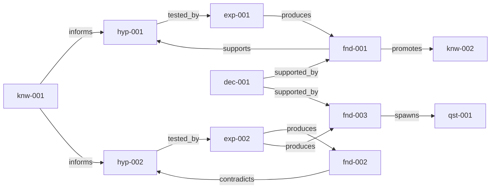

# Example: ML Backbone Selection for Industrial Defect Detection

This is a complete EMDD knowledge graph demonstrating how to use Evolving Mindmap-Driven Development to make a research-informed engineering decision.

## Scenario

A manufacturing team needs to select a CNN backbone for an automated visual defect detection system. The constraints are strict: inference under 100ms, accuracy above 90%, and a single GPU budget. Two candidates are evaluated -- ResNet-18 and MobileNetV3-Small -- through a structured hypothesis-experiment-finding workflow.

## Reading Order

Follow the three-act narrative to understand how the graph evolved:

### Act 1: Exploration (epi-001)
1. **knw-001** -- Domain requirements established (latency, accuracy, hardware constraints)
2. **hyp-001** -- Hypothesis: ResNet-18 can meet the 90%+ accuracy bar
3. **hyp-002** -- Hypothesis: MobileNetV3 can match accuracy with lower latency
4. **exp-001** -- Experiment: ResNet-18 baseline training
5. **exp-002** -- Experiment: MobileNetV3 comparison under identical conditions

### Act 2: Convergence (epi-002)
6. **fnd-001** -- Finding: ResNet-18 achieves 94.2% accuracy, 38ms latency
7. **fnd-002** -- Finding: MobileNetV3 only 87.1% accuracy -- below threshold
8. **fnd-003** -- Finding: 3x latency advantage but 7%p accuracy gap
9. **hyp-001** moves to SUPPORTED, **hyp-002** moves to REFUTED

### Act 3: Decision (epi-003)
10. **fnd-001** promoted to **knw-002** (CNN outperforms classical CV)
11. **dec-001** -- Decision: Adopt ResNet-18 as production backbone
12. **qst-001** -- Open question: Can distillation close the gap? (future work)

## Graph Diagram



## Node Summary

| ID | Type | Title | Status | Confidence |
|----|------|-------|--------|------------|
| knw-001 | knowledge | Defect Detection Requirements | ACTIVE | 0.95 |
| knw-002 | knowledge | CNN Outperforms Classical CV | ACTIVE | 0.90 |
| hyp-001 | hypothesis | ResNet-18 Sufficient for 90%+ | SUPPORTED | 0.85 |
| hyp-002 | hypothesis | MobileNetV3 Matches Accuracy | REFUTED | 0.20 |
| exp-001 | experiment | ResNet-18 Baseline Training | COMPLETED | -- |
| exp-002 | experiment | MobileNetV3 Comparison | COMPLETED | -- |
| fnd-001 | finding | ResNet-18 Achieves 94.2% | PROMOTED | 0.90 |
| fnd-002 | finding | MobileNetV3 Accuracy 87.1% | VALIDATED | 0.80 |
| fnd-003 | finding | Inference Latency Gap | VALIDATED | 0.85 |
| qst-001 | question | Can Distillation Close Gap? | OPEN | -- |
| dec-001 | decision | Adopt ResNet-18 | ACCEPTED | -- |
| epi-001 | episode | Project Kickoff | COMPLETED | -- |
| epi-002 | episode | Experiment Results | COMPLETED | -- |
| epi-003 | episode | Consolidation Review | COMPLETED | -- |

## Try It

```bash
# From the repository root:
npx tsx src/cli.ts lint examples/ml-backbone-selection/graph
npx tsx src/cli.ts health examples/ml-backbone-selection/graph
npx tsx src/cli.ts graph examples/ml-backbone-selection/graph
```
